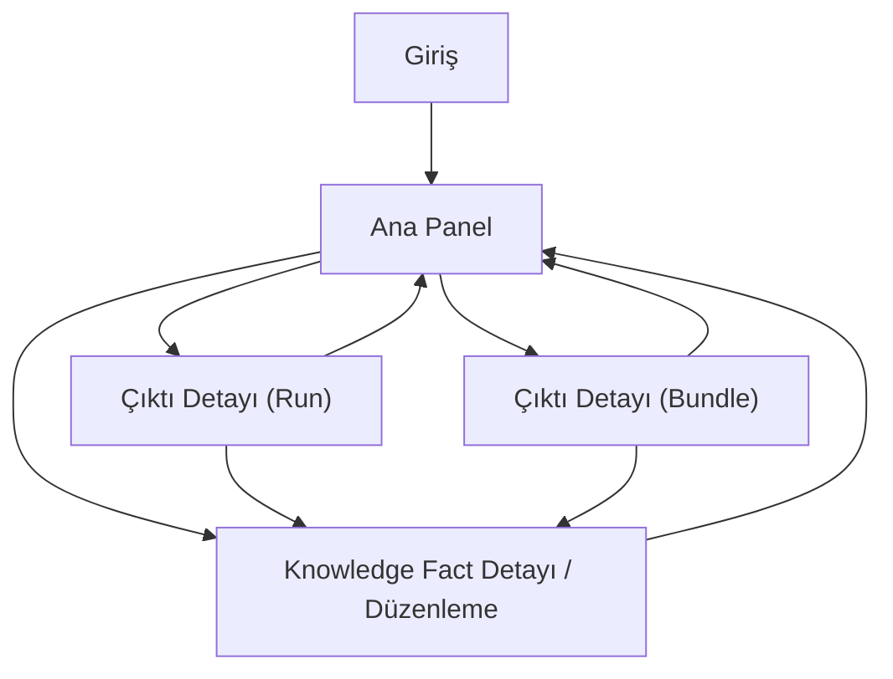

## 1. Product Overview
Ajanın ürettiği çıktıları (runs/bundles) ve knowledge facts kayıtlarını tek bir web portalda görüntüleme ve temel yönetim ihtiyaçlarını karşılayan bir arayüz.
Hedef: çıktılara hızlı erişim, izlenebilirlik (run→bundle→fact ilişkisi) ve minimum eforla “doğru bilgi seti” tutmak.

## 2. Core Features

### 2.1 User Roles
| Rol | Kayıt/Giriş Yöntemi | Temel Yetkiler |
|------|----------------------|----------------|
| Kullanıcı | E‑posta ile giriş (Supabase Auth) | Kendi run/bundle/fact kayıtlarını görür, fact oluşturur/düzenler/siler |
| Yönetici | Supabase üzerinden rol ataması | Tüm kayıtları görür, kullanıcı bazında filtreler |

### 2.2 Feature Module
Portal aşağıdaki ana sayfalardan oluşur:
1. **Giriş**: e‑posta ile giriş, oturum yönetimi.
2. **Ana Panel**: runs/bundles listeleri, detaylara geçiş, filtreleme; knowledge facts listesi ve oluşturma.
3. **Çıktı Detayı (Run/Bundle)**: seçilen run veya bundle’ın metadata ve içerik görünümü; ilişkili kayıtlar.
4. **Knowledge Fact Detayı / Düzenleme**: fact görüntüleme, düzenleme, doğrulama durumunu güncelleme.

### 2.3 Page Details
| Page Name | Module Name | Feature description |
|-----------|-------------|------------------|
| Giriş | E‑posta ile giriş formu | E‑posta + şifre alanlarıyla giriş yap; hata/başarı durumunu göster; oturum açınca Ana Panel’e yönlendir. |
| Giriş | Şifre işlemleri | “Şifremi unuttum” ile e‑posta gönder; yeni şifre belirleme akışına yönlendir. |
| Ana Panel | Üst gezinme + sekmeler | Runs / Bundles / Knowledge Facts sekmeleriyle liste alanını değiştir; kullanıcı menüsünde çıkış yap. |
| Ana Panel | Runs listesi | Run kayıtlarını tablo olarak göster; satırdan Run Detayı’na git; boş durum mesajı göster. |
| Ana Panel | Runs filtre paneli (input alanları) | Tarih aralığı (başlangıç/bitiş), durum (success/fail/running), serbest metin arama (run_id / başlık) ile filtrele; “Temizle” uygula. |
| Ana Panel | Bundles listesi | Bundle kayıtlarını tablo olarak göster; satırdan Bundle Detayı’na git. |
| Ana Panel | Bundles filtre paneli (input alanları) | Tarih aralığı, etiket(ler) (tags), serbest metin arama (bundle adı/id) ile filtrele. |
| Ana Panel | Knowledge Facts listesi | Fact’leri tablo/karte olarak göster; Fact Detayı’na git; doğrulama durumu (draft/verified/rejected) rozetini göster. |
| Ana Panel | Fact oluşturma (input alanları) | Başlık, içerik (textarea), etiketler, doğrulama durumu (varsayılan draft), kaynak türü (run/bundle/manual), kaynak id (opsiyonel), güven skoru (0–1 opsiyonel) alanlarıyla oluştur; kaydedince listeyi güncelle. |
| Çıktı Detayı (Run) | Run özet + metadata | Run id, başlık, durum, başlangıç/bitiş zamanı, süre, hata mesajı (varsa) göster. |
| Çıktı Detayı (Run) | Run çıktısı görünümü | Run log/çıktı metnini (salt okunur) göster; uzun metinde katlanabilir alan ve kopyalama butonu sun. |
| Çıktı Detayı (Run) | İlişkili bundle/fact bağlantıları | Run’a bağlı bundle ve fact’leri listele; tıklayınca ilgili detaya git. |
| Çıktı Detayı (Bundle) | Bundle özet + içerik | Bundle id, ad, tags, oluşturulma zamanı ve içerik/öğe listesini göster; kopyala/indir (JSON) aksiyonu sun. |
| Çıktı Detayı (Bundle) | İlişkili run/fact bağlantıları | Bundle’ın geldiği run’ı ve bağlı fact’leri göster; geçiş sağla. |
| Knowledge Fact Detayı / Düzenleme | Fact görüntüleme | Başlık, içerik, tags, durum, kaynak bilgisi, oluşturma/güncelleme zamanlarını göster. |
| Knowledge Fact Detayı / Düzenleme | Fact düzenleme (input alanları) | Başlık, içerik, tags, durum (draft/verified/rejected), güven skoru, kaynak türü + kaynak id alanlarını düzenle; kaydet/iptal akışı sağla. |
| Knowledge Fact Detayı / Düzenleme | Silme | Onay modalı ile fact sil; başarılı olunca Ana Panel’e dön. |

## 3. Core Process
- Kullanıcı akışı: Giriş yap → Ana Panel’de Runs/Bundles/Facts sekmelerinde arama/filtreleme yap → bir kaydı açıp detaylarını incele → gerekirse yeni fact oluştur veya mevcut fact’i güncelle → çıkış yap.
- Yönetici akışı: Giriş yap → Ana Panel’de kullanıcı bazlı filtre (opsiyonel) ile kayıtları denetle → hatalı run’ları ve ilişkili fact’leri incele → fact doğrulama durumunu güncelle.

