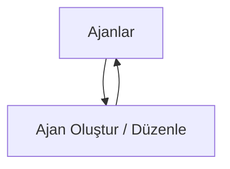

## 1. Product Overview
Kurumsal Portal içinde ajan kayıtlarını oluşturma, listeleme ve düzenleme imkânı veren hafif bir “Ajan Yönetimi” modülü.
Hedef: standart alanlarla (ad/kod, açıklama, yetenekler) tutarlı ajan envanteri oluşturmak.

## 2. Core Features

### 2.1 Feature Module
Portal aşağıdaki ana sayfalardan oluşur:
1. **Ajanlar**: ajanları listeleme, arama/filtreleme, “Yeni Ajan” aksiyonu.
2. **Ajan Oluştur / Düzenle**: ajan formu (ad, kod, açıklama, yetenekler), kaydet/iptal.

### 2.2 Page Details
| Page Name | Module Name | Feature description |
|---|---|---|
| Ajanlar | Üst başlık + birincil aksiyon | Sayfa başlığı göster; “Yeni Ajan” butonu ile oluşturma sayfasına git. |
| Ajanlar | Liste (tablo) | Ajanları tablo halinde göster (Ad, Kod, Açıklama özeti, Yetenek sayısı, Güncellenme); satıra tıklayınca Düzenle’ye git. |
| Ajanlar | Arama / filtre | Kod veya ad ile serbest metin araması yap; “Temizle” ile filtreleri sıfırla. |
| Ajanlar | Boş durum + hata durumları | Hiç ajan yoksa yönlendirici boş durum göster; yükleniyor/hata durumunda mesaj göster ve tekrar dene aksiyonu sun. |
| Ajan Oluştur / Düzenle | Form alanları | Ajan adı (zorunlu), ajan kodu (zorunlu, benzersiz), açıklama (opsiyonel), “neler yapar” yetenekleri (çoklu değer) alanlarını düzenle. |
| Ajan Oluştur / Düzenle | Doğrulama kuralları | Zorunlu alanları doğrula; kod benzersiz değilse hatayı göster; yeteneklerde boş değer eklenmesini engelle. |
| Ajan Oluştur / Düzenle | Kaydet / İptal | Kaydet ile oluştur/güncelle; başarılıysa Ajanlar listesine dön ve yeni/updated satırı görünür yap; İptal ile değişiklik yapmadan geri dön. |

## 3. Core Process
- Ajan ekleme akışı: Ajanlar → “Yeni Ajan” → formu doldur (ad/kod/açıklama/yetenekler) → Kaydet → Ajanlar listesine dönüş.
- Ajan düzenleme akışı: Ajanlar → ajan satırına tıkla → formda alanları güncelle → Kaydet → listeye dönüş.
- Ajanları bulma akışı: Ajanlar → arama kutusuna ad/kod yaz → sonuçları incele → gerekiyorsa satırdan düzenlemeye git.

