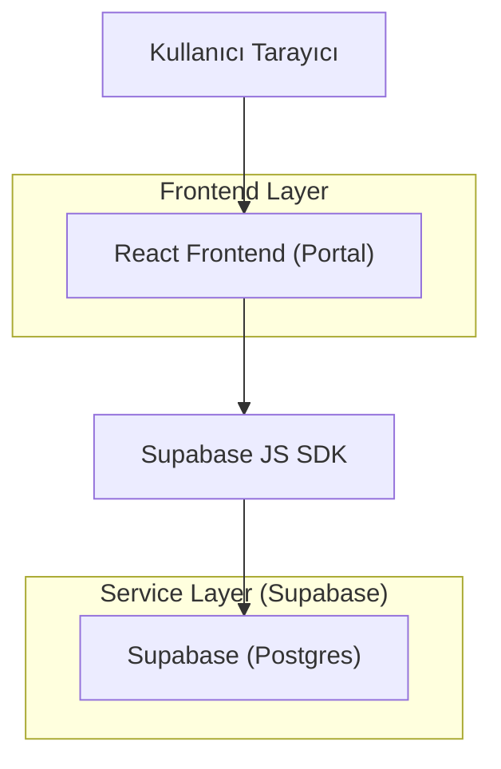
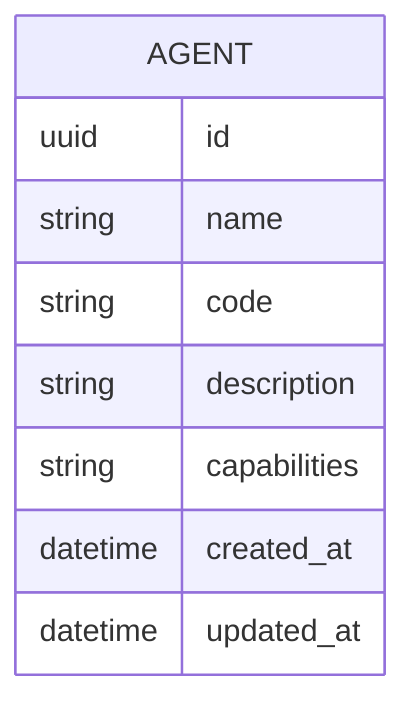

## 1.Architecture design


## 2.Technology Description
- Frontend: React@18 + vite + TypeScript + tailwindcss@3
- Backend: Supabase (PostgreSQL)

## 3.Route definitions
| Route | Purpose |
|---|---|
| /agents | Ajan listeleme + arama + “Yeni Ajan” aksiyonu |
| /agents/new | Yeni ajan oluşturma formu |
| /agents/:agentId/edit | Ajan düzenleme formu |

## 4.API definitions (If it includes backend services)
Not: Aşağıdaki uçlar, Supabase PostgREST (/rest/v1) üzerinden veya aynı sözleşmeyi sunan bir backend üzerinden sağlanabilir.

### 4.1 Agent CRUD
**Listele**
- GET /rest/v1/agents?select=*

**Detay**
- GET /rest/v1/agents?id=eq.:agentId&select=*

**Oluştur**
- POST /rest/v1/agents

**Güncelle**
- PATCH /rest/v1/agents?id=eq.:agentId

TypeScript tipleri (frontend)
```ts
export type Agent = {
  id: string;
  name: string;
  code: string;
  description: string | null;
  capabilities: string[]; // “neler yapar”
  created_at: string;
  updated_at: string;
};

export type UpsertAgentInput = {
  name: string;
  code: string;
  description?: string | null;
  capabilities: string[];
};
```

## 6.Data model(if applicable)

### 6.1 Data model definition


### 6.2 Data Definition Language
Agents (agents)
```sql
CREATE TABLE agents (
  id UUID PRIMARY KEY DEFAULT gen_random_uuid(),
  name TEXT NOT NULL,
  code TEXT NOT NULL,
  description TEXT,
  capabilities TEXT[] NOT NULL DEFAULT '{}',
  created_at TIMESTAMPTZ NOT NULL DEFAULT now(),
  updated_at TIMESTAMPTZ NOT NULL DEFAULT now()
);

CREATE UNIQUE INDEX ux_agents_code ON agents(code);
CREATE INDEX idx_agents_updated_at ON agents(updated_at DESC);

-- Supabase önerilen yetki yaklaşımı (RLS kullanıyorsanız policy ekleyin)
GRANT SELECT ON agents TO anon;
GRANT ALL PRIVILEGES ON agents TO authenticated;
```