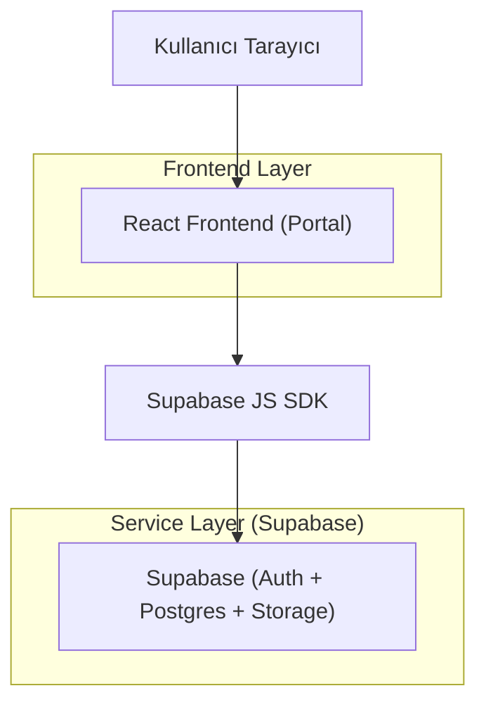
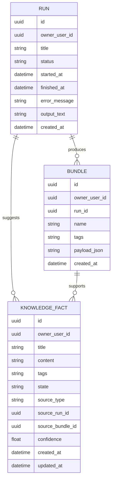

## 1.Architecture design


## 2.Technology Description
- Frontend: React@18 + vite + TypeScript + tailwindcss@3
- Backend: Supabase (Auth + PostgreSQL + Storage)

## 3.Route definitions
| Route | Purpose |
|-------|---------|
| /login | Giriş ve şifre işlemleri |
| /app | Ana Panel (Runs/Bundles/Facts sekmeleri) |
| /app/runs/:runId | Run Detayı |
| /app/bundles/:bundleId | Bundle Detayı |
| /app/facts/:factId | Knowledge Fact Detayı / Düzenleme |

## 6.Data model(if applicable)

### 6.1 Data model definition


### 6.2 Data Definition Language
Not: İlişkiler uygulama seviyesinde tutulur (fiziksel FK zorunlu değil). RLS ile kullanıcı izolasyonu sağlanır.

Runs (runs)
```sql
CREATE TABLE runs (
  id UUID PRIMARY KEY DEFAULT gen_random_uuid(),
  owner_user_id UUID NOT NULL,
  title TEXT,
  status TEXT NOT NULL CHECK (status IN ('running','success','fail')),
  started_at TIMESTAMPTZ,
  finished_at TIMESTAMPTZ,
  error_message TEXT,
  output_text TEXT,
  created_at TIMESTAMPTZ NOT NULL DEFAULT now()
);
CREATE INDEX idx_runs_owner_created_at ON runs(owner_user_id, created_at DESC);
CREATE INDEX idx_runs_status_created_at ON runs(status, created_at DESC);

ALTER TABLE runs ENABLE ROW LEVEL SECURITY;

-- Örnek RLS: kendi kayıtlarını gör
CREATE POLICY runs_select_own ON runs
  FOR SELECT TO authenticated
  USING (owner_user_id = auth.uid());

-- Yönetici senaryosu: service role veya ayrı admin policy (opsiyonel)
```

Bundles (bundles)
```sql
CREATE TABLE bundles (
  id UUID PRIMARY KEY DEFAULT gen_random_uuid(),
  owner_user_id UUID NOT NULL,
  run_id UUID,
  name TEXT NOT NULL,
  tags TEXT, -- basit kullanım: virgüllü string veya JSON string
  payload_json JSONB NOT NULL,
  created_at TIMESTAMPTZ NOT NULL DEFAULT now()
);
CREATE INDEX idx_bundles_owner_created_at ON bundles(owner_user_id, created_at DESC);
CREATE INDEX idx_bundles_run_id ON bundles(run_id);

ALTER TABLE bundles ENABLE ROW LEVEL SECURITY;

CREATE POLICY bundles_select_own ON bundles
  FOR SELECT TO authenticated
  USING (owner_user_id = auth.uid());
```

Knowledge Facts (knowledge_facts)
```sql
CREATE TABLE knowledge_facts (
  id UUID PRIMARY KEY DEFAULT gen_random_uuid(),
  owner_user_id UUID NOT NULL,
  title TEXT NOT NULL,
  content TEXT NOT NULL,
  tags TEXT,
  state TEXT NOT NULL DEFAULT 'draft' CHECK (state IN ('draft','verified','rejected')),
  source_type TEXT NOT NULL DEFAULT 'manual' CHECK (source_type IN ('run','bundle','manual')),
  source_run_id UUID,
  source_bundle_id UUID,
  confidence DOUBLE PRECISION,
  created_at TIMESTAMPTZ NOT NULL DEFAULT now(),
  updated_at TIMESTAMPTZ NOT NULL DEFAULT now()
);
CREATE INDEX idx_facts_owner_updated_at ON knowledge_facts(owner_user_id, updated_at DESC);
CREATE INDEX idx_facts_state ON knowledge_facts(state);

ALTER TABLE knowledge_facts ENABLE ROW LEVEL SECURITY;

CREATE POLICY facts_select_own ON knowledge_facts
  FOR SELECT TO authenticated
  USING (owner_user_id = auth.uid());

CREATE POLICY facts_write_own ON knowledge_facts
  FOR INSERT TO authenticated
  WITH CHECK (owner_user_id = auth.uid());

CREATE POLICY facts_update_own ON knowledge_facts
  FOR UPDATE TO authenticated
  USING (owner_user_id = auth.uid())
  WITH CHECK (owner_user_id = auth.uid());

CREATE POLICY facts_delete_own ON knowledge_facts
  FOR DELETE TO authenticated
  USING (owner_user_id = auth.uid());
```

Yetkilendirme notları
- Portal verileri hassas olabileceği için anon role doğrudan SELECT verilmez; tüm okuma/yazma authenticated + RLS üzerinden yapılır.
- Yönetici erişimi gerekiyorsa: (a) ayrı bir “admins” tablosu ve policy, veya (b) sadece server-side service-role ile raporlama yaklaşımı.
