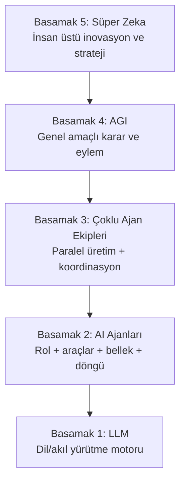
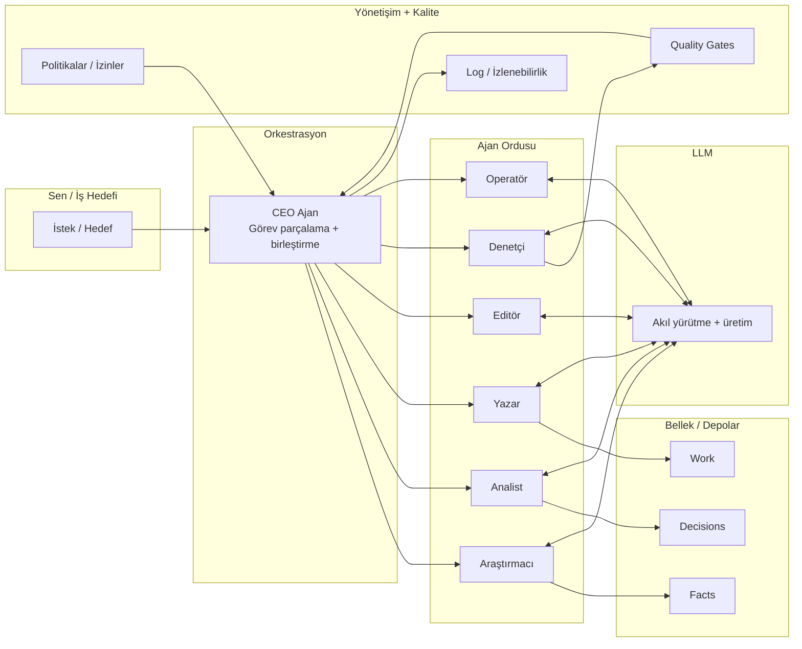
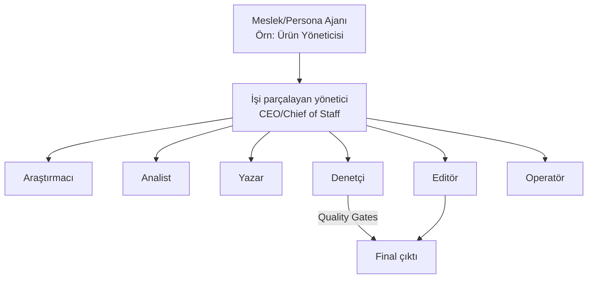
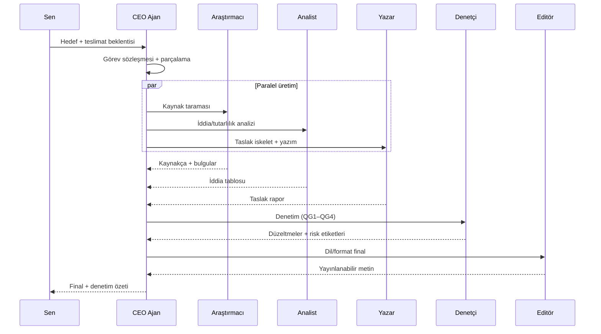
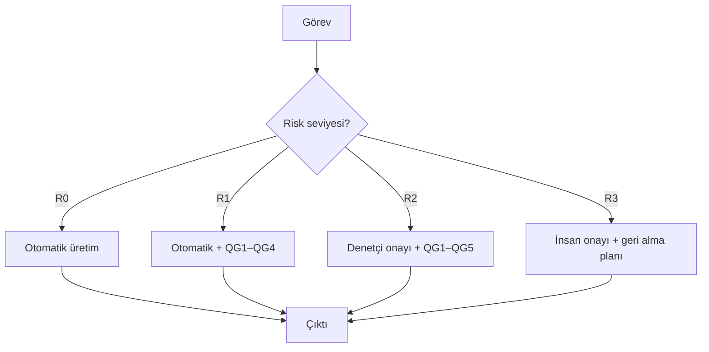
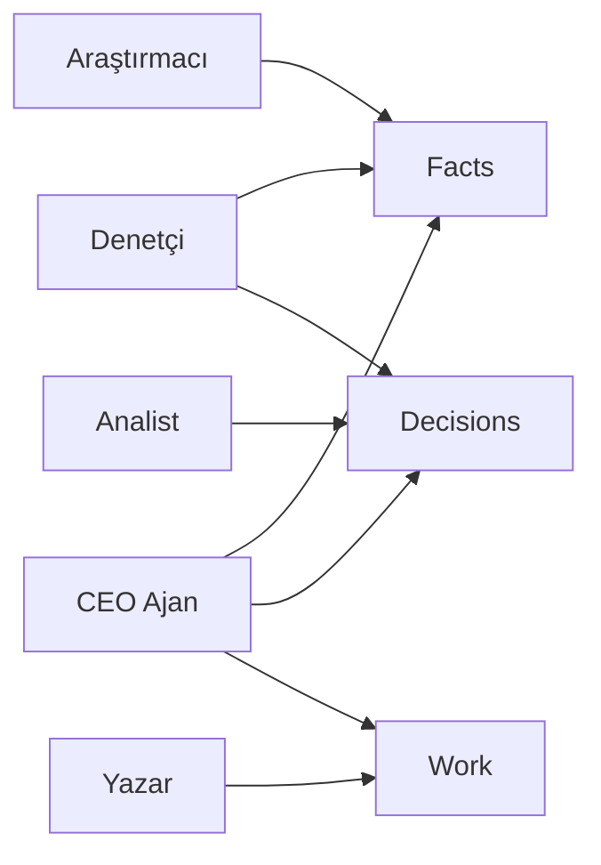

# AI Ajan Ordusu: 5 Basamaklı Piramit ve 1–3 Basamak Ürün Mimarisi

Bu doküman iki şeyi birlikte verir:

1. **5 basamaklı piramit olgunluk modeli** (LLM → Ajanlar → Çoklu ajan ekipleri → AGI → Süper zeka)
2. **1–3 basamağın ürünleştirilebilir mimarisi**: roller, görev sözleşmesi, kalite kapıları, yönetişim, ölçüm ve şablonlar

> Not: 4–5. basamaklar bugün için ağırlıklı olarak **vizyon + güvenlik/yönetişim çerçevesi** şeklinde ele alınır; 1–3. basamaklar ise pratikte uygulanabilir “ürün tasarımı”dır.

## Proje Durumu (Bu Repo ile Eşleşme)

Aşağıdaki tablo, bu dokümanda anlatılan mimarinin repo içindeki karşılıklarını ve şu anki olgunluk seviyemizi gösterir.

| Başlık | Dokümandaki hedef | Repo’daki karşılık | Durum |
|---|---|---|---|
| LLM katmanı | Zeka motoru | `src/AgentArmy.Cli/Llm/OpenAiResponsesClient.cs`, `--model` | ✅ |
| Rol bazlı ajanlar | Research/Analyze/Write/Edit/Verify/Operate | `src/AgentArmy.Cli/Agents/AgentsCatalog.cs` | ✅ |
| Playbook orkestrasyonu | Adım adım iş akışı | `src/AgentArmy.Cli/Runtime/Orchestrator.cs`, `playbooks/`, `domain-packs/.../playbooks/` | ✅ |
| Çoklu çalışma (bundle) | Birden fazla akışı otomatik yürütme | `bundle` komutu + `domain-packs/.../bundles/*.json` | ✅ |
| Quality Gates | Denetimsiz final yok | `Verifier` + `domain-packs/market-intel/rubrics/verifier.md` | ✅ (Market Intel) |
| Web kaynaklı grounding | Kaynaklı araştırma | `--web true` + `web_search` | ✅ |
| Domain politikası | Güvenilir kaynaklara yönlendirme | `domain-packs/market-intel/allowed-domains.txt` (soft policy + tool fallback) | ⚠️ |
| Paylaşılan bellek | Facts/Decisions/Work ayrımı | run çıktıları: `facts.md`, `decisions.md`, `work.md` | ✅ |
| Kalıcı bilgi deposu | Reusable facts store | `facts.json` + `knowledge/market-intel/facts.jsonl` | ✅ (Market Intel) |
| Risk/izin enforcement | R0–R3’e göre otomatik dur/kısıt | CLI’da `--risk` var, enforcement sınırlı | ⚠️ |
| CEO ajan (dinamik parçalama) | İstekten görev parçalama | Şu an statik playbook; dinamik CEO yok | ❌ |
| Contrarian | Karşı görüş / hata avcısı | Henüz ajan/step yok | ❌ |

**Yorum:** 1–3 basamak için doğru yoldayız. En kritik kazançlar: `web_search` ile kaynaklı araştırma, rubrikli `Verifier`, ve `facts` çıkarımı ile kalıcı hafıza.

---

---

## Piramit Görseli (Basit)

```
                 ┌──────────────────────────────┐
                 │ 5) SÜPER ZEKA               │
                 └──────────────▲───────────────┘
                                │
                 ┌──────────────┴───────────────┐
                 │ 4) AGI (Genel Zeka)         │
                 └──────────────▲───────────────┘
                                │
                 ┌──────────────┴───────────────┐
                 │ 3) ÇOKLU AJAN EKİPLERİ       │
                 └──────────────▲───────────────┘
                                │
                 ┌──────────────┴───────────────┐
                 │ 2) AI AJANLARI (ORDU)        │
                 └──────────────▲───────────────┘
                                │
                 ┌──────────────┴───────────────┐
                 │ 1) LLM (Zeka Motoru)         │
                 └──────────────────────────────┘
```

## Piramit Diyagramı (Mermaid)



---

# 1) Hedef ve Kapsam

## 1.1. Hedef
Senin adına çalışan bir yapı kurmak:

- **Soru-cevap** yerine **görev → çıktı** üretir.
- Çıktı üretirken **kanıt**, **izlenebilirlik** ve **güvenlik** varsayılan olur.
- Özerklik arttıkça “kontrol mekanizmaları” da artar.

## 1.2. Kapsam

- Uygulanabilir ürün tasarımı: **1–3 basamak**
- Vizyon ve risk çerçevesi: **4–5 basamak**

## 1.3. Çalışma Prensipleri

- **Single Source of Truth**: gerçekler tek bir yerde toplanır.
- **Quality Gates**: hiçbir çıktı denetimsiz “final” olmaz.
- **İzin (permissions) temelli özerklik**: ajan “yapabilir” ve “yapamaz”ları bilir.
- **Geri alınabilirlik**: kritik eylemler geri döndürülebilir tasarlanır.

---

# 2) Sistem Modeli (Bileşenler)

Bu sistemi 4 katmanda düşünmek pratik ve ölçeklenebilir bir zihinsel model verir.

## 2.1. Zeka Katmanı (LLM)

- Görev: metin/kod üretimi, akıl yürütme, alternatif üretme.
- LLM, tek başına “doğruyu garanti etmez”; doğruluğu sağlayan şey **kanıt** ve **denetim** katmanlarıdır.

## 2.2. Ajan Katmanı

Her ajan şu yapı taşlarından oluşur:

- **Rol**: Araştırmacı, yazar, denetçi gibi.
- **Görev sözleşmesi**: beklenen çıktı, kapsam, kalite kriterleri.
- **Araçlar**: arama, repo erişimi, görev sistemi, e-posta taslağı vb.
- **Bellek**: facts/decisions/work depoları.
- **Çalışma döngüsü**: planla → üret → kontrol et → gerekirse düzelt.
- **Güvenlik sınırları**: risk seviyesi ve izin matrisi.

## 2.3. Orkestrasyon Katmanı

- Görevi parçalar, ajanlara dağıtır.
- Paralel çalışmayı yönetir.
- Çatışmaları çözer (iki ajan farklı sonuç verdiyse).
- Kalite kapılarını uygular.

## 2.4. Yönetişim Katmanı

- İzinler, onay akışları, loglama, denetim, geri alma mekanizmaları.
- “Sormadan çalışmak” ancak bu katman sağlam olursa güvenli hale gelir.

## 2.5. Mimari Diyagram (Mermaid)



---

# 3) Ajan Rolleri (Meslek/Persona + Fonksiyonel Çekirdek)

Meslek temelli ajanlar, “ordu”yu kullanmayı kolaylaştırır; fonksiyonel çekirdek ajanlar ise kaliteyi ve kontrolü yükseltir. En iyi sonuç genelde **iki katmanlı tasarımla** gelir.

## 3.1. İki Katmanlı Ajan Tasarımı

### Dış katman: Meslek/Persona ajanları

Bu ajanlar kullanıcıya bakan arayüzdür:

- Kullanıcının dilini konuşur (PM dili, finans dili, hukuk dili).
- Tipik teslimatları bilir (PRD, karar notu, rapor, plan).
- Gelen isteği **görev sözleşmesine** çevirir ve işi parçalar.

Meslek/Persona ajanları, tek başına her işi yapmak yerine içerideki uzmanları koordine etmelidir.

### İç katman: Fonksiyonel çekirdek ajanlar

Bu ajanlar “işin motoru”dur:

- Araştırma, analiz, yazım, edit, doğrulama, operasyon gibi dar sorumluluklarda uzmanlaşır.
- Çıktıları kalite kapılarından geçirir.
- Yetki ve risk sınırları net olur.

## 3.2. Fonksiyonel Çekirdek (Minimum 6 Rol)

### Araştırmacı (Researcher)
- Kaynak tarar, not çıkarır, alıntıları ve linkleri düzenler.
- Çıktı: “Kaynakça + bulgu notları + güven puanı”.

### Analist (Analyst)
- İddiaları test eder, tutarlılık kontrolü yapar.
- Çıktı: “İddia tablosu (iddia/kanıt/güven/riski)”.

### Yazar (Writer)
- Nihai raporu üretir; yapı/akış/argüman kurar.
- Çıktı: “Özet + detay + ekler”.

### Editör (Editor)
- Dil, ton, okunabilirlik, format standardı.
- Çıktı: “Yayınlanabilir metin”.

### Denetçi (Verifier/Auditor)
- Kaynak doğrulama, çelişki yakalama, risk etiketleme.
- Çıktı: “Denetim raporu + red/accept + düzeltme listesi”.

### Operatör (Operator)
- Araç çağırır (görev açma, dosya hazırlama, otomasyon).
- Çıktı: “Yapılan işlem listesi + geri alma adımları”.

## 3.3. Opsiyonel Fonksiyonel Uzmanlar

- **Contrarian**: “Bu neden yanlış olabilir?” raporu.
- **Cost/Time Planner**: efor/maliyet/ROI.
- **Policy/Privacy**: PII/telif/uyumluluk kontrolü.

## 3.4. Meslek/Persona Ajan Kataloğu (Örnek)

Aşağıdaki liste, dünyadaki “meslek”lerin çoğunun bu çekirdek rollere nasıl indirgenebileceğini gösterir.

| Meslek/Persona ajanı | Tipik teslimatlar | İç ekip (öneri) |
|---|---|---|
| Ürün Yöneticisi (PM) | PRD, roadmap, karar notu | Researcher + Analyst + Writer + Verifier + Editor |
| Pazar Araştırmacısı | pazar özeti, rakip analizi | Researcher + Contrarian + Verifier + Writer |
| İş Analisti | süreç, gereksinim, tablo | Analyst + Writer + Verifier |
| Veri Analisti | metrik, trend, dashboard notu | Analyst + Verifier + Writer |
| Yazılım Mühendisi | teknik tasarım, PoC planı | Analyst + Writer + Verifier + Operator |
| QA/Test Mühendisi | test planı, risk listesi | Analyst + Verifier + Writer |
| DevOps/SRE | runbook, incident notu | Operator + Analyst + Verifier |
| Growth Pazarlama | kampanya planı, mesaj seti | Researcher + Writer + Editor + Verifier |
| Satış (Sales) | teklif taslağı, objection handling | Writer + Editor + Verifier |
| Finans | bütçe notu, senaryo analizi | Analyst + Verifier + Writer |
| Hukuk/Risk (uyarıcı) | risk işaretleme, uyum notu | Policy/Privacy + Verifier + Writer |
| İK/Recruiter | ilan metni, mülakat seti | Writer + Editor + Verifier |
| Proje Yöneticisi | plan, bağımlılık, RACI | Analyst + Writer + Verifier |
| Operasyon | SOP, check-list | Operator + Writer + Verifier |
| İç Denetim | kontrol listesi, bulgu raporu | Verifier + Analyst + Writer |

## 3.5. Meslek Ajanı → İç Ekip Diyagramı (Mermaid)



---

# 4) CEO Ajan (3. Basamak için Yönetici)

CEO ajan, “takım lideri” gibi çalışır.

## 4.1. Sorumluluklar

- İsteği **görev sözleşmesine** çevirir.
- Görevi parçalar, rol bazlı dağıtır.
- Çıktıları birleştirir.
- Çatışma çözümü üretir.
- Riskli adımlarda doğru “dur/iste” kapısını uygular.

## 4.2. CEO’nun Ürettiği Standart Çıktılar

- Görev sözleşmesi (kısa)
- Çalışma planı (hangi ajan ne yapacak)
- “Birleşik çıktı” + “denetim özeti”

## 4.3. Çoklu Ajan Koordinasyon Akışı (Mermaid)



---

# 5) Görev Sözleşmesi (Task Contract)

“Ajanlar artık soru sormasın” hedefinin en kritik parçası budur.

## 5.1. Standart Alanlar

- **Amaç**: Ne için yapılıyor?
- **Teslimatlar**: Format(lar), uzunluk, dil, hedef kitle.
- **Kapsam**: Neler dahil?
- **Kapsam dışı**: Neler hariç?
- **Kalite kriterleri**: Kaynak zorunluluğu, doğruluk eşiği.
- **Risk seviyesi**: R0–R3.
- **Araç izinleri**: Okuma/yazma; hangi sistemler.
- **Deadline**: Zaman sınırı (varsa).

## 5.2. Örnek Görev Sözleşmesi

```text
Amaç: X alanında yatırımcı sunumu için 2 sayfalık pazar özeti üret.
Teslimatlar: 1 sayfa özet + 1 sayfa detay + 10 kaynakça.
Kapsam: Son 24 ay trendleri, 3 rakip, 5 metrik.
Kapsam dışı: Finansal tahmin (modelleme yok).
Kalite kriterleri: Her metrik kaynaklı; kaynaksız iddia yok.
Risk: R1
Araç izinleri: İnternet araştırma (okuma), dosya yazma (yerel).
```

---

# 6) Kalite Kapıları (Quality Gates)

Kalite kapıları, ordunun “hızlı ama dağınık” olmasını engeller.

## 6.1. Kapılar

- **QG1 — Yapı/Kapsam**: doğru format, kapsam dışına çıkmama.
- **QG2 — Kanıt/Kaynak**: kritik iddiaların kaynağı.
- **QG3 — Tutarlılık**: iç çelişki, sayı kontrolü, tanım birliği.
- **QG4 — Risk Etiketleme**: belirsizliklerin işaretlenmesi.
- **QG5 — İletişim**: ton, açıklık, hedef kitle uygunluğu.

## 6.2. Kapı Matrisi

| Çıktı türü | QG1 | QG2 | QG3 | QG4 | QG5 |
|---|---:|---:|---:|---:|---:|
| İç araştırma notu | ✅ | ✅ | ✅ | ✅ | ◻️ |
| Dış rapor / blog | ✅ | ✅ | ✅ | ✅ | ✅ |
| Müşteriye gidecek metin | ✅ | ✅ | ✅ | ✅ | ✅ |

---

# 7) Risk ve İzin Matrisi (Özerkliğin Güvenli Hali)

“Sormadan çalışmak” ile “kontrolden çıkmak” arasındaki çizgiyi izin matrisi çizer.

## 7.1. Risk Seviyeleri

- **R0 (Zararsız)**: özet, taslak, fikir listesi.
- **R1 (Düşük)**: iç doküman, analiz, plan.
- **R2 (Orta)**: dış iletişim taslağı, fiyat/vaat içeren metin.
- **R3 (Yüksek)**: para, hukuki/sağlık, production, müşteriyle doğrudan etkileşim.

## 7.2. Önerilen Onay Kuralı

| Risk | Özerklik | Zorunlu adım |
|---|---|---|
| R0 | Tam otomatik | Log
| R1 | Otomatik | QG1–QG4
| R2 | Yarı otomatik | Denetçi onayı + gerekçe
| R3 | İnsan onayı zorunlu | Onay + geri alma planı

## 7.3. Risk Akış Diyagramı (Mermaid)



---

# 8) Çoklu Ajan İş Akışları (Playbook’lar)

Playbook, tekrar eden işlerin standart “tarifidir”. Orduyu ölçekleyen şey playbook sayısıdır.

## 8.1. Araştırma → Rapor Üretimi

1. CEO: görev sözleşmesi
2. Researcher: kaynakça + alıntılar
3. Contrarian: karşı argümanlar
4. Analyst: iddia testi tablosu
5. Writer: rapor
6. Verifier: QG1–QG4
7. Editor: final (QG5)

## 8.2. PRD (Ürün Dokümanı)

- Researcher: kullanıcı/rakip/pazar sinyali
- Analyst: metrikler, varsayımlar, risk matrisi
- Writer: PRD üretimi
- Verifier: ölçülebilirlik + kaynak doğrulama
- CEO: go/no-go önerisi

## 8.3. Teknik Tasarım + Uygulama Planı

- Analyst: mimari seçenekler + trade-off
- Writer: tasarım dokümanı
- Verifier: güvenlik/ölçek kontrol listesi
- CEO: sprint planı + bağımlılıklar

---

# 9) Paylaşılan Bellek (Single Source of Truth)

Ordu “aynı gerçeği” paylaşmıyorsa, her ajan farklı bir evrende yaşar.

## 9.1. Üç Temel Depo

- **Facts (Gerçekler)**: kaynaklı, doğrulanmış bilgi.
- **Decisions (Kararlar)**: karar, gerekçe, risk, onay.
- **Work (Çalışmalar)**: taslaklar, raporlar, ara çıktı.

## 9.2. Bellek Akışı (Mermaid)



---

# 10) Ölçüm ve KPI’lar (Orduyu Yönetmek)

Ölçemediğin şeyi iyileştiremezsin. Bu metrikler “kalite”yi ve “maliyeti” görünür yapar.

## 10.1. Önerilen KPI’lar

- **Doğruluk**: denetçinin reddettiği kritik iddia oranı.
- **Kaynak kapsaması**: kaynaksız kritik iddia sayısı.
- **Tutarlılık**: çelişki sayısı (revizyon öncesi/sonrası).
- **Hız**: görev başına süre; paralel kazanım.
- **Maliyet**: görev başına compute/token.
- **İnsan düzeltmesi**: finalde insanın değiştirdiği bölüm oranı.
- **Geri dönüş**: hata sonrası toparlama süresi.

## 10.2. Basit Skor Kartı Örneği

| Görev | Doğruluk | Kaynak | Süre | Maliyet | İnsan düzeltmesi |
|---|---:|---:|---:|---:|---:|
| Rakip analizi | 0.92 | 0.95 | 45 dk | Orta | %10 |
| PRD taslağı | 0.88 | 0.90 | 60 dk | Orta | %20 |

---

# 11) Şablonlar (Kopyala–Yapıştır)

Şablonlar “soru sormadan çalışmanın” pratik anahtarıdır: girdi ve çıktı formatı netleşir.

## 11.1. Araştırma Raporu Şablonu

### 1 Sayfa Özet

- Amaç
- 5 ana bulgu
- Öneri (varsa)
- Riskler (en fazla 5)

### Detay

- Problem tanımı
- Metodoloji (nasıl arandı)
- Bulgular (kaynaklı)
- Karşıt görüşler
- Sonuç + açık sorular

### Kaynakça

- Kaynak
- Tarih
- Güven puanı (yüksek/orta/düşük)

## 11.2. Karar Notu (Decision Memo)

- Karar
- Seçenekler (A/B/C)
- Kriterler (maliyet, hız, risk, etki)
- Öneri
- Gerekçe
- Risk azaltma planı
- Onay gereksinimi (R seviyesi)

## 11.3. Denetçi Kontrol Listesi

- Kapsam dışına çıkıldı mı?
- Kaynaksız kritik iddia var mı?
- Çelişki / sayı hatası var mı?
- Belirsizlikler işaretlendi mi?
- Ton hedef kitleye uygun mu?

## 11.4. Meslek/Persona Ajanı Brifi

Bu brif, bir “meslek ajanı”nın (örn. PM, Finans, SRE) işi doğru yorumlayıp iç ekibi koordine etmesi için minimum girdiyi standardize eder.

```text
Persona: (örn. Ürün Yöneticisi)
Bağlam: (ürün/şirket/alan kısa özeti)
Amaç: (tek cümle)
Teslimatlar: (format + uzunluk + hedef kitle)
Kapsam: (dahil)
Kapsam dışı: (hariç)
Kalite kriterleri: (kaynak, doğruluk, ton)
Risk seviyesi: (R0/R1/R2/R3)
Araç izinleri: (okuma/yazma, hangi sistemler)
Deadline: (varsa)
```

---

# 12) Kapanış: Bu Mimari Ne Sağlar?

- “Ajan ordusu”nu sohbetten çıkarır, **süreç + kalite** ile üretim sistemine çevirir.
- Çoklu ajan ile paralel üretim yapar; denetçi ve kapılar ile güvenilirliği yükseltir.
- CEO ajan, işi yönetir; sen daha çok **hedef ve sınır** koyarsın.
- Özerklik artarken riskler kontrolde kalır: izin matrisi + onay kapıları.

## 12.1. 4–5. Basamağa Köprü Notu

1–3 basamak, “özerklik”i güvenli ve ölçülebilir hale getirir. 4–5 basamaklara giden yolun gerçek anahtarı, modelin zekâsından çok:

- hizalama (ne “yararına”?)
- denetlenebilirlik (neden böyle karar aldı?)
- geri alınabilirlik (yanlışsa nasıl geri döner?)
- yönetişim (hangi sınırlar?)

Bu omurga olmadan, daha zeki bir sistem daha hızlı hata yapabilir.

## 12.2. Öneriler (Meslek Bazlı Ordu İçin)

- Meslek ajanlarını “tek başına süper çalışan” gibi değil, **orkestratör** gibi tasarla; işi iç çekirdeğe bölsün.
- İlk etapta 10–15 persona ile başla; her persona için 3–5 net teslimat tanımla (PRD, karar notu, rapor gibi).
- Çekirdek ajanları sabit tut; persona sayısı artsa bile içeride aynı **Research/Analyze/Write/Edit/Verify/Operate** zinciri kalsın.
- Operatör ajanını en kısıtlı izinlerle başlat; R2–R3 eylemlerde otomatik dur + insan onayı zorunlu olsun.
- Her persona için “örnek çıktılar”dan oluşan küçük bir değerlendirme seti oluştur; denetçinin reddettiği iddia türlerine göre playbook’ları iyileştir.
- Contrarian ve Verifier’ı opsiyon değil, “kalite sigortası” gibi düşün; özellikle dışa giden içerikte zorunlu çalıştır.
