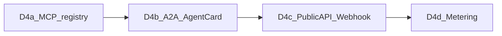

# D4 — Ekosistem dalgası (teknik tasarım + PR kırılımı)

**Durum:** A3 9/9 + D3 canary kapıları açıldıktan sonra uygulanır.  
**Kural:** Dış yüzey (public API/webhook) ile genel planlayıcı aynı anda açılmaz; D4c, D3 canary gözlemi yeşil olduktan sonra.

Mevcut temel: `mcp_servers` + `McpProxyTool` ([20260614110000_mcp_servers.sql](../supabase/migrations/20260614110000_mcp_servers.sql)), risk/compensation/D0 taint, `operation_budgets`, `notification_channels`.

---

## D4a — MCP registry keşfi (önce bu PR)

### Amaç
Elle `mcp_servers` kaydı yerine: resmi/topluluk registry’den ara → öner → onay → bağla. Sector Factory “eksik araç” çıktısı bu keşfe bağlanır.

### Kapsam
1. **Registry istemcisi** (portal API): okuma-only HTTP client; ilk hedef Anthropic / community MCP registry JSON index (URL policy_settings: `mcp.registry_urls`).
2. **Şema:** `mcp_registry_cache` (slug, name, description, transport, homepage, fetched_at) — TTL 24h; secrets yok.
3. **Portal:** ToolsPage “Araç keşfet” — arama, risk tahmini (read/write), “Öner” → `mcp_servers` taslağı `status=pending_approval`.
4. **Onay kapısı:** R2+ MCP sunucu ekleme `approval_queue` veya mevcut pack-merge benzeri owner onayı; bağlanınca `McpProxyTool` yolu değişmez.
5. **Factory köprüsü:** `sector-paket-taslak` / eval missing_tools → registry search RPC/helper; sonuç `domain_pack_drafts.draft_json.suggested_mcp`.

### Bilinçli dışı
- Otomatik kurulum (onaysız `enabled=true`)
- Uzak registry’ye credential gönderme
- MCP sunucu kodunu repo’ya vendor etme

### Kabul
- Registry arama → pending `mcp_servers` satırı
- Onay sonrası CLI run’da `McpProxyTool` listelenir
- D0: MCP tool çıktısı untrusted ise mevcut taint/privilege gate geçer
- Birim: registry client fake HTTP + ToolsPage smoke

### Dosya dokunuşları (tahmini)
- `supabase/migrations/YYYYMMDD_mcp_registry_cache.sql`
- `portal/api/lib/mcpRegistry.ts` + route `portal/api/routes/mcp.ts`
- `portal/src/pages/ToolsPage.tsx` (veya yeni Discover paneli)
- `src/AgentArmy.Cli` — değişiklik yok (mevcut proxy)

---

## D4b — A2A Agent Card

### Amaç
Her persona / aktif pack için `/.well-known/agent.json` (A2A Agent Card) yayınla; dış ajanlar yetenek keşfi yapabilsin. Çalıştırma hâlâ D4c API key ile.

### Kapsam
1. Card üretici: `personas` + `playbooks` + allowed tools özeti → JSON (name, description, url, skills, authentication hint).
2. Nginx/Express: `GET /.well-known/agent.json` (tenant host veya `?pack=`).
3. Policy: `a2a.card_enabled` default false; canary owner’da aç.
4. Kartta **yan etkili skill** listelenirken risk etiketi zorunlu; R3 skill’ler `requires_human_approval: true`.

### Kabul
- Card şema doğrulaması (JSON Schema)
- Kapalı policy → 404
- Açık policy → pack skill’leri görünür; secret yok

---

## D4c — Public API + webhook

### Amaç
Dış sistemler operasyon tetikler; tamamlanınca imzalı webhook.

### Kapsam
1. `api_keys` tablosu (owner, hash, scopes: `operations:write`, `packs:read`); düz metin bir kez gösterilir.
2. `POST /api/v1/operations` — mevcut operations insert sözleşmesi; auth: `Authorization: Bearer aak_…`.
3. `webhook_endpoints` (url, secret, events: `operation.done|escalated`).
4. İmza: `X-AgentArmy-Signature: sha256=HMAC(secret, body)`.
5. Rate limit + `operation_budgets` zorunlu.

### Güvenlik (D0 hizası)
- Public API **planner’ı zorla açmaz**; tenant policy’sine uyar.
- Webhook URL allowlist / HTTPS only.
- Scope’suz key reddedilir.

### Kabul
- Key ile op oluştur → worker işler → done webhook 2xx
- Geçersiz imza / scope → 401/403
- Planner global false iken public API yine playbook yolunu kullanır

---

## D4d — Usage metering

### Amaç
Cost ledger → tenant görünümü; marketplace/SaaS öncesi faturalama temeli.

### Kapsam
1. Mevcut run token/cost alanlarını `usage_ledger`’a aggregate (günlük rollup).
2. Portal BudgetsPage yanına Usage: tokens in/out, tool calls, MCP calls.
3. Soft limit: `usage.monthly_token_cap` policy → aşımda escalate / yeni op reddi.
4. Export CSV (owner).

### Kabul
- 24h rollup job veya tick
- Cap aşımında yeni op 429/escalate
- Admin olmayan tenant yalnız kendi ledger’ını görür

---

## Uygulama sırası ve bağımlılıklar

| PR | Bağımlılık | Risk |
|----|------------|------|
| D4a | D2 factory + mcp_servers | Düşük — keşif + onay |
| D4b | D4a (skill listesinde MCP) | Düşük — salt okunur yüzey |
| D4c | D3 canary gözlemi yeşil; D0 | Yüksek — dış saldırı yüzeyi |
| D4d | D4c (API çağrıları ölçülür) | Orta |

**İlk uygulama adımı:** D4a için `mcp.registry_urls` seed + `mcpRegistry.ts` iskeleti + ToolsPage keşif paneli PR’ı.

---

## D4a uygulama notu (2026-07-10)

Teslim:
- Migration [`20260710190000_d4a_mcp_registry.sql`](../supabase/migrations/20260710190000_d4a_mcp_registry.sql)
- [`portal/api/lib/mcpRegistry.ts`](../portal/api/lib/mcpRegistry.ts) + [`portal/api/routes/mcp.ts`](../portal/api/routes/mcp.ts)
- ToolsPage “MCP keşfet” paneli; PackDraftReview `suggested_mcp` satırı
- Factory: `runRequestWorker` draft insert’te `missing_tools` + `suggested_mcp`
- Onay: owner `pending_approval` → `active` + `enabled=true`; ardından `mcp-sync --server <slug>`
- Yalnız HTTPS remote bağlanır (stdio sonraki PR)
