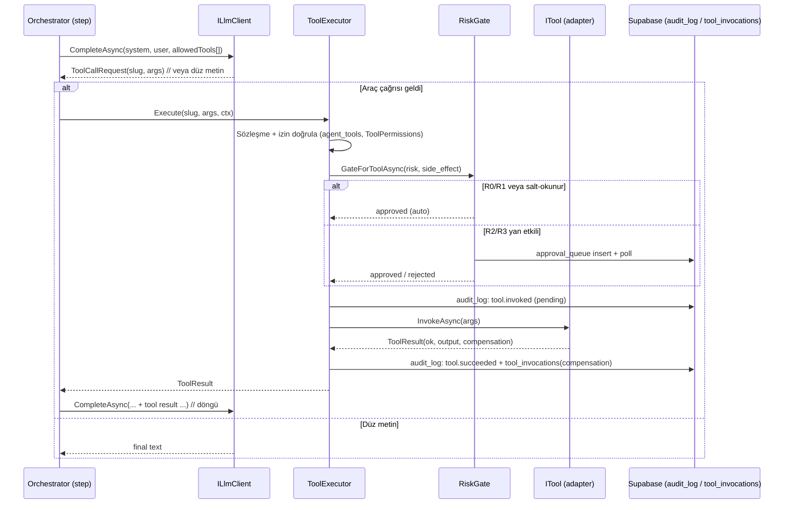

# Faz A — Tool Invocation: Teknik Tasarım

**Tarih:** 2026-05-27
**Repo:** `ai_agent`
**Bağlam:** [`operasyonel-ozerklik-yol-haritasi.md`](operasyonel-ozerklik-yol-haritasi.md) Faz A'nın somut tasarımı. Hedef: operatör ajanını "taslak üreten"den "gerçek sistemlerde geri-alınabilir eylem yapan"a taşımak — yani **OA0 → OA2 kapısını açmak**.

> Bu doküman mevcut kodun üstüne kurulur. Tasarımdaki her parça, repoda halihazırda var olan bir bileşene bağlanır; sıfırdan mimari önermez.

---

## 0. Kapsam (net sınırlar)

**Dahil (Faz A):**
- LLM'in adım içinde **araç çağırma talebi** üretebilmesi (function-calling).
- Bu talebi yürüten bir **`ToolExecutor`** ve araçları soyutlayan **`ITool`** modeli.
- Her aracın **sözleşmesi**: girdi/çıktı şeması + yan etki + risk + geri-alınabilirlik.
- Her çağrının **RiskGate**'ten geçmesi ve **audit_log**'a yazılması.
- İlk araç seti: **yalnızca salt-okunur veya geri-alınabilir** araçlar.

**Hariç (sonraki fazlar):**
- Kapalı döngü / sürekli operasyon (Faz C).
- Para, production deploy, müşteriye doğrudan giden e-posta gibi **geri-alınamaz R3** eylemler (Faz B sertleştikten sonra).
- OAuth2 gerektiren araçların gerçek bağlantısı (`email_send`, `calendar_write` seed'de var ama Faz A'da pasif kalır).

---

## 1. Bugünkü durum (kod gerçekleri)

Tasarımın dayandığı mevcut yapı taşları:

| Var olan | Dosya / migration | Faz A'daki rolü |
|---|---|---|
| `tools` + `agent_tools` tabloları | `0017_tool_registry.sql` | Araç kataloğu + ajan-araç erişimi (genişletilecek) |
| 8 seed araç | `0017` | Başlangıç kataloğu (slug, kategori, auth, `config_schema`) |
| `RiskGate.GateAsync(...)` | `Cli/RiskGate.cs` | R2/R3'te `approval_queue`'ya yazıp bekler (tool-call granülaritesine taşınacak) |
| `audit_log` + `append_audit_log()` RPC | `0014_audit_log.sql` | Immutable denetim; `tool.invoked` vb. buraya yazılır |
| `Orchestrator.RunAsync` adım döngüsü | `Runtime/Orchestrator.cs` | Tool-call döngüsü buraya enjekte edilir |
| `ILlmClient.CompleteAsync(system, user)` | `Llm/ILlmClient.cs` | Genişletilecek: tool tanımları + tool-call sonucu |
| `BuildPayload(input, tools, ...)` | `Llm/OpenAiResponsesClient.cs` | Zaten `tools` dizisi alıyor (şu an yalnız `web_search`) — custom function tool buraya eklenir |
| `Operator` ajanı (RiskCeiling R3) | `Agents/AgentsCatalog.cs` | Araç taşıyan birincil ajan |
| `TaskContract.ToolPermissions` (string) | `Runtime/TaskContract.cs` | Görev başına araç izin listesi |
| `RunContext` (`Db`, `OwnerId`, `RunId`, `AppendLogAsync`) | `Runtime/RunContext.cs` | Yürütme bağlamı + event log |

**Bugün eksik olan tek şey:** adımın LLM çıktısını metin olarak alıp bitirmesi — araç çağırıp sonucu geri besleyen bir döngü yok. `grep` ile `ToolExecutor / InvokeTool / ITool` repoda bulunmuyor.

---

## 2. Hedef akış



Özet: adım artık **bir LLM çağrısı değil, küçük bir döngü** — "düşün → araç iste → yürüt → sonucu gör → tekrar düşün → bitir". Döngü, `maxToolCalls` ile sınırlanır (sonsuz döngü koruması).

---

## 3. Bileşen tasarımı

### 3.1. Araç sözleşmesi (Tool Contract)

`tools` tablosu bugün `slug, name, category, auth_type, config_schema` içeriyor ama **yan etki / risk / geri-alınabilirlik** alanları yok. Bunlar yönetişimin temeli, ekleniyor (bkz. §5 migration):

```jsonc
// Araç sözleşmesi (mantıksal model)
{
  "slug": "file_store",
  "input_schema":  { /* JSON Schema draft-07 — args doğrulama */ },
  "output_schema": { /* JSON Schema — sonucu doğrulama */ },
  "side_effect":   "write",         // none | read | write | external
  "reversible":    true,            // geri alınabilir mi?
  "min_risk":      "R1",            // bu araç en az hangi risk seviyesi sayılır
  "compensation":  "delete_object"  // geri-alma eylemi (varsa)
}
```

İki invariant:
- `side_effect = none|read` → **her zaman otomatik geçer** (RiskGate'i meşgul etmez).
- `side_effect = write|external` ve `reversible = false` → **Faz A'da kullanılamaz** (yürütücü reddeder). Faz A'nın güvenlik sözü budur.

### 3.2. `ITool` ve `IToolExecutor`

```csharp
namespace AgentArmy.Cli;

public sealed record ToolResult(
    bool Ok,
    string Slug,
    JsonElement? Output,        // output_schema'ya uygun
    string? CompensationToken,  // geri-alma için (ör. silinecek obje id'si)
    string? Error
);

/// Tek bir aracın somut uygulaması (web_scrape, file_store, ...).
public interface ITool
{
    string Slug { get; }
    ToolDescriptor Descriptor { get; }       // sözleşme: schema + side_effect + reversible + min_risk
    Task<ToolResult> InvokeAsync(JsonElement args, RunContext ctx, CancellationToken ct);
}

/// Araç çağrılarını doğrulayan + kapıdan geçiren + loglayan tek giriş noktası.
public interface IToolExecutor
{
    /// Verilen ajanın bu adımda kullanabileceği araçların LLM-uyumlu tanımları.
    IReadOnlyList<ToolDescriptor> AvailableFor(Agent agent, TaskContract contract);

    /// Doğrula → izin → RiskGate → invoke → audit → ToolResult.
    Task<ToolResult> ExecuteAsync(string slug, JsonElement args, Agent agent, RunContext ctx, CancellationToken ct);
}
```

`ToolExecutor`'ın `ExecuteAsync` adımları (sıra önemli — hiçbiri atlanamaz):

1. **Çözümle:** `slug` kayıtlı bir `ITool` mü? Değilse `Ok=false`.
2. **İzin:** araç hem `agent_tools`'ta bu ajana açık, hem `contract.ToolPermissions` izin listesinde mi? (§8)
3. **Şema:** `args`, aracın `input_schema`'sına uyuyor mu? (JSON Schema doğrulama)
4. **Faz A güvenliği:** `side_effect ∈ {write,external}` ve `reversible=false` ise **reddet**.
5. **RiskGate:** etkin risk = `max(contract.Risk, tool.min_risk)`; yan etkiliyse `GateForToolAsync` çağır (§3.4).
6. **Audit (pending):** `tool.invoked` → `append_audit_log`.
7. **Invoke:** `tool.InvokeAsync(args, ctx, ct)`.
8. **Audit (sonuç):** `tool.succeeded`/`tool.failed` + `tool_invocations` satırına `compensation_token` yaz.

### 3.3. LLM tool-call döngüsü

`ILlmClient` bugün yalnız metin döndürüyor. Yeni, geriye-uyumlu bir overload ekleniyor:

```csharp
public sealed record ToolCall(string Slug, JsonElement Args, string CallId);

public sealed record LlmTurn(
    string? Text,                       // model düz cevap verdiyse
    IReadOnlyList<ToolCall> ToolCalls,  // model araç istediyse
    string Model, int TokensIn, int TokensOut
);

public interface ILlmClient
{
    // Mevcut imza korunur (geriye uyumluluk):
    Task<LlmResult> CompleteAsync(string systemPrompt, string userPrompt, CancellationToken ct);

    // Yeni: araç-farkında tur.
    Task<LlmTurn> CompleteWithToolsAsync(
        string systemPrompt, string userPrompt,
        IReadOnlyList<ToolDescriptor> tools,
        IReadOnlyList<ToolExchange> priorExchanges,  // önceki tool çağrı+sonuçları
        CancellationToken ct);
}
```

`OpenAiResponsesClient`'ta bu, mevcut `BuildPayload(input, tools, ...)`'a custom **function tool** tanımları eklemek ve yanıttaki `function_call` çıktılarını `ToolCall`'a parse etmekle olur — `web_search` için zaten kurulu olan tools mekanizmasının genişletilmesi. `FakeLlmClient` ise dry-run için sıralı, deterministik tool-call senaryoları döndürür (test için kritik).

**Orchestrator entegrasyonu:** adım döngüsünde, eğer `agent.Behaviors.CanUseTools` (yeni bayrak, §3.6) açıksa `CompleteAsync` yerine küçük bir while döngüsü:

```csharp
var exchanges = new List<ToolExchange>();
for (int i = 0; i < maxToolCalls; i++)
{
    var turn = await llm.CompleteWithToolsAsync(system, user, tools, exchanges, ct);
    if (turn.ToolCalls.Count == 0) { output = turn.Text ?? ""; break; }
    foreach (var call in turn.ToolCalls)
    {
        var res = await _toolExecutor.ExecuteAsync(call.Slug, call.Args, agent, ctx, ct);
        exchanges.Add(new ToolExchange(call, res));
        await ctx.AppendLogAsync(new { type = "tool_invoked", runId = ctx.RunId,
            step = step.Id, agent = agent.Id, slug = call.Slug, ok = res.Ok }, ct);
    }
}
```

### 3.4. RiskGate entegrasyonu (tool-call granülaritesi)

`RiskGate.GateAsync` bugün `runId/step` için yazıyor. Aynı altyapıyı tool-call için kullanan ince bir sarmalayıcı ekleniyor — **yeni onay mekanizması icat etmeden**:

```csharp
public static Task<GateOutcome> GateForToolAsync(
    SupabaseWriter? db, string risk, string runId, string agentId,
    string toolSlug, object args, CancellationToken ct)
    => GateAsync(db, risk, runId, agentId,
         actionSummary: $"tool:{toolSlug}",
         actionDetail: new { tool = toolSlug, args }, ct);
```

**Faz B köprüsü (önemli):** Mevcut `RiskGate`'te DB yoksa veya `RUN_OWNER_USER_ID` env yoksa **sessiz dev-mode bypass** var. Bu, yan etkili araçlar için **kabul edilemez**. Faz A'da kural: yan etkili bir araç için bypass tetiklenirse araç **çalıştırılmaz** (fail-closed), sadece uyarı verilip geçilmez. Bu, yol haritası Faz B'nin "her path'te enforce" sözünün ilk parçası.

### 3.5. Audit + geri-alma kaydı

Her yan etkili çağrı, sonucu ne olursa olsun `audit_log`'a (mevcut `append_audit_log` RPC ile) yazılır:

| action | ne zaman | severity |
|---|---|---|
| `tool.invoked` | yürütmeden hemen önce (pending) | info |
| `tool.succeeded` | başarıyla bitince | info |
| `tool.failed` | hata/şema ihlali | warn/error |
| `tool.blocked` | RiskGate reddetti / fail-closed | warn |
| `tool.compensated` | geri-alma uygulandı | info |

`SupabaseWriter`'a bir `CallRpcAsync("append_audit_log", ...)` metodu eklenir (worker service-role anahtarıyla çağırır). Geri-alma için her başarılı yan etkili çağrı, `tool_invocations` tablosuna `compensation_token` ile yazılır; böylece "bir önceki eylemi geri al" mümkün olur (Faz C'de döngü bunu kullanır).

### 3.6. Ajan bayrağı

`AgentBehaviors`'a tek bayrak: `CanUseTools` (varsayılan `false`). Yalnız `Operator` (ve ileride seçili persona overlay'leri) için `true`. Böylece araç yürütme, mevcut manifest-behavior desenine (`RequiresWebSearch` gibi) uyumlu kalır; `AgentBehaviorsOverlay`'e de tri-state `bool?` olarak eklenir.

---

## 4. İlk araç seti (Faz A — geri alınabilir / salt-okunur)

Seed'deki 8 araçtan Faz A'da **aktif edilecekler** (hepsi `none|read` veya geri-alınabilir `write`):

| slug | side_effect | reversible | Neden Faz A'ya uygun |
|---|---|---|---|
| `web_search` | read | — | Zaten çalışıyor; sözleşmeye bağlanır |
| `web_scrape` | read | — | Salt-okuma |
| `calendar_read` | read | — | Salt-okuma (OAuth gerekirse pasif) |
| `sql_query` | read | — | Salt-okunur SQL (`max_rows` zorunlu) |
| `file_store` | write | ✅ | Yazar ama `delete_object` ile geri alınır |
| `task_queue_add`* | write | ✅ | İç kuyruğa iş ekler; `remove` ile geri alınır |

*`task_queue_add` Faz A'da eklenen yeni bir iç araç (operatörün "kendine not/iş bırakması" — dış sisteme dokunmaz).

**Faz A'da KAPALI kalanlar:** `email_send`, `calendar_write`, `code_exec` (sandbox sertleşene kadar). Bunlar registry'de görünür ama yürütücü `min_risk`/`reversible` kuralıyla reddeder.

---

## 5. DB değişiklikleri — `0027_tool_invocation.sql`

```sql
-- 1) tools sözleşmesini genişlet
ALTER TABLE public.tools
  ADD COLUMN IF NOT EXISTS input_schema  JSONB   NOT NULL DEFAULT '{}',
  ADD COLUMN IF NOT EXISTS output_schema JSONB   NOT NULL DEFAULT '{}',
  ADD COLUMN IF NOT EXISTS side_effect   TEXT    NOT NULL DEFAULT 'none'
       CHECK (side_effect IN ('none','read','write','external')),
  ADD COLUMN IF NOT EXISTS reversible    BOOLEAN NOT NULL DEFAULT false,
  ADD COLUMN IF NOT EXISTS min_risk      TEXT    NOT NULL DEFAULT 'R1'
       CHECK (min_risk IN ('R0','R1','R2','R3')),
  ADD COLUMN IF NOT EXISTS compensation  TEXT;

-- 2) tool_invocations: her çağrının kalıcı kaydı + geri-alma anahtarı
CREATE TABLE IF NOT EXISTS public.tool_invocations (
  id                 UUID PRIMARY KEY DEFAULT gen_random_uuid(),
  owner_user_id      UUID NOT NULL,
  run_id             TEXT NOT NULL,
  step_id            TEXT,
  agent_id           TEXT,
  tool_slug          TEXT NOT NULL,
  args               JSONB,
  status             TEXT NOT NULL DEFAULT 'pending'
       CHECK (status IN ('pending','succeeded','failed','blocked','compensated')),
  risk_level         TEXT,
  side_effect        TEXT,
  output             JSONB,
  compensation_token TEXT,                 -- geri-alma için
  error              TEXT,
  approval_queue_id  UUID,                  -- RiskGate kaydına bağ
  created_at         TIMESTAMPTZ NOT NULL DEFAULT now()
);
CREATE INDEX IF NOT EXISTS idx_tool_inv_run   ON public.tool_invocations(run_id, created_at DESC);
CREATE INDEX IF NOT EXISTS idx_tool_inv_owner ON public.tool_invocations(owner_user_id, created_at DESC);

ALTER TABLE public.tool_invocations ENABLE ROW LEVEL SECURITY;
CREATE POLICY tool_inv_select_own ON public.tool_invocations
  FOR SELECT TO authenticated USING (owner_user_id = auth.uid());
GRANT SELECT ON public.tool_invocations TO authenticated;
GRANT INSERT, UPDATE ON public.tool_invocations TO service_role;

-- 3) seed araçların sözleşmelerini doldur (örnek)
UPDATE public.tools SET side_effect='read',  reversible=true,  min_risk='R0' WHERE slug IN ('web_search','web_scrape','calendar_read','sql_query');
UPDATE public.tools SET side_effect='write', reversible=true,  min_risk='R1', compensation='delete_object' WHERE slug='file_store';
UPDATE public.tools SET side_effect='external', reversible=false, min_risk='R3' WHERE slug IN ('email_send','calendar_write');
```

> Not: `SupabaseWriter` `Prefer: return=minimal` kullandığı için (RiskGate'te görüldüğü gibi) `tool_invocations` insert'lerinde **istemci tarafı UUID** üretilir.

---

## 6. Portal değişiklikleri

- **`ToolsPage.tsx`**: registry görünümüne `side_effect / reversible / min_risk` rozetleri ekle; her araç için "test invoke" (sadece read araçlarda) ve son çağrı durumu.
- **Yeni `ToolInvocationsPage`** (veya `RunDetailPage`'e sekme): `tool_invocations`'ı run bazında listele — slug, args, durum, geri-alma anahtarı. Bu, audit'in operatör-dostu yüzü.
- **`ApprovalQueuePage`**: zaten var; tool-call kaynaklı onaylar `action_summary = "tool:<slug>"` ile görünecek (ek iş gerekmez, sadece etiket netliği).

---

## 7. Görev sözleşmesi entegrasyonu

`TaskContract.ToolPermissions` bugün serbest metin (ör. `"contrarian:on"`). Faz A'da basit, ayrıştırılabilir bir gramer:

```
tools: web_search, web_scrape, file_store; max_calls: 6; contrarian: on
```

`ToolExecutor.AvailableFor` bu listeyi `agent_tools` (DB erişimi) ile **kesişim** alır — yani bir araç hem ajana açık hem görevde izinli olmalı. İzin = `agent_tools ∩ ToolPermissions`. İkisinden biri yoksa araç LLM'e hiç sunulmaz (en güvenli varsayılan: görünmez = çağrılamaz).

---

## 8. Güvenlik invariant'ları (değişmez kurallar)

1. **Kapı dışından eylem yok:** Hiçbir yan etkili çağrı `ToolExecutor` + `RiskGate` dışından geçemez. (Orchestrator LLM çıktısını asla doğrudan "uygulamaz".)
2. **Fail-closed:** RiskGate kararsızsa / DB yoksa, yan etkili araç **çalışmaz**.
3. **Geri-alınamaz = yasak (Faz A):** `reversible=false` yan etkili araç reddedilir.
4. **Görünmez = çağrılamaz:** izin matrisinde olmayan araç LLM'e sunulmaz.
5. **Her çağrı loglanır:** başarı/başarısızlık fark etmez, `audit_log` + `tool_invocations`.

---

## 9. Test ve dogfood planı

- **Birim:** `FakeLlmClient` ile deterministik tool-call senaryoları (araç iste → sonucu al → bitir); şema ihlali, izinsiz araç, geri-alınamaz araç red senaryoları.
- **Entegrasyon:** gerçek `web_scrape` + `file_store(draft)` ile uçtan uca bir adım — DB'de `tool_invocations` + `audit_log` satırları doğrulanır.
- **Dogfood (ilk gerçek değer):** market-intel brief akışında, Researcher'ın `web_scrape` ile bir kaynağı çekip `file_store` ile taslağı kaydetmesi. Tek operasyon, OA1→OA2 kanıtı.

---

## 10. Uygulama adımları (PR'lara bölünmüş)

| PR | İçerik | Biten tanımı |
|---|---|---|
| **PR1** | `0027` migration + `ToolDescriptor`/`ToolResult` modelleri | DB'de sözleşme alanları + `tool_invocations` var |
| **PR2** | `ITool` + `IToolExecutor` + 2 read aracı (`web_scrape`, `sql_query`) | Executor bir read aracını izin+şema doğrulayıp çalıştırıyor |
| **PR3** | `ILlmClient.CompleteWithToolsAsync` + `OpenAiResponsesClient` function-call + `FakeLlmClient` senaryoları | LLM araç isteyip sonucu görebiliyor (dry-run yeşil) |
| **PR4** | `Orchestrator` tool-call döngüsü + `CanUseTools` bayrağı (Operator) | Bir playbook adımı gerçek araç çağırabiliyor |
| **PR5** | `RiskGate.GateForToolAsync` + fail-closed + `append_audit_log` RPC | Yan etkili çağrı kapıdan geçiyor, loglanıyor |
| **PR6** | `file_store` (geri-alınabilir write) + `compensation_token` | Geri-alınabilir bir write ucu uçtan uca çalışıyor |
| **PR7** | Portal: ToolsPage rozetleri + ToolInvocations görünümü | Operatör çağrıları UI'dan izleyebiliyor |

**Tüm fazın "biten" tanımı:** Bir playbook adımı, izinli bir aracı RiskGate'ten geçirerek çağırıp sonucunu sonraki adıma besliyor; her çağrı `audit_log` + `tool_invocations`'ta; geri-alınamaz yan etkili araçlar reddediliyor. → **OA2 ulaşıldı, Faz C (kapalı döngü) başlayabilir.**

---

## 11. Açık kararlar (senin onayın gereken)

1. **`code_exec` Faz A'da mı?** Sandbox güvenliği ciddi iş; öneri: **hayır**, Faz A'da kapalı.
2. **Geri-alma otomatik mı, manuel mi?** Faz A'da öneri: `compensation_token` **kaydedilir ama otomatik geri-alma Faz C'de**. Faz A sadece "geri alınabilir olanı kullan".
3. **`ToolPermissions` gramerini** bu basit formatla mı bırakalım, yoksa baştan JSON mu yapalım? (Basit format hızlı; JSON daha ileri-uyumlu.)

İstersen bir sonraki adımda **PR1**'i (migration + modeller) doğrudan kodlayıp açabilirim.
