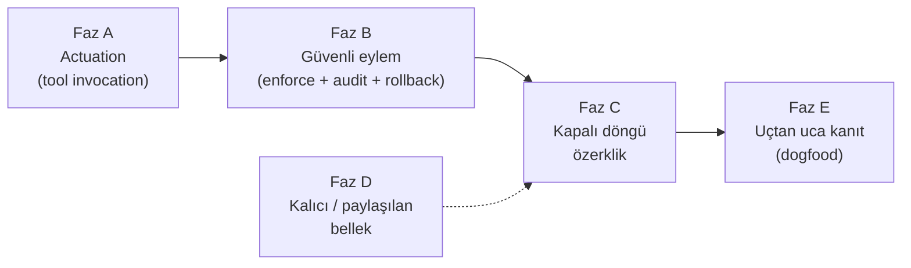

# 3. Basamaktan Operasyonel Özerkliğe Yol Haritası

**Tarih:** 2026-05-27
**Repo:** `ai_agent`
**Bağlam:** Bu doküman [`ai-ajan-ordusu-piramit.md`](ai-ajan-ordusu-piramit.md) (kavramsal model) ve [`proje-durumu-2026-05.md`](proje-durumu-2026-05.md) (teknik durum) ile birlikte okunmalıdır. Buradaki amaç tek soruya cevap vermek: **bugün sağlam bir 2–3. basamak olan bu sistem, bir operasyonu uçtan uca yürütecek hale nasıl gelir — ve 4. basamak (AGI) için aslında neye ihtiyaç var?**

---

## 0. Önce çerçeve: zekâ buradan gelmiyor

Tek cümlelik tez: **Zekânın kendisi temel modelden (LLM) gelir; bu repo onu üretmez, güvenli ve denetlenebilir biçimde *koşumlar*.** Bu yüzden bu repoya ne kadar kod eklenirse eklensin 3. basamak 4'e dönüşmez. Bu projenin kontrolündeki şey "daha zeki olmak" değil, **var olan zekâyı bir operasyona güvenle bağlamaktır**.

Bu ayrım tüm yol haritasının belkemiği:

- **3 → operasyonel özerklik**: tamamen mühendislik problemi. Ulaşılabilir, planı bu dokümanda.
- **operasyonel özerklik → 4 (AGI)**: çoğunlukla *temel model* problemi (sektör çapında açık araştırma) + bu projenin sağlayacağı *hazırlık katmanı*. Bkz. Bölüm 2.

---

## 1. "Operasyonel özerklik" ne demek? (Olgunluk merdiveni)

Bugün ne yapabildiğini ve nereye gitmek istediğimizi ortak bir dille konuşmak için risk modeline (R0–R3) paralel bir **Operasyonel Özerklik (OA)** merdiveni tanımlıyoruz:

| Seviye | Tanım | Sistem ne yapar | İnsan rolü | Bugünkü durum |
|---|---|---|---|---|
| **OA0** | Üretici | Araştırır, analiz eder, taslak/rapor üretir | Her şeyi uygular | ✅ Buradayız |
| **OA1** | Aksiyon önerici | Eylemi *hazır* eder (taslak e-posta, hazır PR, doldurulmuş form) | Onaylar + uygular | ⚠️ Kısmen |
| **OA2** | Eyleme geçen (gözetimli) | R0–R1 eylemleri *kendi* uygular; R2–R3 için onay bekler | Sadece riskli eylemde onay | ❌ Henüz yok |
| **OA3** | Kapalı döngü operatör | Sonucu gözler, düzeltir, çok adımlı işi sürdürür | Hedef + sınır koyar, istisnaları yönetir | ❌ Henüz yok |
| **OA4** | Operasyon sahibi | Sürekli çalışan bir operasyonu uçtan uca yürütür | Denetler, müdahale eder | ❌ (hedef) |

"Bir şirketi/operasyonu baştan sona yönetir" sorusunun cevabı **OA3–OA4**. Bugün **OA0**'dayız; iskelet OA1'e değiyor. Aradaki mesafe bu yol haritasının konusu.

---

## 2. Fazlı yol haritası

Sıralama tesadüf değil: **eyleme geçme (Faz A) ile güvenlik (Faz B) ayrılmaz** — sistemin gerçek dünyada iş yapabilmesi, ancak her eylemin enforce edilebildiği gün güvenlidir. Kapalı döngü (Faz C) bu ikisinin üstüne kurulur. Bellek (Faz D) paralel ilerleyebilir. Faz E baştan sona kanıttır.

### Faz A — Actuation: operatör artık *iş yapar*

**Sorun:** Operatör ajanı bugün sadece taslak üretebiliyor; gerçek sistemlerde eylem yok. Backlog `G1` (Tool invocation API/MCP ❌) ve portal `E9` (ToolsPage registry var, *invocation yok*, ~%10) bunu söylüyor. Bu, OA0'dan yukarı çıkmanın tek sert ön koşulu.

**Yapılacaklar (repo dokunuşları):**
- `src/AgentArmy.Cli` içine bir **ToolExecutor / tool-call runtime**: registry'deki bir aracı (HTTP API veya MCP) parametrelerle çağırıp sonucu `RunContext`'e yazan katman. Bugün böyle bir sınıf yok (`grep` ile `ToolExecutor/InvokeTool/McpClient` bulunmuyor).
- **Tool sözleşmesi**: her araç için `inputs / outputs / yan etki var mı / geri alınabilir mi / minimum risk seviyesi` şeması. Risk modeliyle bu noktada birleşir.
- Portal `ToolsPage`'i registry'den **invocation + sonuç/log görünümüne** taşımak (E9'u ⚠️'dan ✅'a).
- İlk araçlar **salt-okunur veya geri alınabilir** olsun (ör. dosya yazma, taslak oluşturma, kuyruğa ekleme) — para/production yok.

**Biten tanımı:** Bir playbook adımı, gerçek bir aracı çağırıp çıktısını sonraki adıma besleyebiliyor; her çağrı loglanıyor. → **OA1 tamam, OA2'nin kapısı açık.**

### Faz B — Güvenli eylem: her path'te enforce + audit + rollback

**Sorun:** Eyleme geçmeye başlar başlamaz yönetişim *opsiyonel* olamaz. Bugün `D6 RiskGate` tüm path'lerde değil (⚠️), `D7 audit` pack lifecycle eksik (~%40), geri-alma tasarlanmış ama kanıtlanmamış.

**Yapılacaklar:**
- `RiskGate`'i **tek zorunlu geçit** yapmak: hiçbir tool-call onun dışından geçemesin (CLI + worker + portal, tüm yollar).
- **Geri-alma (compensating action) kaydı**: yan etkili her eylem, "nasıl geri alınır" adımıyla birlikte loglanmadan tamamlanmış sayılmaz (piramit §1.3 "geri alınabilirlik").
- **Tam audit zinciri**: `tool.invoked`, `tool.failed`, `draft.created`, `pack.published` (backlog `G2`) → `audit_log`. Bir eylemin kim/neden/hangi onayla yapıldığı eksiksiz izlenebilir olsun.
- R2/R3 eylemlerde portal onay kuyruğu (`D4/D5` zaten ✅) **tool-call seviyesinde** devreye girsin, sadece run seviyesinde değil.

**Biten tanımı:** Sistem R0–R1 eylemleri otonom uygular, R2–R3'te durup onay ister, ve her eylemin geri-alma yolu kayıtlı. → **OA2 tamam.**

### Faz C — Kapalı döngü özerklik

**Sorun:** Gerçek operasyon süreklidir: gözle → karar ver → uygula → sonucu gözle → düzelt. Bugünkü model `request → run → output`: insan tetikli, açık döngü. CEO ajanı işi *parçalıyor* (✅ `CeoPlanner/CeoExecutor`) ama bir operasyonu *sürdürmüyor*.

**Yapılacaklar:**
- **Operasyon döngüsü (operating loop)**: bir hedefi alıp tetikleyici/zamanlayıcı ile periyodik koşan, sonucu değerlendirip bir sonraki adımı kendi planlayan üst-orkestrasyon. CeoExecutor'ın "tek atış" mantığının üstüne "izle-ve-devam et" katmanı.
- **Sonuç değerlendirme (observe)**: eylem çıktısını Verifier + rubric ile yargılayıp "başarılı / yeniden dene / eskale et" kararı üretmek (retry altyapısı `A7`'de kısmen var).
- **Eskalasyon politikası**: döngü tıkandığında / belirsizlikte insana ne zaman, hangi özetle gider.
- **Uzun-ufuk durum**: operasyon boyu ilerlemenin kalıcı tutulması (Faz D ile birleşir).

**Biten tanımı:** Bir hedef verildiğinde sistem insan tetiği olmadan çok adımlı bir işi sürdürür, takılırsa eskale eder. → **OA3 tamam.**

### Faz D — Kalıcı / paylaşılan bellek (domain'ler arası)

**Sorun:** `A13 FactsIndex/FactsStore` ağırlıkla market-intel'e bağlı (⚠️). Bir operasyonu sürdürmek, tek run'ı değil günlerce süren durumu taşımayı gerektirir.

**Yapılacaklar:**
- Facts/Decisions/Work üçlüsünü (piramit §9) **tüm domain pack'lere** genelleştirmek — market-intel'e özel olmaktan çıkarmak.
- **Operasyon-kapsamlı bellek**: bir hedefe bağlı, run'lar arası taşınan kalıcı durum (DB tablosu).
- Çelişen gerçeklerde **tazelik/öncelik** kuralı (memory stale olabilir; en yeni gözlem kazanır).

**Biten tanımı:** Aynı operasyonun farklı run'ları ortak, güncel bir gerçek tabanını paylaşır.

### Faz E — Uçtan uca kanıt (dogfood)

**Sorun:** Sector Discovery E2E ~%55 (`F` tablosu), dogfood (`G4` TÜBİTAK 1507, e-ticaret prod) 🧪. Mimari "çalışıyor" demek için tek bir gerçek operasyonun baştan sona yeşil olması gerekir.

**Yapılacaklar:**
- Bir (yalnız bir) dar operasyonu seç — ör. "haftalık market-intel brief'ini otonom üret + yayınla" veya "hibe taslağını hazırla + onaya gönder".
- Faz A–D'yi *o operasyonda* uçtan uca yeşile al; KPI'larla ölç (piramit §10: doğruluk, kaynak kapsaması, insan düzeltme oranı, geri dönüş süresi).
- Sonra ikinci operasyona genişlet.

**Biten tanımı:** En az bir gerçek operasyon, tanımlı KPI eşiklerinde, insan sadece denetleyerek uçtan uca dönüyor. → **OA4'ün ilk kanıtı.**

---

## 3. Öncelik özeti

| Sıra | Faz | Neden bu sırada | Kilitlediği OA seviyesi |
|---|---|---|---|
| 1 | A — Actuation | Bu olmadan diğer her şey akademik kalır | OA1 → OA2 kapısı |
| 2 | B — Güvenli eylem | Eyleme geçmek ancak enforce edilince güvenli | OA2 |
| 3 | C — Kapalı döngü | A+B üstüne kurulur | OA3 |
| 4 | D — Bellek | C ile paralel; uzun-ufuk için şart | OA3 destek |
| 5 | E — Dogfood | Hepsinin gerçek kanıtı | OA4 |

**Tek cümlelik tavsiye:** Genişliğe (daha çok persona/playbook) değil, **derinliğe** yatır — önce Faz A. Bugün eksik olan "kaç meslek" değil, "gerçekten iş yapabiliyor mu".

---

# Bölüm 2 — 4. Basamağa (AGI) Çıkmak: Ne Gerekir, Ne Gerekmez

> Uyarı: "AGI" tanımı sektörde tartışmalıdır; aşağıdaki çerçeve senin piramit modelindeki 4. basamak tanımına (genel amaçlı karar ve eylem) dayanır, kesin bir tahmin değil.

## 4.1. 4. basamak senin modelinde ne demek?

3. basamak: **önceden tanımlı** rollerle, playbook'larla, rubric'lerle çalışan çok-ajanlı ekip. 4. basamak ise bunların *kalkması*:

- **Genel transfer**: hiç playbook/persona/rubric yazılmamış, *yepyeni* bir alanda işi çözebilmek.
- **Otonom hedef oluşturma**: sadece verilen görevi parçalamak değil, üst hedeften alt hedefleri kendi türetmek.
- **Rubric'siz öz-düzeltme**: kalite ölçütünü insan yazmadan, sonuca bakıp kendi standardını kurmak.
- **Uzun-ufuk tutarlılık**: tek run değil, günler/haftalar süren bir bağlamı tutarlı taşımak.

## 4.2. 4. basamağa GÖTÜRMEYEN şeyler (yaygın yanılgılar)

Bunlar 3. basamağı *ölçeklemek*tir, 4'e *çıkmak* değil:

- ➖ **Daha çok persona / playbook eklemek.** Genişlik artar, genellik artmaz. 100 persona da olsa hepsi insan-yazımı şablona bağlıdır.
- ➖ **Daha çok orkestrasyon kodu / daha akıllı prompt.** Koşum takımını iyileştirir; atın hızını değil.
- ➖ **Daha büyük rubric kütüphanesi.** Öz-düzeltmeyi taklit eder, sağlamaz.

Bunlara yatırım yapmak yanlış değil — ama bunlar **OA0–OA4 yolculuğu (Bölüm 1)**, AGI yolculuğu değil. İkisini karıştırmamak kritik.

## 4.3. 4. basamağın asıl kaynağı: temel model (bu repo değil)

Yukarıdaki dört yetenek (genel transfer, otonom hedef, öz-düzeltme, uzun-ufuk) **temel modelin** yeteneğidir. Bunlar bugün sektör çapında **açık araştırma problemleridir** — Anthropic/OpenAI/DeepMind dahil kimsenin "çözdük" diyemediği konular:

- sağlam genelleme ve dağıtım-dışı (out-of-distribution) transfer,
- güvenilir uzun-ufuk planlama (adım sayısı arttıkça hata birikmemesi),
- gerçek öz-düzeltme (kendi hatasını dışarıdan ölçüt olmadan görmek),
- temellenmiş dünya modeli (gerçeğe bağlı, halüsinasyonsuz),
- ve hepsinin üstünde **hizalama** (yetenek arttıkça niyetten sapmama).

Senin repon bu yetenekleri *üretmez*. Daha genel bir model çıktığında onu **takabileceğin sokete** sahip olur.

## 4.4. Bu projenin kontrolündeki kısım: hazırlık (4. basamak soketi)

İşte senin tezinin (piramit §12.1) tam olarak doğru olduğu yer: 4–5. basamağa giden yolun anahtarı modelin zekâsından çok **omurgadır**. Daha zeki bir sistem, bu omurga olmadan sadece *daha hızlı hata yapar*. Bu projenin AGI için yapabileceği — ve yapması gereken — şey, model geldiğinde hazır olmaktır:

| Hazırlık katmanı | Neden 4. basamak için kritik | Repo'da bugün |
|---|---|---|
| **Hizalama / niyet** ("kimin yararına?") | Daha genel model = daha geniş hareket alanı; niyete bağlanmazsa tehlikeli | Görev sözleşmesi var; "intent" katmanı zayıf |
| **Denetlenebilirlik** ("neden böyle karar aldı?") | Otonom kararların izlenebilmesi | `audit_log` ⚠️ (~%40), kısmi |
| **Geri alınabilirlik** ("yanlışsa nasıl döner?") | Geniş yetkili ajanın güvenlik supabı | Tasarlandı, kanıtlanmadı (Faz B) |
| **Yönetişim** ("hangi sınırlar?") | Yetki arttıkça sınırın enforce edilmesi | `RiskGate` ⚠️ tüm path'te değil (Faz B) |

**Sonuç:** 4. basamak için bu repoda yapılacak "doğru" iş, AGI'yi *inşa etmek* değil — **Bölüm 1'deki Faz B'yi (enforce + audit + rollback) üretim sertliğine çıkarmak ve niyet/hizalama katmanını netleştirmektir.** Yani operasyonel özerklik yolculuğu ile AGI hazırlığı, B fazında *aynı işe* çıkar. Bu, kaynaklarını tek noktaya odaklayabileceğin anlamına gelir.

## 4.5. Net cevap

- **4. basamağa çıkmak için neye ihtiyaç var?** Bu repoda *değil*, temel modelde sıçrama (genel transfer + uzun-ufuk + öz-düzeltme + hizalama). Bunlar açık araştırma; takvimi senin elinde değil.
- **Peki sen ne yapabilirsin?** Soketi hazırlamak: denetlenebilirlik, geri alınabilirlik, yönetişim ve niyet katmanını sağlamlaştırmak — ki bu, zaten operasyonel özerklik için yapman gereken Faz B ile birebir örtüşüyor.
- **Ne yapmamalısın?** Daha çok persona/playbook ekleyerek "AGI'ye yaklaştığını" düşünmek. O, değerli ama farklı bir eksen (genişlik), AGI ekseni (genellik) değil.

---

## Sonraki adım

Bu yol haritasının ilk taşı **Faz A — Tool Invocation**. İstersen bir sonraki dokümanda onun somut teknik tasarımını çıkaralım: `ToolExecutor` arayüzü, araç sözleşmesi şeması, registry → execution akışı ve ilk (geri alınabilir) araç seti.
