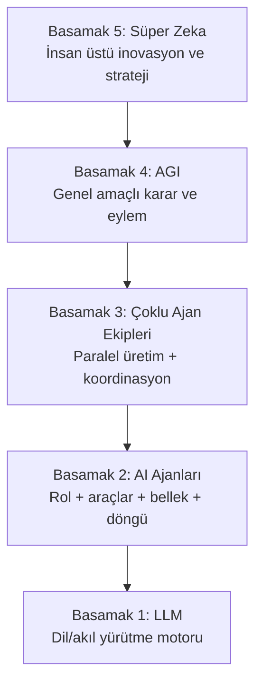

# Tam Otomasyon Planı + Sonnet Prompt Paketi

**Tarih:** 2026-06-11
**Hedef:** AgentArmy'yi "istek üzerine rapor üreten" sistemden, **süreçleri kendi izleyen, karar veren, gerektiğinde aksiyon alan kapalı döngü bir otomasyona** (OA3 → OA4) taşımak.

## Vizyon çapası: 5 basamaklı piramit

Bu plan, projenin nihai hedefi olan piramidin **3. basamağını tamamlayıp 4. basamağın soketini hazırlama** aşamasıdır:



Eşleme: S1–S2 bugün tamam (LLM motoru + araçlı/bellekli ajanlar). S3 büyük ölçüde var (bundle/CEO koordinasyonu); bu plandaki PR1–PR6 onu **kapalı döngü** ile tamamlar. S4–S5 temel model sıçraması gerektirir ve bu repoda *inşa edilmez* — ama PR1 (rollback), PR2 (guard hattı) ve PR5 (RiskGate kanıtı) tam olarak 4. basamağın soketidir: daha genel bir model çıktığında denetlenebilir, geri alınabilir, sınırlanabilir biçimde takılacağı omurga (bkz. `operasyonel-ozerklik-yol-haritasi.md` Bölüm 2). Bu doküman ileride bu piramit yapısına göre yeniden örgütlenecek.

---

## 1. Mevcut durum özeti (kod incelemesine dayalı)

Proje dokümanlardaki durumdan **daha ileride**. Bugün repoda fiilen çalışan parçalar:

| Katman | Durum | Kanıt |
|---|---|---|
| Tool invocation (Faz A) | ✅ Tamam | `ToolExecutor`, `ITool`, 7 araç (`stock_check`, `product_search`, `purchase_order`, `cargo_track`, `link_check`, `web_scrape`, `file_store`), function-calling döngüsü `Orchestrator.RunStepCompletionAsync` |
| Risk + onay | ✅ Çalışıyor | `RiskGate.GateForToolAsync`, `approval_queue`, `decide_approval` RPC, R3 `purchase_order` onaysız geçmiyor |
| Zamanlayıcılar | ✅ 5 cron workflow | `agent-worker` (15dk), `scheduler-tick`, `self-reflection` (gece 02:00), `stock-monitor` (15dk), `ci` |
| Tedarik otomasyonu | ✅ Uçtan uca (demo PO/kargo) | 8 adımlı playbook + `stockMonitorTick` + `TedarikReportPage` |
| Öz-yansıma | ✅ İskelet | `selfReflectionTick`: FAIL oranı > %40 playbook'lara CEO sinyali |
| DB şema | ✅ 36 migration | tool_invocations, sla_tracking, audit_log, persona_schedules vb. |

**OA seviyesi: OA2 (mühendislik olarak).** OA3–OA4'e giden boşluklar aşağıda.

### Kritik boşluklar (öncelik sırasıyla)

1. **Kapalı döngü yok.** Model hâlâ `request → run → output`. Scheduler tetikliyor ama sonucu **gözleyip bir sonraki adıma kendisi karar veren** bir "operasyon döngüsü" yok. `selfReflectionTick` bunun embriyosu ama yalnız playbook kalitesine bakıyor, operasyon hedefine değil.
2. **Rollback tetiklenmiyor.** `compensation_token` kaydediliyor ama hiçbir kod onu çalıştırmıyor. Başarısız/reddedilen eylem geri alınmıyor.
3. **Verifier FAIL aksiyonu durdurmuyor.** Tedarik akışında link_check FAIL olsa bile satın alma adımına ilerleniyor (bilgilendirici). Otonom sistemde bu kabul edilemez.
4. **Eskalasyon/bildirim kanalı yok.** Onay kuyruğunda iş bekliyor ama kimseye e-posta/Slack/push gitmiyor; insan portala bakmazsa döngü süresiz tıkanıyor.
5. **RiskGate her path'te kanıtlanmadı.** Worker, CLI, CEO-executor yolları için tek zorunlu geçit testi yok.
6. **Bellek market-intel'e sıkışık.** Operasyonlar arası kalıcı durum (`operation state`) tablosu yok; her run sıfırdan başlıyor.
7. **Worker gecikmesi 15 dk** (GitHub Actions cron). Gerçek operasyon için kabul edilebilir ama onay sonrası devam etme akışında 15 dk × adım sayısı kadar bekleme birikiyor.
8. **Bütçe/limit yok.** Otonom satın alma için harcama tavanı, günlük araç çağrısı limiti, anomali kesicisi (circuit breaker) tanımsız.

> Güvenlik notu: `agentarmy.local.json` gitignore'da (✅) ama içinde canlı OpenAI key + Supabase service-role key var. `.mcp.json`'daki `21st_sk_...` API anahtarı ise **repoda commit'li** — onu döndürüp (rotate) env'e taşı.

---

## 2. Hedef mimari: Operasyon Döngüsü (Operating Loop)

Tek cümle: bugünkü "iş kuyruğu"nun üstüne, **hedef-sahibi bir döngü** ekleniyor.

```
operations (yeni tablo: hedef + sınırlar + durum)
   │
   ▼ her tick (5 dk)
OperationLoop ──► observe (son run/araç sonuçları + Verifier)
   │              decide  (LLM: devam / yeniden dene / eskale / bitti)
   │              act     (run_requests insert VEYA araç çağrısı VEYA eskalasyon)
   ▼
run_requests → mevcut worker → Orchestrator → ToolExecutor → RiskGate
   │                                              │
   ▼                                              ▼
operation_events (her gözlem/karar loglanır)   approval_queue + bildirim
```

Mevcut hiçbir bileşen atılmıyor; `CeoExecutor`'ın "tek atış" mantığının üstüne "izle-ve-devam-et" katmanı geliyor (operasyonel-ozerklik dokümanındaki Faz C'nin somutlaması).

---

## 3. Uygulama planı — 6 PR, sıralı

Her PR bağımsız merge edilebilir; her birinin "biten tanımı" var. Sıra önemli: önce güvenlik kilitleri (PR1–2), sonra döngü (PR3–4), sonra kanıt (PR5–6).

| PR | Başlık | Kapsam | Biten tanımı |
|---|---|---|---|
| **PR1** ✅ | Rollback runtime | `compensation_token`'ı çalıştıran `CompensationExecutor`; reddedilen/başarısız R1+ eylemlerde otomatik tetik; `tool.compensated` audit kaydı | Reddedilen bir `file_store` yazımı otomatik siliniyor, audit'te görünüyor |
| **PR2** ✅ | Guard hattı: Verifier-blok + bütçe + bildirim **+ PR1 devirleri** | (a) Playbook adımına `blockOnVerifierFail: true` (Verifier-FAIL'de compensation da buna bağlanır); (b) `operation_budgets` tablosu + `RiskGate`'te harcama/çağrı tavanı kontrolü; (c) onay kuyruğuna düşen her kayıt için e-posta/Slack webhook bildirimi; (d) PR1 devri: invocation id'nin `ToolResult`/`ToolExchange`'e taşınması — in-flight compensation DB'yi de patch'lesin (çift geri-alma riski); (e) CLI compensation'da `status='compensated'` güncellemesi | FAIL'li linkle satın alma bloklanıyor; bütçe aşan PO reddediliyor; onaya düşünce bildirim gidiyor; in-flight compensate edilen kayıt CLI'dan ikinci kez compensate edilemiyor |
| **PR3** ✅ | `operations` şeması + OperationLoop tick | `operations`, `operation_events` tabloları; `operationLoopTick.ts` (observe→decide→act); karar LLM'i için dar JSON sözleşmesi (`continue / retry / escalate / done`); max-adım ve cooldown koruması | Bir hedef verilen operasyon, insan tetiği olmadan 2+ run'ı ardışık yürütüyor, takılınca eskale ediyor |
| **PR4** ✅ | Operasyon belleği | `operation_memory` (facts/decisions/work, operasyon kapsamlı); `FactsStore`'un domain-pack bağımsızlaştırılması; tazelik kuralı (en yeni gözlem kazanır); Orchestrator prompt'una operasyon belleği enjeksiyonu | Aynı operasyonun 2. run'ı, 1. run'ın kararlarını prompt'ta görüyor |
| **PR5** ✅ | RiskGate tek-geçit kanıtı + portal Operations UI | Tüm tool-call path'lerinde RiskGate zorunluluğunu doğrulayan entegrasyon testleri; `OperationsPage` (hedef tanımla, durum izle, duraklat/devam, event timeline) | Test yeşil; portaldan operasyon açılıp canlı izlenebiliyor |
| **PR6** ✅ | Dogfood: tedarik operasyonu kapalı döngü | Tedarik akışını `operations` üstünden uçtan uca koştur: stok düşer → döngü açılır → araştırma → onay (bildirimli) → PO → kargo takibi **döngü tarafından** sorgulanır → teslimde stok güncellenir → operasyon `done`. KPI: insan dokunuşu sayısı, döngü süresi, hata oranı | Tek insan dokunuşu = PO onayı; geri kalanı otonom; KPI raporu `docs/`a yazıldı |

Tahmini sıra maliyeti: PR1–2 küçük (1–2 oturum), PR3 en büyüğü, PR4–5 orta, PR6 ağırlıkla test/ayar.

### PR1 — Tamamlandı (2026-06-11)

Teslim edilenler: `ICompensable` + `CompensationResult` (`ITool.cs`); `FileStoreTool` (idempotent dosya silme) ve `PurchaseOrderTool` (JSON token `{order_id, product, quantity}` + `adjust_stock(-qty)`) implementasyonları; `CompensationExecutor` iki yol (CLI DB-from + Orchestrator in-memory); `SupabaseWriter.PatchAsync`; Orchestrator'da yalnız exception/abort tetiklemesi (Verifier-FAIL bilinçli olarak PR2'ye ertelendi); `compensate --invocationId` CLI komutu; `20260611100000_compensation_columns.sql` (compensated_at + compensation_status + partial index); 11 birim test (null-DB toleranslı).

PR2'ye devreden bilinen boşluklar:

1. **Çift geri-alma riski:** in-memory yol (`CompensateExchangesAsync`) `tool_invocations` satırını güncellemiyor (id `ToolExchange`'de yok) → aynı kayıt sonradan CLI'dan tekrar compensate edilebilir; `adjust_stock(-qty)` ikinci kez çalışırsa stok bozulur. Çözüm PR2 (d).
2. CLI yolu `status='compensated'` set etmiyor; portalda geri alınmış kayıt "succeeded" görünür. Çözüm PR2 (e).
3. PO compensation'da token'da product/qty eksikse stok geri alınmadan `Success` dönüyor — mesaja uyarı eklenmeli.

### PR2 — Tamamlandı (2026-06-11)

Teslim edilenler: `blockOnVerifierFail` step bayrağı (JSONB veri migration'ı `20260611110000` + `PlaybookStep` alanı + Orchestrator bloğu, `step.blocked_by_verifier` audit); `operation_budgets` + atomik `consume_budget` RPC (rollover + spent/calls artışı tek transaction, `20260611120000`) + `BudgetChecker` + ToolExecutor'da RiskGate öncesi bütçe kilidi (`budget.exceeded` audit); `notification_channels` (`20260611130000`) + `NotificationDispatcher` (Slack webhook + Resend; target log'a yazılmaz) + RiskGate insert sonrası bildirim + portal `NotificationChannelsPage`; PR1 devirleri kapatıldı (istemci-taraflı `InvocationId` → in-flight DB patch, CLI'da `status='compensated'`, PO uyarı mesajı).

Sonraki PR'lara devreden notlar:

1. In-flight compensation `status='compensated'` set etmiyor (çift geri-alma yine engelli; portalde kozmetik tutarsızlık).
2. `consume_budget`'ta `FOR UPDATE` yok — PR3 operasyon döngüsü paralellik getirince RPC'ye satır kilidi eklenmeli.
3. Bütçe niyet anında tüketiliyor (onay/invoke öncesi) — bilinçli muhafazakâr tercih; reddedilen PO da bütçe yer.
4. `BudgetChecker` RPC hatasında fail-open — ileride `amount > 0` iken fail-closed yapılmalı.
5. Run-seviyesi R2 onay bildirimleri (worker / `gate_run_for_approval`) kapsam dışı kaldı — PR3'te eklenecek.

> PR2 devir durumu: 1 (in-flight status) ✅ PR3'te kapandı · 2 (FOR UPDATE) ✅ PR3'te kapandı (`20260611141000`) · 5 (worker bildirimi) ✅ PR3'te kapandı (`notifyChannels.ts`) · 3 (niyet anında bütçe) ve 4 (fail-open) bilinçli tercih olarak açık.

### PR3 — Tamamlandı (2026-06-11)

Teslim edilenler: `operations` + `operation_events` tabloları + `run_requests.operation_id` (`20260611140000`); `operationLoopTick.ts` (observe→decide→act; optimistic claim NULL/değer ayrımlı, max_steps kod kontrolü, ard arda 3 başarısız → escalate, `wait_approval` 24h timeout → escalate, strict JSON parse başarısız → escalate); decide prompt'u ayrı modülde (`prompts/operationDecide.ts`); paylaşılan `notifyChannels.ts` (Slack + Resend, target loglanmaz) — escalate + worker R2 onayı buradan bildirir; `operation-loop.yml` (5 dk cron); `POST/GET /api/operations` + `/api/operations/:id/events` (owner auth token'dan, 42ca135 deseni); PR2 devirleri: `consume_budget`'a `FOR UPDATE` (`20260611141000`), in-flight compensation'a `status='compensated'`.

Review'da yakalanıp kapatılan buglar: (1) `verifier_outcome` `run_events`'ten değil `runs`'tan okunur — `result_json.run_id → runs.external_id` zinciri kuruldu; (2) decide model varsayılanı `claude-sonnet-4-6` → `gpt-4.1` (OpenAI endpoint'inde 404 → tick çöküyordu); (3) CLI araç-seviyesi onayları döngüye görünmüyordu — `RUN_REQUEST_ID` env → `RiskGate` → `approval_queue.run_request_id`.

PR4+/sonrası devirler:

1. observe'daki `.or()` fallback'inde `step_name = lastRun.id` koşulu ölü kod (step_name CLI run id taşır, run_request UUID değil) — temizlenebilir.
2. Bütçe niyet anında tüketiliyor + `BudgetChecker` fail-open (PR2 not 3–4) hâlâ açık.
3. Portal `OperationsPage` (izleme/duraklat UI) PR5'te — API hazır, UI yok.
4. Decide LLM'i Chat Completions endpoint'i kullanıyor; CLI Responses API kullanıyor — bilinçli ayrım, sorun değil.

### PR4 — Tamamlandı (2026-06-11)

Teslim edilenler: `operation_memory` tablosu (`20260611150000`, RLS `operation_events` deseni, aktif-kayıt + dedup indeksleri); `OperationMemoryStore` (FK-güvenli sıra: istemci id → INSERT → eskiye PATCH `superseded_by`; `ComputeTopicKey` SHA256 kind+ilk-120; null-DB no-op); `RunContext.OperationId` (`RUN_OPERATION_ID` env, OwnerId deseni); `PromptBuilder`'a `operationMemory` parametresi (sistem prompt'u, her adımda görünür); Orchestrator run başında max 30 aktif kaydı yükler + run sonunda fact/decision/work üçlüsünü yazar; Runner'da market-intel kilidi kaldırıldı — operasyona bağlı run'larda facts her zaman açık, bağımsız run'larda eski davranış (maliyet kontrollü); worker `RUN_OPERATION_ID` geçiriyor. 23/23 test yeşil.

Bilinen sınırlar / devirler:

1. `topic_key` dedup'ı yalnız aynı-önekli (ilk 120 karakter) içeriği süpersede eder; farklı ifade edilmiş çelişen fact'ler ayrı kayıt kalır — PR6 dogfood'da sorun çıkarırsa anlamsal dedup eklenir.
2. DB'li supersede/limit senaryoları birim test kapsamı dışında (SupabaseWriter HttpClient sabit) — duman testiyle doğrulanır.

### PR5 — Tamamlandı (2026-06-11)

Teslim edilenler — Görev A: `IRiskGate` + `RiskGateAdapter` (static RiskGate'e delege) ve `IBudgetChecker` + adapter; `ToolExecutor` ctor'una opsiyonel enjeksiyon (geriye uyumlu); bütçe guard'ı (`ctx.Db/OwnerId null` kontrolü) kaldırıldı — enjekte edilen checker koşulsuz çağrılır, null toleransı adapter içinde; `ToolExecutorTests` 5 senaryo: gate reddi → blocked, R0 read gate'siz geçer, geri-alınamaz write Faz A bloğu, bütçe aşımı gate'ten önce blok, null-DB + R2 bypass → fail-closed. Görev B: `OperationsPage` (durum rozetli liste, renk kodlu event timeline, lazy event yükleme, 10 sn polling, duraklat/devam/sonlandır, yeni operasyon formu) + route + nav. Ayrıca PR3 devir 1 kapandı: `.or()` ölü fallback'i temizlendi.

Review'da yakalanıp kapatılan buglar: (1) bütçe guard'ı null-DB testinde checker'ı atlıyordu — guard kaldırıldı; (2) `NewOpForm` insert'i `owner_user_id` göndermiyordu (NOT NULL + RLS WITH CHECK ihlali) — `auth.getUser()` + `owner_user_id: user.id` eklendi.

> RiskGate tek-geçit kanıtı tamam: üç yürütme yolu (CLI run, worker, ceo-executor) tek `IToolExecutor` pipeline'ından geçiyor ve bypass fail-closed testle doğrulandı. Faz B'nin "enforce" ayağı ve 4. basamak soketinin yönetişim katmanı bu PR ile kapandı.

### PR6 — Tamamlandı (2026-06-11)

Teslim edilenler: `operations.context_json` + çift tetik koruması; `stockMonitorTick` artık run_request değil **operasyon** açıyor; tedarik akışı üç alt-playbook'a bölündü ve DB'ye seed edildi (`tedarik-arastirma` 5 adım, `tedarik-siparis` Verifier re-check + PO `blockOnVerifierFail:true` — PR2 kilidi bölünmede korundu, `tedarik-kargo` cargo_track → stock_replenish → özet); decide prompt'una tedarik faz kuralları + DB'den çekilen gerçek slug listesi ("yalnız bu slug'lar" kısıtı); yeni `StockReplenishTool` (write/R1/reversible/ICompensable — stok artışı sipariş anından teslim anına taşındı, yönetişim hattının içinden); PO compensation'dan `adjust_stock(-qty)` kaldırıldı (tutarlılık); `CargoTrackTool` Unix-gömülü tracking + zamana dayalı durum makinesi + `CARGO_DEMO_SCALE` env (duman testi ~2 dk); `kpi_summary` event (CHECK genişletildi) + `computeKpiSummary` + `scripts/export-kpi.ts` → `docs/dogfood-tedarik-kpi.md`; `docs/tedarik-otomasyonu.md` güncellendi.

Review'da yakalanıp kapatılan buglar: (1) playbook seed'i var olmayan kolonlara insert ediyordu (`title/domain_pack/steps_json` → gerçek şema `name/pack_id/steps`); (2) step JSON'u `{step,name,persona,instructions}` formatındaydı — `PlaybookStep` kontratı `{id,agent,goal,output}`'a çevrildi; (3) PO'daki Verifier kilidi playbook bölünmesinde sessizce düşüyordu — `tedarik-siparis`'e re-verify adımı eklendi; (4) `stock_replenish` kategorisi `'inventory'` CHECK'e takıldı → `'commerce'`; (5) ilk tasarımda cargo_track (read aracı) içine `adjust_stock` gömülüyordu — yönetişim ihlali, ayrı write aracına taşındı.

**Kalan kabul adımı (kod değil, operasyon):** canlı uçtan uca dogfood — stok eşiği düşür → operasyon açılır → araştırma → PO onayı (tek insan dokunuşu) → kargo → teslim → stok artar → `done` + `kpi_summary` → `export-kpi.ts` ile KPI satırı. `CARGO_DEMO_SCALE=60` ile ~30 dk'da koşulabilir. Bu koşu yeşil olana kadar OA3 "mühendislik olarak tamam, operasyonda kanıtlanmadı" statüsünde.

---

## Seri durumu (2026-06-11): PR1–PR6 tamamlandı

Piramit eşlemesi: S3 (çoklu ajan ekipleri) kapalı döngü ile **mühendislik olarak tamamlandı**; Faz A–D yerinde, Faz E (dogfood kanıtı) canlı koşu bekliyor. 4. basamak soketi (denetim + geri alma + sınır + tek-geçit) PR1/PR2/PR5 ile kuruldu. Açık kalan bilinçli tercihler: bütçe niyet anında tüketimi, `BudgetChecker` fail-open, topic_key önek dedup'ı.

---

## İkinci seri: DB-first tamamlama + operasyon UX (PR7–PR8)

PR6 sonrası taramada tespit edilen boşluklar: politika eşikleri kodda sabit (RiskGate 4h/15s, wait_approval 24h, self-reflection %40/5 run/24h, bellek limiti 30, kargo eşikleri); `operation_budgets` için UI yok (bütçe yalnız SQL'le tanımlanabiliyor); decide prompt'u dosyada; `tools.enabled` bayrağı executor'da okunmuyor (DB'den araç kapatılamıyor).

| PR | Başlık | Biten tanımı |
|---|---|---|
| **PR7** ✅ | DB-first tamamlama: policy_settings + BudgetsPage + tools.enabled | Eşikler portaldan değişiyor (deploy'suz); bütçe UI'dan tanımlanıp doluluk göstergesiyle izleniyor; DB'de disable edilen araç executor'da reddediliyor |
| **PR8** ✅ | Operasyon UX paketi | Operasyon kapanış KPI kartı, escalated'dan "düzelt ve devam et", bekleyen onaya tek tık + nav rozeti, pack seçici + bütçe bağlama, bildirim test butonu, compensation rozetleri |

### PR7 prompt'u — policy_settings + BudgetsPage + tools.enabled

```
Repo: ai_agent. Bağlam: docs/otomasyon-plani-ve-sonnet-promptlari.md (İkinci seri bölümü),
src/AgentArmy.Cli/Cli/RiskGate.cs (MaxWait/PollInterval sabitleri),
portal/api/lib/operationLoopTick.ts (24h timeout), portal/api/lib/selfReflectionTick.ts
(FAIL_RATE_THRESHOLD/MIN_RUNS/COOLDOWN_HOURS), src/AgentArmy.Cli/Runtime/Orchestrator.cs
(MaxOperationMemory), src/AgentArmy.Cli/Tools/CargoTrackTool.cs (durum eşikleri),
src/AgentArmy.Cli/Tools/ToolExecutor.cs (CreateDefault), portal/src/pages/NotificationChannelsPage.tsx
(CRUD sayfa deseni).

KURAL: Migration yazmadan önce hedef tablonun gerçek kolonlarını ve CHECK kısıtlarını
mevcut migration dosyalarından doğrula; kolon/değer uydurma (PR6'da iki kez yaşandı).

Görev 1 — policy_settings:
1. Migration: policy_settings(id, owner_user_id UUID NULL — NULL=global varsayılan,
   key TEXT, value JSONB, description TEXT, updated_at). UNIQUE(owner_user_id, key).
   RLS: owner kendi satırlarını + global (owner_user_id IS NULL) satırları SELECT eder;
   kendi satırlarını INSERT/UPDATE eder; service_role tam.
   Seed (global): riskgate.max_wait_hours=4, riskgate.poll_seconds=15,
   oploop.wait_approval_timeout_hours=24, selfreflect.fail_rate=0.4,
   selfreflect.min_runs=5, selfreflect.cooldown_hours=24, memory.max_entries=30,
   cargo.stage_minutes=[10,25,45,70,100].
2. C# PolicyReader (Infra/): SelectAsync ile owner→global fallback okuma, 5 dk in-memory
   cache, DB yoksa koddaki mevcut sabit. RiskGate, Orchestrator, CargoTrackTool bunu kullanır.
3. TS policyReader.ts (portal/api/lib/): aynı fallback mantığı; operationLoopTick ve
   selfReflectionTick sabitleri buradan okur.
4. Portal: Ayarlar > Politikalar sayfası — global varsayılanlar salt-okunur gösterilir,
   kullanıcı kendi override'ını ekler/siler (NotificationChannelsPage CRUD deseni).

Görev 2 — BudgetsPage:
1. portal/src/pages/BudgetsPage.tsx: operation_budgets CRUD — scope (tools tablosundan
   slug seçici + 'global'), period, max_amount, max_tool_calls. Dönem içi doluluk:
   spent_amount/max_amount ve used_calls/max_tool_calls progress bar'ları, %80 üstü sarı,
   %100 kırmızı. Auth deseni: insert'te owner_user_id = auth.uid() (OperationsPage deseni).
2. Nav + route ekle.

Görev 3 — tools.enabled enforcement:
1. tools tablosunda enabled kolonu varsa kullan, yoksa migration ile ekle (default true).
2. ToolExecutor: çözümleme adımında DB'den (ctx.Db varsa) aracın enabled durumunu kontrol et;
   disabled ise ToolResult.Failure + ToolInvocationStatus.Blocked + audit "tool.disabled".
   DB yoksa mevcut davranış (kod listesi). Performans: run başına tek SELECT ile tüm
   slug→enabled haritasını çek, RunContext'te cache'le.
3. ToolsPage'e enable/disable toggle ekle.

Önce kısa uygulama planı yaz, onaydan sonra koda geç.
Bitti kriteri: dotnet build + test yeşil; npm run build yeşil; portaldan
riskgate.max_wait_hours=1 yapınca CLI RiskGate 1 saat bekliyor (log'dan doğrula);
BudgetsPage'den bütçe tanımlanıp progress görünüyor; ToolsPage'den kapatılan araç
çağrıldığında Blocked dönüyor ve audit'te tool.disabled var.
```

### PR7 — Tamamlandı (2026-06-11)

Teslim edilenler: `policy_settings` (`20260611170000`, çift partial-unique index ile NULL semantiği doğru, 8 global seed); `PolicyReader.cs` + `policyReader.ts` (owner→global→kod sabiti zinciri, 5 dk cache, parse hatasında sessiz fallback); tüketiciler: RiskGate (MaxWait/Poll + doğrulama logu), Orchestrator (bellek limiti), CargoTrackTool (kargo eşikleri), operationLoopTick (24h timeout), selfReflectionTick (3 eşik); `BudgetsPage` (progress bar'lı CRUD); `PoliciesPage` (global salt-okunur + tipli override CRUD); `tools.enabled` enforcement — Runner tenant filtreli tek SELECT (platform→tenant öncelik), ToolExecutor'da Blocked + `tool.disabled` audit. 28/28 test.

PR8'e zorunlu devir: ToolsPage toggle'ı platform satırını (tenant_id NULL) doğrudan güncelliyor ve `tools_update` RLS'i buna izin veriyor — bir kullanıcı platform aracını **tüm tenant'lar için** kapatabilir. PR8 madde 7'de RLS daraltma + tenant override upsert ile kapatılacak. Tek kullanıcılı kurulumda acil risk değil.

### PR8 — Tamamlandı (2026-06-11)

Teslim edilenler: KPI kapanış kartı (`kpi_summary` → süre/tick/insan/hata grid'i) + escalated'dan "Düzelt ve devam et" (`resumed_by_user` event'iyle); bekleyen onay rozeti (`run_requests.operation_id` bağıyla toplu sorgu) → `?highlight=` ile ApprovalQueue'da sarı border + scroll; AppShell nav rozeti (60 sn polling); NewOpForm'da domain_packs seçici + `context_json.budget_scope` bütçe bağlama; `POST /api/notifications/test` Express route'u (owner token'dan) + "Test Gönder" butonu; compensation rozetleri (plandaki RunDetailPage yerine ToolsPage'in mevcut "son araç çağrıları" görünümüne — doğru yer); PR7 devri kapandı: `tools_update` RLS daraltıldı + `tool_overrides` tablosu (review önerisi (b) yaklaşımı — `tools.slug` global UNIQUE olduğundan tenant satırı klonlamak yerine ayrı override tablosu) + Runner iki adımlı map yüklemesi (override kazanır) + ToolsPage "kişisel ayar" rozeti ve sıfırlama. 28/28 test.

Review'da yakalanan kritik: ilk planda tenant override'ı `tools`'a `ON CONFLICT (slug, tenant_id)` upsert'iyle yazılacaktı — `tools.slug` global UNIQUE (0017:11) olduğu için bu yaklaşım patlardı; `tool_overrides` tablosuna çevrildi. Ayrıca test endpoint'i Vercel serverless olarak planlanmıştı — mevcut Express route desenine (app.ts) düzeltildi.

---

## İkinci seri durumu (2026-06-11): PR7–PR8 tamamlandı

DB-first ilkesi kapandı: politika eşikleri, bütçeler, araç aktivasyonu (kişisel override dahil) artık portaldan yönetiliyor; kodda yalnız fallback sabitleri var. Kalan tek büyük iş **canlı dogfood koşusu** (Faz E / OA3 kanıtı): stok eşiği düşür → operasyon → araştırma → PO onayı (tek insan dokunuşu) → kargo → teslim → stok artışı → done + KPI. `CARGO_DEMO_SCALE=60` ile ~30 dk.

### PR8 prompt'u — Operasyon UX paketi

```
Repo: ai_agent. Bağlam: portal/src/pages/OperationsPage.tsx, ApprovalQueuePage.tsx,
RunDetailPage.tsx, AppShell.tsx, NotificationChannelsPage.tsx, PlaybookUpsertPage.tsx
(domain_pack seçici deseni), portal/api/lib/notifyChannels.ts, scripts/export-kpi.ts
(KPI alanları).

Görev — altı UX iyileştirmesi:
1. Operasyon kapanış kartı: status=done operasyonun detay panelinde kpi_summary event'i
   varsa kart göster: toplam süre, tick sayısı, insan dokunuşu, hata sayısı, koşulan
   playbook'lar. escalated ise escalation_reason + "Düzelt ve devam et" butonu:
   tıklanınca status='active', escalation_reason=null, step_count korunur; operation_events'e
   kind='act', payload={action:'resumed_by_user'} yazılır.
2. Bekleyen onay entegrasyonu: OperationsPage satırında bekleyen onay sayısı rozeti
   (approval_queue, operasyonun run'larına bağlı, status=pending). Tıklayınca
   ApprovalQueuePage'e query param ile gidip ilgili kaydı highlight eder.
3. Nav rozeti: AppShell'de Onay Kuyruğu nav öğesine toplam pending sayısı (60 sn polling,
   0 ise gizli).
4. Yeni operasyon formu: domain_pack serbest metin yerine domain_packs tablosundan seçici;
   opsiyonel "bütçe bağla" dropdown'u (operation_budgets'tan scope listesi — bilgilendirme
   amaçlı, context_json.budget_scope'a yazılır).
5. Bildirim test butonu: NotificationChannelsPage'de her kanal satırına "Test gönder" —
   notifyChannels'ı tek kanala test mesajıyla çağıran küçük API endpoint'i
   (POST /api/notifications/test, auth token'dan owner; owner_user_id body'den ALINMAZ).
6. Compensation rozetleri: RunDetailPage'de tool_invocations listesinde
   status='compensated' kayıtlara rozet + compensation_status (succeeded/failed) +
   compensated_at tooltip'i.
7. PR7 devri — ToolsPage toggle çok-tenant düzeltmesi (ZORUNLU):
   a. Migration: tools_update RLS policy'sini daralt — authenticated yalnız kendi tenant
      satırını (tenant_id = auth.uid()) UPDATE edebilsin; platform satırı (tenant_id IS NULL)
      yalnız service_role. Bugün herhangi bir kullanıcı platform aracını HERKES için
      kapatabiliyor.
   b. ToolsPage.toggleEnabled: platform aracında (tenant_id IS NULL) doğrudan UPDATE yerine
      kullanıcının tenant'ına override satırı upsert et (aynı slug, tenant_id=user.id,
      enabled=!current). Runner'daki platform→tenant öncelik mantığı (PR7) bu override'ı
      zaten uygular. UI'da override'lı araçlara "kişisel ayar" rozeti + "varsayılana dön"
      (override satırını sil) aksiyonu.

Önce kısa plan, onaydan sonra kod. Bitti kriteri: npm run build yeşil; altı iyileştirme
portal duman testinde çalışıyor (done-KPI kartı, escalated→resume, onay rozetinden
ApprovalQueue'ya geçiş, pack seçici, test bildirimi Slack'e düşüyor, compensated rozeti).
```

---

## 4. Sonnet'e verilecek promptlar

Genel kullanım önerileri:

- Her PR'ı **ayrı oturumda, tek prompt'la** başlat; oturum başına tek PR.
- Prompt'a her zaman şu üç dosyayı bağlam olarak ekle/işaret et: `docs/operasyonel-ozerklik-yol-haritasi.md`, `docs/faz-a-tool-invocation-tasarim.md`, `docs/tedarik-otomasyonu.md`.
- Sonnet'ten önce **plan modu** iste ("önce planını yaz, onaylayınca koda geç") — büyük PR'larda sapmayı azaltır.
- Her PR sonunda: `dotnet build src/AgentArmy.Cli -c Release` + `npm run build --prefix portal` + ilgili testler yeşil olmadan bitti sayma.

### PR1 prompt'u — Rollback runtime

```
Repo: ai_agent (AgentArmy). Bağlam dosyaları: docs/operasyonel-ozerklik-yol-haritasi.md (Faz B),
docs/faz-a-tool-invocation-tasarim.md, src/AgentArmy.Cli/Tools/ToolExecutor.cs, supabase/migrations/0027_tool_invocation.sql.

Görev: compensation (geri alma) runtime'ını yaz. Bugün ToolExecutor her araç çağrısında
compensation_token kaydediyor ama hiçbir kod bunu tetiklemiyor.

İstenenler:
1. ICompensable arayüzü: ITool implementasyonları opsiyonel olarak CompensateAsync(token, ctx) sunar.
   FileStoreTool için gerçek implementasyon (delete_object), purchase_order için cancel_order (demo).
2. CompensationExecutor sınıfı: tool_invocations tablosundan token'ı okur, ilgili aracın
   CompensateAsync'ini çağırır, sonucu audit_log'a "tool.compensated" / "tool.compensation_failed"
   olarak yazar (append_audit_log RPC).
3. Tetikleme noktaları: (a) RiskGate onayı REDDEDİLEN yan etkili çağrı zaten uygulanmışsa;
   (b) playbook adımı FAIL ile biterse o adımın yan etkili çağrıları; (c) CLI'dan manuel:
   `dotnet run -- compensate --invocationId <id>`.
4. Migration: tool_invocations'a compensated_at, compensation_status kolonları.
5. Birim test: FakeLlmClient + sahte araçla "reject → compensate" akışı.

Kurallar: Mevcut mimariye uy (DB-first, RPC'ler, RunContext). Statik içerik ekleme.
Önce kısa bir uygulama planı yaz, onayımdan sonra koda geç.
Bitti kriteri: reddedilen file_store yazımı otomatik siliniyor ve audit_log'da izleniyor;
dotnet build + testler yeşil.
```

### PR2 prompt'u — Verifier-blok + bütçe + bildirim

```
Repo: ai_agent. Bağlam: docs/tedarik-otomasyonu.md ("Bilinen sınırlar" bölümü),
src/AgentArmy.Cli/Runtime/Orchestrator.cs, src/AgentArmy.Cli/Cli/RiskGate.cs,
portal/api/lib/stockMonitorTick.ts.

Görev: otonom aksiyon öncesi 3 güvenlik kilidi ekle.

1. Verifier-blok: Playbook step şemasına opsiyonel "blockOnVerifierFail": true alanı.
   Orchestrator'da, bu bayrağı taşıyan adımdan önceki Verifier sonucu FAIL ise adımı çalıştırma;
   run'ı "blocked_by_verifier" durumuyla işaretle ve audit'e yaz. Tedarik playbook'unda
   purchase_order adımına bu bayrağı ekle (DB'deki playbook'u sync eden yoldan, statik dosya değil).
2. Bütçe: yeni migration operation_budgets(owner_user_id, scope, period, max_amount, max_tool_calls,
   spent_amount, used_calls). RiskGate.GateForToolAsync içinde: purchase_order gibi parasal araçlarda
   args'taki tutar bütçeyi aşıyorsa otomatik REJECT + audit "budget.exceeded". Araç çağrı sayacı
   her invocation'da artar.
3. Bildirim: approval_queue'ya yeni kayıt düşünce webhook bildirimi. Yeni tablo notification_channels
   (owner, type: slack_webhook|email, target, enabled). portal/api/lib içine notifyTick.ts değil —
   insert anında tetikleme: RiskGate approval_queue insert'inden sonra Supabase Edge Function yerine
   basit HTTP POST (Slack webhook) + Resend API (e-posta, RESEND_API_KEY env). Kanal yoksa sessiz geç.
   Portal'a Ayarlar > Bildirim Kanalları CRUD ekle.
4. PR1 devirleri (compensation runtime sertleştirme):
   a. ToolExecutor.FinishAsync'in insert ettiği tool_invocations id'sini ToolResult'a (InvocationId)
      taşı; ToolExchange üzerinden CompensateExchangesAsync bu id ile DB satırını da patch'lesin
      (compensated_at + compensation_status). Bu olmadan in-flight compensate edilen kayıt CLI'dan
      ikinci kez compensate edilebiliyor — adjust_stock(-qty) çift çalışır.
   b. CLI compensation yolunda status='compensated' da güncellensin (CHECK zaten destekliyor).
   c. PurchaseOrderTool.CompensateAsync: token'da product/qty eksikse Success mesajına
      "stok geri alınamadı" uyarısı ekle.
5. Verifier-FAIL compensation bağlantısı: blockOnVerifierFail=true bir adım bloklandığında,
   önceki adımların yan etkili çağrıları İÇİN compensation TETİKLENMEZ (blok zaten aksiyonu önledi);
   yalnız adımın kendisi yarıda kesilirse (exception) mevcut PR1 davranışı geçerli. Bunu yorumla netleştir.

Kurallar: DB-first; migration adlandırması mevcut tarih-damgalı düzeni izlesin; RLS owner-bazlı.
Önce plan, sonra kod. Bitti kriteri: FAIL'li run'da PO bloklanıyor; bütçe üstü PO reddediliyor;
onaya düşen iş Slack'e bildirim atıyor; build + portal build yeşil.
```

### PR3 prompt'u — operations şeması + OperationLoop

```
Repo: ai_agent. Bağlam: docs/operasyonel-ozerklik-yol-haritasi.md (Faz C — kapalı döngü),
portal/api/lib/schedulerTick.ts ve selfReflectionTick.ts (mevcut tick deseni),
portal/api/lib/runRequestWorker.ts, src/AgentArmy.Cli/Cli/CeoExecutor.cs.

Görev: "izle-ve-devam-et" operasyon döngüsünü kur. Bugün model request→run→output;
hedef: bir hedefi alıp çok adımlı işi insan tetiği olmadan sürdüren döngü.

1. Migration: operations(id, owner_user_id, goal_text, domain_pack, status:
   active|paused|escalated|done|failed, max_steps, step_count, cooldown_minutes,
   last_tick_at, escalation_reason, created_at) ve operation_events(id, operation_id,
   kind: observe|decide|act|escalate, payload jsonb, created_at). RLS owner-bazlı.
2. portal/api/lib/operationLoopTick.ts — mevcut tick desenini izle (schedulerTick gibi):
   a. active operasyonları çek (cooldown ve max_steps'e uy).
   b. OBSERVE: operasyonun son run_request'inin durumunu, run_outputs'unu, Verifier sonucunu,
      bekleyen approval'larını topla.
   c. DECIDE: OpenAI Responses API'ye dar bir JSON sözleşmesiyle sor:
      {"action": "continue|retry|wait_approval|escalate|done",
       "next_playbook": "...", "next_topic": "...", "reason": "..."}.
      Sıkı parse; bozuk JSON'da escalate.
   d. ACT: continue/retry → run_requests insert (selected_tools dahil); wait_approval → hiçbir şey;
      escalate → status=escalated + PR2'deki bildirim kanalından haber ver; done → status=done.
   e. Her aşamayı operation_events'e yaz.
3. Sonsuz döngü korumaları: max_steps, cooldown, aynı playbook'un art arda 3 başarısız
   denemesinde zorunlu escalate.
4. .github/workflows/operation-loop.yml — 5 dakikada bir tick (mevcut scheduler-tick.yml'i şablon al).
5. Basit başlangıç API'si: POST /api/operations (goal_text + domain_pack) — portal route'larına ekle.
6. PR2 devirleri:
   a. consume_budget RPC'sine SELECT ... FOR UPDATE ekle (operasyon döngüsü paralellik getiriyor;
      check+increment arasındaki yarış kapanmalı).
   b. Run-seviyesi R2 onayları (worker / gate_run_for_approval) için de NotificationDispatcher
      eşdeğeri bildirim: runRequestWorker approval'a düşen işte notification_channels'a göre
      Slack/Resend bildirimi atsın.
   c. CompensateExchangesAsync'in DB patch'ine status='compensated' da eklensin (CLI yoluyla tutarlılık).

Kurallar: mevcut worker'a dokunma, onun ÜSTÜNE kur. CEO planlayıcısını yeniden yazma;
decide adımı gerekirse mode=ceo run_request üretebilir. Önce plan, sonra kod.
Bitti kriteri: lokalde npx tsx ile tick koşunca, hedefli bir operasyon iki ardışık run'ı
kendi başına tetikliyor ve events'te observe/decide/act zinciri görünüyor.
```

### PR4 prompt'u — Operasyon belleği

```
Repo: ai_agent. Bağlam: docs/operasyonel-ozerklik-yol-haritasi.md (Faz D),
src/AgentArmy.Cli/Knowledge/ (FactsExtractor, FactsStore, FactsIndex),
src/AgentArmy.Cli/Runtime/PromptBuilder.cs, PR3'te eklenen operations tablosu.

Görev: run'lar arası taşınan, operasyon kapsamlı kalıcı bellek.

1. Migration: operation_memory(id, operation_id, kind: fact|decision|work, content text,
   source_run_id, superseded_by uuid null, created_at). RLS owner.
2. FactsExtractor'ı domain-pack bağımsız hale getir (market-intel özel yolları genelle);
   her run sonunda fact/decision/work üçlüsünü operation_id varsa operation_memory'ye de yaz.
3. Tazelik kuralı: aynı konuda çelişen yeni kayıt geldiğinde eskisinin superseded_by'ını doldur.
   Çelişki tespiti basit tutulsun: aynı kind + normalize edilmiş konu anahtarı eşleşmesi.
4. PromptBuilder: run bir operasyona bağlıysa, aktif (superseded olmayan) bellek kayıtlarını
   sistem prompt'una "Operasyon belleği" bloğu olarak enjekte et (token tavanı: en yeni 30 kayıt).
5. CLI: run_requests'e operation_id kolonu (migration) + worker'ın bunu CLI'ya
   --operationId olarak geçirmesi.

Önce plan, sonra kod. Bitti kriteri: aynı operasyonun 2. run'ında, 1. run'da alınan bir karar
sistem prompt'unda görünüyor (dry-run ile doğrulanabilir); build + testler yeşil.
```

### PR5 prompt'u — RiskGate kanıtı + Operations UI

```
Repo: ai_agent. Bağlam: src/AgentArmy.Cli/Cli/RiskGate.cs, Tools/ToolExecutor.cs,
tests/AgentArmy.Cli.Tests, portal/src/pages (mevcut sayfa desenleri, ör. TedarikReportPage.tsx).

Görev A — RiskGate tek-geçit kanıtı:
1. ToolExecutor'da RiskGate bypass'ının derleme düzeyinde imkânsız olduğunu netleştir:
   Execute yalnız gate sonucuyla ilerleyen tek bir private path'e sahip olsun.
2. Entegrasyon testleri (FakeLlmClient + sahte Supabase ya da test çiftleri):
   a. R3 yan etkili araç → approval_queue'ya düşer, onaysız ilerlemez.
   b. R0 read araç → otomatik geçer.
   c. reversible=false + side_effect=write → reddedilir.
   d. Bütçe aşımı → reddedilir (PR2).
   e. CLI run, worker path ve ceo-executor path'lerinin üçü de aynı gate'ten geçer.

Görev B — Portal OperationsPage:
1. /app/operations liste + detay: hedef, durum rozeti, adım sayısı, son tick, event timeline
   (observe/decide/act/escalate renkli), Duraklat/Devam Et/Sonlandır butonları.
2. Yeni operasyon formu: goal_text, domain_pack seçici, max_steps, cooldown, bütçe bağlama.
3. Mevcut tasarım dilini ve bileşenlerini kullan (TedarikReportPage'deki canlı yenileme deseni).

Önce plan, sonra kod. Bitti kriteri: dotnet test yeşil; portalda operasyon açıp canlı izleyebiliyorum.
```

### PR6 prompt'u — Dogfood: tedarik kapalı döngü

```
Repo: ai_agent. Bağlam: docs/tedarik-otomasyonu.md, PR1–PR5 çıktıları,
portal/api/lib/stockMonitorTick.ts, operationLoopTick.ts.

Görev: tedarik sürecini operations üstünden uçtan uca kapalı döngüye bağla ve KPI'larla kanıtla.

1. stockMonitorTick'i değiştir: eşik altı ürün için artık doğrudan run_request DEĞİL,
   bir operations kaydı açsın (goal_text: "X ürününün stoğunu hedef seviyeye çıkar",
   bütçe bağlanmış, max_steps=12). Çift tetik koruması operasyon düzeyinde olsun
   (aynı ürün için aktif operasyon varsa yenisini açma).
2. OperationLoop'un decide adımına tedarik durumlarını öğret (prompt'ta örnekler):
   araştırma bitti → PO adımına geç; PO onay bekliyor → wait_approval;
   PO onaylandı → kargo takibi; kargo "teslim edildi" → stok güncelle + done;
   kargo 3 tick'tir değişmiyor → escalate.
3. cargo_track aracına "teslim edildi" durumunu üretebilen demo durum makinesi ekle
   (sipariş yaşına göre: hazırlanıyor → yolda → teslim).
4. Teslimde stok güncelleme: adjust_stock RPC'sini teslim anında çağır (sipariş anındaki
   demo artışı kaldır), docs/tedarik-otomasyonu.md'yi güncelle.
5. KPI ölçümü: operasyon kapanınca operation_events'ten özet çıkar →
   docs/dogfood-tedarik-kpi.md'ye ekle: toplam süre, tick sayısı, insan dokunuşu sayısı
   (hedef: yalnız PO onayı), hata/retry sayısı, toplam maliyet (cost ledger).

Önce plan, sonra kod. Bitti kriteri: stok eşiği düşürülerek tetiklenen tam akışta tek insan
dokunuşu PO onayı; operasyon "done" ile kapanıyor; KPI dosyası oluşuyor.
```

---

## 5. Plan dışı ama önerilen hızlı işler

Sıraya girmeyen, 15 dakikalık bakım işleri:

1. `.mcp.json` içindeki `21st_sk_...` anahtarı commit'li — anahtarı döndür, dosyadan çıkar, env'e taşı.
2. `portal/dist`, `dist2`, `dist3` klasörleri repo'da — gitignore'a ekle, sil.
3. `schedulerTick.ts.clean` artık dosyası — sil.
4. Worker gecikmesi kritikleşirse: GitHub Actions cron yerine Supabase pg_cron + Edge Function'a veya küçük bir VPS'te `runRequestWorkerLoop`'a geçiş (PR3 sonrası değerlendir).

---

## 6. Sonnet ile çalışma taktikleri (özet)

- **Oturum başına tek PR.** Bağlam şişince kalite düşer.
- **Plan modu zorunlu:** "Önce uygulama planını yaz, ben onaylayınca koda geç."
- **Bitti kriterini prompt'a göm** — Sonnet kendi kendini test etmeden bitti diyemesin.
- Her PR sonrası: `dotnet build` + `dotnet test` + `npm run build --prefix portal` + kısa manuel duman testi.
- Migration yazdırırken mevcut adlandırma düzenini (tarih damgalı) ve RLS desenini örnek göster; Sonnet'e "yeni desen icat etme, 0027 ve 20260609* dosyalarını örnek al" de.
- PR3 ve PR6'da decide-LLM prompt'larını ayrı dosyada tut (`prompts/` veya DB) ki ayar yapmak kod değişikliği gerektirmesin.
