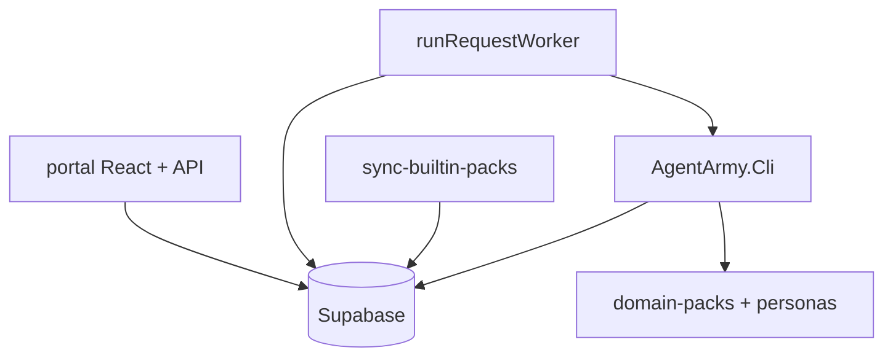
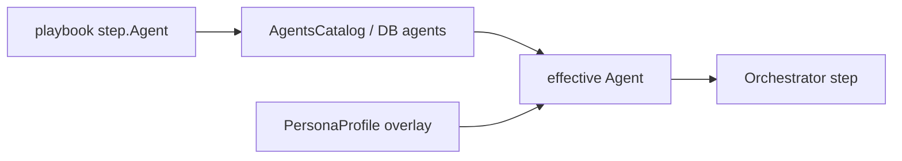

# AgentArmy — Proje Durumu

**Tarih:** 2026-05-16  
**Repo:** `ai_agent`  
**Amaç:** Güncel teknik olgunluk özeti (piramit strateji dokümanından bağımsız, periyodik güncellenir).

**Durum sembolleri:** ✅ Çalışıyor · ⚠️ Kısmi / kırılgan · ❌ Yok veya plan dışı · 🧪 Pilot / manuel doğrulama gerekir

---

## Özet skor kartı

| Alan | Tahmini tamamlanma |
|------|-------------------|
| CLI çekirdek (run / bundle / ceo) | ~95% |
| Domain pack içerik (3 sektör + system) | ~90% |
| DB şema + sync + DB-first yükleme | ~85% |
| Persona davranış katmanı | ~80% (cost_class → LLM hariç) |
| Portal operasyon + CRUD | ~85% |
| Sector Discovery uçtan uca | ~55% |
| Tool registry → execution | ~10% |
| Audit / compliance tam akış | ~40% |

**Piramit olgunluğu (ürün):** Basamak 2–3 — rol bazlı ajan ordusu, playbook orkestrasyonu, çoklu-ajan ekipleri (bundle/CEO); AGI/süper-zeka katmanı bilinçli olarak kapsam dışı.

---

## A. Çekirdek platform (CLI + runtime)

| # | Yetenek | Repo karşılığı | Durum | Not |
|---|---------|----------------|-------|-----|
| A1 | LLM motoru | `OpenAiResponsesClient`, `LlmRouter`, `--model` | ✅ | Multi-model + fallback |
| A2 | Rol bazlı ajanlar | `AgentsCatalog` + DB `agents` | ✅ | Worker `agents.json` override |
| A3 | Manifest behaviors | `Agent.cs` → `Orchestrator` | ✅ | Hardcoded ajan ID yok |
| A4 | Playbook orkestrasyonu | `Orchestrator`, playbook JSON | ✅ | DB-first `PlaybookLoader` |
| A5 | Bundle | `bundle` + `BundleLoader` | ✅ | DB-first |
| A6 | CEO planlama | `CeoPlanner`, `ceo` / `ceo-iterate` | ✅ | |
| A7 | CEO yürütme | `CeoExecutor` | ✅ | Retry, `ceo_plans` / `ceo_executions` |
| A8 | Contrarian | `Contrarian` + `TriggersContrarian` | ✅ | |
| A9 | Verifier + rubric | `Verifier` + `rubrics/verifier.md` | ✅ | Pack bazlı |
| A10 | Web grounding | `--web`, `RequiresWebSearch` | ✅ | |
| A11 | Domain allowlist | `allowed_domains`, `PrefersDomainAllowlist` | ⚠️ | Soft policy |
| A12 | Facts / Work / Decisions | `RunContext`, behaviors | ✅ | + `run_outputs` |
| A13 | Kalıcı facts | `FactsIndex`, `FactsStore` | ⚠️ | Market-intel ağırlıklı |
| A14 | Dry-run | `FakeLlmClient` | ✅ | |
| A15 | Persona koordinasyonu | `PersonaProfile`, `AgentBehaviorMerge` | ✅ | Overlay + risk_ceiling |
| A16 | Persona cost → LLM | — | ❌ | Backlog |

---

## B. Domain pack’ler ve içerik

| # | Yetenek | Repo karşılığı | Durum | Not |
|---|---------|----------------|-------|-----|
| B1 | Built-in pack’ler | `market-intel`, `e-ticaret`, `hibe-yazimi`, `system` | ✅ | |
| B2 | Pack manifest | `domain-packs/*/pack.json` | ✅ | |
| B3 | Playbook `version` | JSON + `ResolvedVersion` | ✅ | |
| B4 | Personas (dosya) | `personas/*.md` | ✅ | Sync + fallback |
| B5 | Kök playbook’lar | `playbooks/*.json` | ✅ | Legacy |

---

## C. Veritabanı (Supabase, Faz 2.5)

| # | Yetenek | Repo karşılığı | Durum | Not |
|---|---------|----------------|-------|-----|
| C1 | Migration set | `supabase/migrations` 0001–0022 | ✅ | 22 dosya |
| C2 | `domain_packs` | `0019_domain_packs.sql` | ✅ | |
| C3 | personas / playbooks / bundles | 0019 | ✅ | RLS tenant |
| C4 | `domain_pack_drafts` | 0019 + merge RPC | ✅ | |
| C5 | DB-first CLI loader | `DomainPackLoader`, loaders | ✅ | Dosya fallback |
| C6 | File → DB sync | `sync-builtin-packs.ts`, `sync-to-db` | ✅ | |
| C7 | Agents manifest | `0011_agents_manifest.sql` | ✅ | |
| C8 | DOMAIN_PACK_ARCHITECT | `0020_domain_pack_architect.sql` | ✅ | |
| C9 | run_outputs / run_events | `0021`, `0022` | ✅ | owner RLS |
| C10 | Tenant pack override | merge draft → tenant pack | ⚠️ | 🧪 üretim |

---

## D. Yönetişim, risk, denetim

| # | Yetenek | Repo karşılığı | Durum | Not |
|---|---------|----------------|-------|-----|
| D1 | Risk R0–R3 CLI | `RiskPolicy` | ✅ | |
| D2 | Playbook default risk | `MergeDefaultRiskFromPlaybooks` | ✅ | |
| D3 | Persona risk tavanı | `EnforceTaskRiskAgainstPersonaCeiling` | ✅ | |
| D4 | Portal R2 kapısı | `gate_run_for_approval` | ✅ | |
| D5 | Onay RPC | approve / reject run_request | ✅ | |
| D6 | Runtime RiskGate | `RiskGate.cs` | ⚠️ | Tüm path’lerde değil |
| D7 | Audit log | `audit_log` | ⚠️ | Pack lifecycle eksik |
| D8 | Cost ledger | runs metrikleri, portal sayfa | ✅ | |
| D9 | SLA tracking | `0018_sla_tracking.sql` | ✅ | |

---

## E. Portal (React + API + worker)

| # | Yetenek | Repo karşılığı | Durum | Not |
|---|---------|----------------|-------|-----|
| E1 | Auth + RLS | Supabase Auth | ✅ | |
| E2 | Dashboard / Runs / Jobs | Jobs + worker | ✅ | |
| E3 | Agents CRUD | AgentsPage | ✅ | |
| E4 | Personas CRUD | PersonasPage | ✅ | behaviors DB |
| E5 | Playbooks / Bundles CRUD | PlaybooksPage, PlaybookBundlesPage | ✅ | |
| E6 | Domain Packs | DomainPacksPage | ✅ | |
| E7 | Approval Queue | ApprovalQueuePage | ✅ | draftId link |
| E8 | Audit Log UI | AuditLogPage | ✅ | |
| E9 | Tools registry | ToolsPage | ⚠️ | Invocation yok |
| E10 | Sector Builder | SectorBuilderPage | ⚠️ | E2E 🧪 |
| E11 | Pack taslakları | PackDraftReviewPage | ⚠️ | |
| E12 | CEO review | CeoReviewPage | ✅ | |
| E13 | Local import | POST /api/import/local | ✅ | |
| E14 | Production build | `npm run build --prefix portal` | ✅ | |

---

## F. Sector Discovery (uçtan uca)

| Adım | Beklenen | Durum | Bilinen engeller |
|------|----------|-------|------------------|
| F1 | Form → `run_requests` | ✅ | `risk=R2` |
| F2 | Worker → dotnet playbook | ⚠️ | R2 → önce Approval Queue |
| F3 | scaffold → `run_outputs` | ⚠️ | Env, JSON kalitesi |
| F4 | `domain_pack_drafts` insert | ⚠️ | Worker + CLI çift yol |
| F5 | Taslaklar UI | ⚠️ | RLS: kendi tenant |
| F6 | merge → aktif pack | 🧪 | |
| F7 | Yeni pack ile run | 🧪 | |

---

## G. Backlog (bilinçli ertelenenler)

| # | Konu | Durum |
|---|------|-------|
| G1 | Tool invocation (API/MCP) | ❌ |
| G2 | Audit: draft.created, pack.published | ❌ |
| G3 | Persona frontmatter → behaviors | ❌ |
| G4 | Dogfood: TÜBİTAK 1507, e-ticaret prod | 🧪 |
| G5 | `ai-ajan-ordusu-piramit.md` eski durum satırları | Referans için bu dosya |

---

## Mimari referans (kısa)

**Agent + Persona (runtime):**

---

## `ai-ajan-ordusu-piramit.md` ile farklar

| Eski piramit tablosu | Bu dosyadaki güncel |
|----------------------|---------------------|
| CEO ❌ | ✅ CeoPlanner + CeoExecutor |
| Contrarian ❌ | ✅ |
| Risk ⚠️ sınırlı | ✅ CLI + portal + persona ceiling |
| Verifier sadece MI | ✅ Tüm pack’lerde rubric |
| Domain pack DB yok | ✅ Faz 2.5 (0019+) |

Strateji ve kavramsal piramit için: [`ai-ajan-ordusu-piramit.md`](ai-ajan-ordusu-piramit.md).  
Operasyonel durum için: **bu dosya**.

---

## Sonraki güncelleme önerisi

1. Sector Discovery E2E yeşil olduktan sonra F ve E10–E11 satırlarını güncelle.  
2. Audit pack lifecycle eklendikten sonra D7 ve G2 kapat.  
3. Tool invocation başlayınca E9 ve G1 güncelle.

*Son kod incelemesi: 2026-05-16 — migration 0022, PersonaProfile / AgentBehaviorMerge, portal Sector Builder + Taslaklar.*
