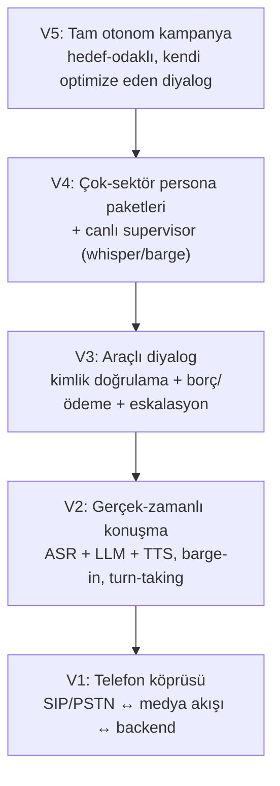
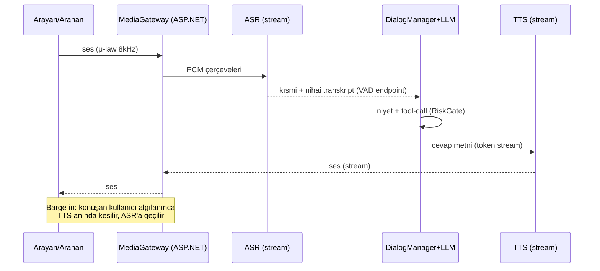

# Sesli Çağrı Merkezi Ajanları — Mimari, PR Planı ve Prompt Paketi

**Tarih:** 2026-06-14
**Hedef:** Çağrı merkezleri için **gerçek zamanlı konuşan (sesli) AI ajanları** kuran, sektör-agnostik ama önce **hukuk (icra takibi)** ve **bankacılık (gecikmiş borç tahsilatı)** ihtiyaçlarını karşılayan; gelen aramaları yanıtlayan, giden aramaları (icra/tahsilat) yürüten, ödeme durumu sorgulayan, ödeme sözü/planı kaydeden ve gerektiğinde insana eskale eden bir platform.

**Backend:** ASP.NET Core (.NET 8). **UI:** React + Tailwind (mevcut `portal/` ile aynı stack; ayrı `console/` uygulaması da olabilir). **Yönetişim deseni:** mevcut repodaki RiskGate + onay kuyruğu + audit zinciri (bkz. `docs/otomasyon-plani-ve-sonnet-promptlari.md`) sesli dünyaya taşınır.

> Bu doküman, mevcut "metin üreten ajan" omurgasının (LLM router, ToolExecutor, RiskGate, operations loop) üzerine **ses + telefon + gerçek-zamanlı diyalog** katmanını ekler. Hiçbir mevcut bileşen atılmaz; konuşma araç çağrıları aynı yönetişim hattından (RiskGate → onay → audit → compensation) geçer.

---

## İçindekiler

1. [Vizyon ve kapsam](#1-vizyon-ve-kapsam)
2. [Hedef senaryolar (use-case'ler)](#2-hedef-senaryolar-use-caseler)
3. [Hedef mimari](#3-hedef-mimari)
4. [Teknoloji seçimleri ve gerekçeleri](#4-teknoloji-secimleri-ve-gerekceleri)
5. [Veri modeli](#5-veri-modeli)
6. [Uyumluluk ve regülasyon (KVKK / BDDK / İcra)](#6-uyumluluk-ve-regulasyon-kvkk--bddk--icra)
7. [PR planı — sıralı](#7-pr-plani--sirali)
8. [Sonnet'e verilecek PR promptları](#8-sonnete-verilecek-pr-promptlari)
9. [Ajan persona / konuşma promptları](#9-ajan-persona--konusma-promptlari)
10. [Değerlendirme, KPI ve test](#10-degerlendirme-kpi-ve-test)
11. [Riskler ve açık kararlar](#11-riskler-ve-acik-kararlar)

---

## 1. Vizyon ve kapsam

Tek cümle: **telefonu açan/arayan, Türkçe akıcı konuşan, kimlik doğrulayan, sistemlerden veri çekip aksiyon alabilen ve mevzuata uyumlu sesli ajan ekibi.**

Olgunluk basamakları (mevcut otomasyon dokümanındaki piramidin sesli karşılığı):



- **V1–V2**: PR0–PR3 (telefon + ses pipeline + diyalog motoru).
- **V3**: PR4–PR6 (kimlik, borç/ödeme araçları, inbound + outbound senaryolar).
- **V4**: PR7–PR8 (uyumluluk katmanı + supervisor UI).
- **V5**: PR9–PR10 (eval/optimizasyon + realtime fast-path + sektör paketleri).

Kapsam dışı (bilinçli): otomatik tebligat (hukuki tebligat yalnız resmi kanaldan yapılır — ajan yalnız **bilgilendirme ve ödemeye davet** eder); ajanın borç miktarı/feragat gibi **bağlayıcı taahhüt** vermesi (yalnız önceden onaylı plan şablonları); kayıtsız (rızasız) çağrı.

---

## 2. Hedef senaryolar (use-case'ler)

### 2.1 Hukuk — icra takibi / borç bilgilendirme (outbound)

Senaryo: Bir hukuk bürosu/varlık yönetim şirketi adına, hakkında icra takibi başlatılmış borçlu aranır. Ajan:

1. Kimlik doğrular (ad-soyad + doğum yılı veya dosya no son 4 hane — **üçüncü kişiyle konuşuluyorsa borç detayı paylaşılmaz**).
2. Aydınlatma + kayıt bilgilendirmesi yapar ("bu görüşme kayıt altına alınmaktadır").
3. Dosya durumunu bilgilendirir (takip aşaması, güncel borç — bağlayıcı tutar değil, "sistemdeki güncel bakiye").
4. Ödemeye davet eder; ödeme sözü/planı kaydeder; ödeme linki/IBAN gönderir (SMS/e-posta).
5. İtiraz/avukatla görüşme talebini eskale eder; arama saatleri ve taciz yasağına uyar.

### 2.2 Bankacılık — gecikmiş borç tahsilatı (outbound, erken vade)

Senaryo: Kredi kartı/ihtiyaç kredisi gecikmesi olan müşteri aranır (yasal takip öncesi, "soft collection"). Ajan:

1. Güçlü kimlik doğrular (banka müşteri doğrulama kuralları; **kart/şifre/OTP asla istenmez**).
2. Gecikme tutarı ve son ödeme tarihini hatırlatır.
3. Yapılandırma/asgari ödeme seçeneklerini (önceden onaylı şablon) sunar.
4. Ödeme sözü alır, ödeme kanalına yönlendirir; gerekiyorsa müşteri temsilcisine aktarır.

### 2.3 Inbound — gelen aramayı yanıtlama (her sektör)

Senaryo: Müşteri kurumu arar. Ajan IVR yerine **konuşarak** karşılar:

1. Niyet anlama ("ödeme durumumu öğrenmek istiyorum", "itirazım var", "temsilciye bağlanmak istiyorum").
2. Kimlik doğrulama sonrası **ödeme durumu/borç bakiyesi sorgulama**, son ödeme tarihi, dosya durumu bilgisi.
3. Çözebildiğini çözer (bakiye, ödeme linki, randevu), çözemediğini doğru kuyruğa/temsilciye yönlendirir.
4. Çalışma saati dışında: mesaj alır, geri arama (callback) talebi oluşturur.

### 2.4 Yatay senaryolar

Randevu hatırlatma, anket/memnuniyet, basit bilgilendirme (kampanya, çalışma saatleri). Aynı motor; yalnız persona + araç seti değişir.

---

## 3. Hedef mimari

### 3.1 Katmanlar

```
┌──────────────────────────────────────────────────────────────────────┐
│ Telefon Katmanı (PSTN/SIP)                                            │
│  SIP trunk / numara sağlayıcı (Twilio · Telnyx · Verimor/Netgsm SIP)  │
│  Media streaming (μ-law 8kHz) ⇄ WebSocket                             │
└───────────────┬──────────────────────────────────────────────────────┘
                │ ses çerçeveleri (WS / RTP fork)
                ▼
┌──────────────────────────────────────────────────────────────────────┐
│ ASP.NET Core — MediaGateway (WebSocket Hub)                            │
│  • VAD / endpointing / barge-in                                        │
│  • Jitter buffer, resample (8k↔16k/24k)                                │
│  • Çağrı oturumu (CallSession) state                                   │
└───────┬───────────────────────────────────┬───────────────────────────┘
        │ ses akışı                          │ metin/karar
        ▼                                    ▼
┌────────────────────┐            ┌─────────────────────────────────────┐
│ Ses Servisleri     │            │ DialogManager (turn döngüsü)        │
│  ISpeechToText     │◄──────────►│  • LLM (function-calling)           │
│  ITextToSpeech     │            │  • Zorunlu script segmentleri       │
│  IRealtimeVoice    │            │    (aydınlatma/kayıt bildirimi)     │
│  (Azure·Deepgram·  │            │  • Niyet + disposition              │
│   ElevenLabs·OpenAI)│           │  • ToolExecutor + RiskGate (mevcut) │
└────────────────────┘            └───────────────┬─────────────────────┘
                                                   │ araç çağrıları
                                                   ▼
┌──────────────────────────────────────────────────────────────────────┐
│ Entegrasyon + Yönetişim                                                │
│  CRM/borç dosyası · core banking · UYAP/icra · ödeme (sanal pos/link)  │
│  RiskGate · approval_queue · audit_log · compensation · KVKK guard     │
└──────────────────────────────────────────────────────────────────────┘
        ▲                                                   ▲
        │ kampanya/iş kuyruğu                               │ canlı izleme
┌───────┴──────────────┐                        ┌───────────┴─────────────┐
│ OutboundDialer       │                        │ Supervisor UI (React)   │
│ (HostedService)      │                        │ canlı transkript·whisper│
│ predictive/preview   │                        │ ·barge·kampanya·rapor   │
└──────────────────────┘                        └─────────────────────────┘
```

### 3.2 Gerçek-zamanlı turn döngüsü



### 3.3 Projeler (çözüm yapısı)

Mevcut `AgentArmy.sln`'e eklenir:

- `src/CallCenter.Api` — ASP.NET Core (WebSocket/SignalR hub, REST, telephony webhook'ları, kampanya API).
- `src/CallCenter.Core` — alan modeli: `CallSession`, `DialogManager`, `Turn`, abstractions (`ISpeechToText`, `ITextToSpeech`, `IRealtimeVoiceClient`, `ITelephonyProvider`).
- `src/CallCenter.Speech` — sağlayıcı adaptörleri (Azure/Deepgram/ElevenLabs/OpenAI Realtime).
- `src/CallCenter.Integrations` — CRM/banking/icra/ödeme bağlayıcıları (mock + gerçek).
- `src/CallCenter.Worker` — `OutboundDialer` HostedService, callback işleyici.
- Mevcut `src/AgentArmy.Cli` içindeki `Tools/`, `RiskGate`, `SupabaseWriter` paylaşılan kütüphane olarak referans edilir (gerekirse `AgentArmy.Core`'a çıkarılır).

### 3.4 Diyalog motoru deseni: hibrit (script + LLM)

Regüle alanda saf LLM riskli; saf IVR esnek değil. **Hibrit**:

- **Deterministik/zorunlu segmentler** (kod ile sabit metin, LLM atlayamaz): kayıt bilgilendirmesi, aydınlatma metni, kimlik doğrulama soruları, yasal feragat ifadeleri.
- **Esnek segmentler** (LLM): itiraz karşılama, soru-cevap, ödeme planı müzakeresi (yalnız onaylı şablon aralığında), ton uyarlama.
- **State machine** çağrı fazlarını yönetir: `greeting → consent → identify → main_intent → action → wrap_up`. Her faza özel izinli araçlar + izinli LLM serbestliği.

---

## 4. Teknoloji seçimleri ve gerekçeleri

İki ses mimarisi vardır; ikisini de `IDialogEngine` arkasına soyutlayıp **pipeline'ı varsayılan**, realtime'ı fast-path olarak tutmayı öneririm.

| Yaklaşım | Artı | Eksi | Karar |
|---|---|---|---|
| **A. Cascade pipeline** (ASR → LLM → TTS) | Tam kontrol; her segmenti loglama/maskeleme; zorunlu script'i garanti; sağlayıcı bağımsız; daha ucuz | Daha çok gecikme mühendisliği (barge-in, endpointing elle) | **Varsayılan** — regüle alanda denetlenebilirlik şart |
| **B. Speech-to-speech realtime** (OpenAI Realtime / Azure Voice Live) | En düşük gecikme; barge-in/turn-taking hazır; doğal ses | Ara transkript/araç kontrolü daha zayıf; maliyet; script garantisi zor | **Fast-path** (PR10) — düşük-risk inbound/genel bilgilendirme |

### Sağlayıcı önerileri (Türkçe önceliğiyle)

- **ASR (Türkçe streaming):** Azure Speech (güçlü TR + diarization + telefon modeli), Deepgram, Google STT. Hepsi `ISpeechToText` arkasında.
- **TTS (Türkçe doğal ses):** Azure Neural TTS (örn. `tr-TR-EmelNeural`, `tr-TR-AhmetNeural`), ElevenLabs (TR), OpenAI TTS. `ITextToSpeech` arkasında; SSML ile telaffuz/duraklatma kontrolü.
- **LLM diyalog:** Mevcut `LlmRouter` (OpenAI `gpt-4.1`/`gpt-5` + fallback). Düşük gecikme için streaming + kısa sistem promptu + araç çağrısı.
- **Telefon:** Twilio Programmable Voice (Media Streams) veya Telnyx (Media Streaming) hızlı başlangıç; Türkiye yerel maliyet/numara için Verimor/Netgsm SIP trunk + self-hosted FreeSWITCH/Asterisk (audio fork → WS). `ITelephonyProvider` arkasında.
- **Sanal santral/yönlendirme:** İnsana aktarım (warm/cold transfer), kuyruk, çalışma saati.

### Gecikme bütçesi (hedef: konuşmacı sustuktan sonra < ~800 ms ilk ses)

| Adım | Hedef |
|---|---|
| Endpointing (sustu algısı) | 150–300 ms |
| ASR nihai transkript | ~100 ms (kısmiyle örtüşür) |
| LLM ilk token | 200–400 ms (streaming) |
| TTS ilk ses çerçevesi | 100–200 ms (streaming) |
| **Toplam algılanan** | **~700–900 ms** |

Optimizasyon: LLM cevabını cümle cümle TTS'e besle (ilk cümle hazır olunca çalmaya başla); "düşünüyorum" dolgu sesleri (filler) ile algılanan gecikmeyi azalt; agresif barge-in.

---

## 5. Veri modeli

Mevcut Supabase/Postgres deseni (RLS + audit) sürdürülür. Yeni tablolar (özet):

| Tablo | Amaç | Kritik alanlar |
|---|---|---|
| `voice_agents` | Persona + ses + diyalog konfigi | `name, domain, system_prompt, voice_id, engine ('pipeline'/'realtime'), allowed_tools[], language` |
| `campaigns` | Outbound kampanya | `name, agent_id, type ('icra'/'collection'/...), dialer_mode ('preview'/'progressive'/'predictive'), calling_window, max_attempts, status` |
| `contacts` | Aranan/arayan kişi | `full_name, masked_phone, dob_year, external_ref, kvkk_consent_id, dnc bool` |
| `debts` / `cases` | Borç / icra dosyası | `contact_id, file_no, current_balance, due_date, stage, currency` (banking/legal pack'e göre) |
| `call_jobs` | Dialer kuyruğu | `campaign_id, contact_id, scheduled_at, attempt, status` |
| `calls` | Tek çağrı | `direction, agent_id, contact_id, started_at, ended_at, disposition, recording_url, consent_recorded bool, transfer_to` |
| `call_turns` | Tur bazlı transkript | `call_id, role ('agent'/'caller'), text, redacted_text, asr_confidence, ts, intent` |
| `payment_promises` | Ödeme sözü/planı | `call_id, contact_id, amount, promised_date, plan_json, channel` |
| `consents` | KVKK rıza/aydınlatma | `contact_id, type ('recording'/'processing'), granted bool, text_version, ts, evidence` |
| `dnc_list` | Aranmayacaklar | `phone_hash, reason, added_at` |
| `compliance_events` | Uyum olayları | `call_id, kind ('window_violation_blocked'/'third_party'/'consent_missing'/...), payload` |
| `escalations` | İnsana eskalasyon | `call_id, reason, queue, status, handled_by` |
| `dispositions` | Çağrı sonuç kodları | `code, label, requires_followup` |

Telefon numaraları **hash + maskeli** saklanır; ham numara yalnız dialer'ın ihtiyaç anında çözdüğü şifreli alanda. Kayıtlar (`recording_url`) erişim-loglu ve saklama süreli (retention) tutulur.

---

## 6. Uyumluluk ve regülasyon (KVKK / BDDK / İcra)

> Bu bir hukuki görüş değildir; mühendislik gereksinimi olarak uyumluluğu **koda gömülü guard** olarak ele alır. Canlıya çıkmadan önce kurumun hukuk/uyum birimiyle metinler ve süreçler onaylanmalıdır.

Koda gömülecek zorunlu kurallar (PR7'de `ComplianceGuard` olarak merkezîleşir):

1. **Kayıt bilgilendirmesi (KVKK):** Her çağrının başında, kayıt başlamadan önce "bu görüşme hizmet kalitesi ve yasal yükümlülükler için kayıt altına alınmaktadır" bildirimi; rıza `consents`'a yazılmadan ana akışa geçilmez.
2. **Aydınlatma metni:** Kişisel veri işleme aydınlatması; versiyonlu (`text_version`) saklanır.
3. **Kimlik doğrulama + üçüncü kişi koruması:** Doğrulama başarısızsa veya konuşan kişi muhatap değilse **borç/dosya detayı paylaşılmaz**; yalnız geri arama talebi bırakılır (`compliance_events: third_party`).
4. **Arama saati penceresi:** İzinli saatler dışında (örn. çok erken/geç, hafta sonu kuralları) outbound arama **dialer tarafından bloklanır**; pencere `campaigns.calling_window`.
5. **Taciz/sıklık limiti:** `max_attempts` ve günlük/haftalık arama sıklığı tavanı; ulaşılan kişi "aranmak istemiyorum" derse `dnc_list`'e eklenir.
6. **Hassas veri yasağı (bankacılık):** Ajan **asla** kart numarası, CVV, şifre, OTP istemez/almaz; kullanıcı söylese bile transkriptte maskelenir ve uyarı verilir.
7. **PII maskeleme:** `call_turns.redacted_text` üretilir (TC kimlik, kart, IBAN, telefon desenleri maskelenir); ham metin kısıtlı erişim.
8. **Bağlayıcı taahhüt yasağı:** Ajan yalnız önceden onaylı plan/şablon aralığında konuşur; bunun dışı talep → eskalasyon.
9. **Saklama (retention):** Kayıt ve transkript için saklama süresi + erişim logu; süre dolunca otomatik silme/anonimleştirme.
10. **Devir/insan hakkı:** Kullanıcı her an "temsilciye bağlan" diyebilir → warm transfer.

Sektör notları: Bankacılıkta BDDK/bankacılık sırrı ve müşteri doğrulama kuralları; hukukta İcra ve İflas Kanunu çerçevesinde ajan **tebligat yapmaz**, yalnız bilgilendirir ve ödemeye davet eder; tahsilat görüşmelerinde tehdit/taciz içeren dil **kesinlikle yasak** (system prompt + çıktı guard).

---

## 7. PR planı — sıralı

Her PR bağımsız merge edilebilir ve net bir "biten tanımı" taşır. Sıra önemli: önce telefon + ses köprüsü (PR0–PR2), sonra diyalog + araçlar (PR3–PR4), sonra senaryolar (PR5–PR6), sonra uyumluluk + UI (PR7–PR8), en son kanıt + fast-path (PR9–PR10). Güvenlik/uyumluluk guard'ları her zaman ilgili PR içinde fail-closed kurulur.

| PR | Başlık | Kapsam | Biten tanımı |
|---|---|---|---|
| **PR0** | İskelet + abstractions + echo bot | `CallCenter.Api/Core/Speech/Integrations/Worker` projeleri; `ITelephonyProvider`, `ISpeechToText`, `ITextToSpeech`, `IRealtimeVoiceClient`, `IDialogEngine`; WebSocket `MediaGateway`; konfig + DI; ses-yankı (echo) testi | `dotnet build` yeşil; gelen WS bağlantısına gönderilen ses geri yankılanıyor; sağlayıcılar mock |
| **PR1** | Telefon entegrasyonu + medya akışı | Bir sağlayıcı (Twilio/Telnyx) webhook'u: gelen çağrı → `MediaGateway` WS; μ-law 8kHz ⇄ PCM resample; `calls` kaydı açılır/kapanır; giden çağrı başlatma API'si | Gerçek bir telefon araması açılıp ses iki yönlü akıyor; çağrı `calls` tablosuna düşüyor |
| **PR2** | ASR + TTS pipeline (Türkçe) | `AzureSpeechStt` + `AzureNeuralTts` (veya seçilen sağlayıcı) adaptörleri; streaming kısmi/nihai transkript; cümle bazlı TTS; basit "söyleneni yaz, geri seslendir" döngüsü | Telefonda Türkçe konuşulanı ajan transkribe edip Türkçe seslendiriyor; `call_turns` doluyor |
| **PR3** | DialogManager + LLM turn döngüsü + barge-in | VAD/endpointing, barge-in (TTS kesme), turn-taking; `DialogManager` state machine (`greeting→...→wrap_up`); LLM streaming + function-calling iskeleti; dolgu sesleri | Ajan doğal sırayla konuşuyor; kullanıcı araya girince TTS kesiliyor; LLM cevabı stream'leniyor; disposition yazılıyor |
| **PR4** | Kimlik doğrulama + borç/ödeme araçları + RiskGate | `verify_identity`, `get_debt_status`, `record_payment_promise`, `send_payment_link`, `schedule_callback`, `transfer_to_human` araçları (mock entegrasyon); mevcut `ToolExecutor`+`RiskGate`+audit hattından geçiş; yazma araçları onay/limit kapsamında | Doğrulama başarısızsa detay paylaşılmıyor; ödeme sözü `payment_promises`'a yazılıyor; her araç çağrısı audit'te; riskli araç RiskGate'ten geçiyor |
| **PR5** | Inbound senaryolar | Niyet sınıflandırma; "ödeme durumu sorgulama", "dosya durumu", "temsilciye bağlan", çalışma saati dışı callback; karşılama personası | Gelen arama doğrulama sonrası bakiye/son ödeme tarihini doğru okuyor; çözemediğini doğru kuyruğa aktarıyor |
| **PR6** | Outbound dialer + icra/tahsilat kampanyası | `OutboundDialer` HostedService (preview→progressive); `campaigns`/`call_jobs` kuyruğu; icra bilgilendirme + banka soft-collection akışları; ödeme sözü + link; yeniden deneme/disposition | Bir kampanya listesi yüklenip otonom aranıyor; ödeme sözü alınınca link gidiyor; sonuç kodları raporlanıyor |
| **PR7** | Uyumluluk katmanı (KVKK/BDDK/İcra) | Merkezî `ComplianceGuard`: kayıt rızası, aydınlatma versiyonu, arama saati guard, DNC, sıklık limiti, üçüncü-kişi koruması, PII maskeleme, hassas-veri reddi, retention job | Saat dışı çağrı bloklanıyor; rıza alınmadan ana akışa geçilmiyor; DNC'deki numara aranmıyor; kart/OTP maskeleniyor; `compliance_events` doluyor |
| **PR8** | Supervisor + yönetim UI (React) | Canlı çağrı izleme (canlı transkript), whisper/barge (fısıltı/araya girme), kampanya yönetimi, persona/prompt editörü, transkript+kayıt inceleme, onay kuyruğu, KPI panosu | Süpervizör canlı çağrıyı izleyip araya girebiliyor; kampanya/persona portaldan yönetiliyor; KPI panosu çalışıyor |
| **PR9** | Eval + kalite + dogfood | Konuşma evalleri (senaryo bazlı simüle arayan), regresyon seti, uyum-ihlali sızma testleri, KPI hesaplama + rapor; uçtan uca dogfood koşusu | Eval seti yeşil eşik üstünde; uyum ihlali denemeleri bloklanıyor; KPI raporu `docs/`'a yazılıyor |
| **PR10** (ops.) | Realtime fast-path + çok-sektör persona paketleri | `OpenAiRealtimeVoiceClient` (speech-to-speech) düşük-risk inbound için; sektör persona paketleri (sigorta, telekom, sağlık randevu, e-ticaret) seed | Düşük gecikmeli realtime mod düşük-risk akışta çalışıyor; yeni sektör paketi config ile ekleniyor |

Tahmini ağırlık: PR1–PR3 en büyük (gerçek-zamanlı ses mühendisliği); PR4–PR6 orta; PR7 kritik ama kapsamı net; PR8 UI ağırlıklı; PR9 test/ayar.

---

## 8. Sonnet'e verilecek PR promptları

Genel kullanım önerileri (otomasyon serisinin dersleriyle aynı):

- **Oturum başına tek PR.** Bağlam şişince kalite düşer; her PR'ı ayrı oturumda, tek prompt'la başlat.
- Prompt'a her zaman şu bağlam dosyalarını işaret et: bu doküman (`docs/sesli-cagri-merkezi-ajanlari-plani.md`), `docs/otomasyon-plani-ve-sonnet-promptlari.md` (yönetişim deseni), `src/AgentArmy.Cli/Tools/ToolExecutor.cs` + `ITool.cs` (araç sözleşmesi), `src/AgentArmy.Cli/Cli/RiskGate.cs` (risk geçidi), `src/AgentArmy.Cli/Infra/PolicyReader.cs` + `SupabaseWriter.cs` (DB-first + RPC deseni).
- **Plan modu zorunlu:** "Önce uygulama planını yaz, ben onaylayınca koda geç." — büyük PR'larda (özellikle PR1–PR3 gerçek-zamanlı ses) sapmayı azaltır.
- **Şema doğrulama refleksi:** Her migration/sorgu prompt'una "önce gerçek kolonları ve CHECK kısıtlarını mevcut migration dosyalarından doğrula; kolon/değer uydurma" satırı eklenmiştir — otomasyon serisinde kolon uydurma hatası 5+ kez yaşandı.
- **Uyumluluk fail-closed:** KVKK/BDDK/İcra guard'ları her zaman fail-closed kurulur (rıza/pencere/DNC belirsizse arama YAPILMAZ, akış İLERLEMEZ). Bir guard'ın fail-open olması bilinçli ve dokümante edilmeden geçilmez.
- Her PR sonunda: `dotnet build AgentArmy.sln -c Release` + ilgili `dotnet test` + (UI varsa) `npm run build --prefix portal` yeşil olmadan bitti sayma. Gerçek-zamanlı ses PR'larında ek olarak kısa bir canlı/mock telefon duman testi.
- Ses ve telefon sağlayıcı anahtarları **env'den** okunur (api_key_env deseni — PR10 `llm_providers` mantığı); hiçbir anahtar repoda commit'lenmez.

### PR0 prompt'u — İskelet + abstractions + echo bot

```
Repo: ai_agent. Bağlam: AgentArmy.sln (mevcut proje düzeni), src/AgentArmy.Cli/Tools/ITool.cs
(arayüz/Descriptor deseni), src/AgentArmy.Cli/Llm/ILlmClient.cs (soyutlama deseni),
src/AgentArmy.Cli/Infra/ (HttpClientPool, SupabaseWriter — DI ve config okuma deseni),
docs/sesli-cagri-merkezi-ajanlari-plani.md (Bölüm 3 mimari + 3.3 projeler).

KURAL: Mevcut .NET 8 sürümünü ve sln/proje stilini birebir izle; yeni dış paket eklerken en
güncel kararlı sürümü kullan (uydurma sürüm yok). Hiçbir mevcut bileşeni silme/taşıma — yalnız
ekle.

Görev: çağrı merkezi platformunun iskeletini ve sağlayıcı-bağımsız soyutlamalarını kur; uçtan
uca "ses-yankı (echo)" akışıyla WebSocket medya hattını kanıtla.

1. Projeler (AgentArmy.sln'e ekle): src/CallCenter.Core (alan modeli + abstractions),
   src/CallCenter.Speech (ses sağlayıcı adaptörleri), src/CallCenter.Integrations
   (CRM/banking/icra/ödeme bağlayıcıları), src/CallCenter.Api (ASP.NET Core — WebSocket hub +
   REST), src/CallCenter.Worker (HostedService iskeleti). Test projesi:
   tests/CallCenter.Tests.
2. Abstractions (CallCenter.Core): ITelephonyProvider (StartOutboundCall, webhook → media
   session), ISpeechToText (streaming: PCM çerçeve → kısmi/nihai transkript event'leri),
   ITextToSpeech (metin → ses çerçevesi stream), IRealtimeVoiceClient (speech-to-speech
   placeholder), IDialogEngine (Turn döngüsü soyutlaması). Her birinin Mock implementasyonu
   CallCenter.Speech/Integrations içinde (echo TTS = gelen PCM'i geri yollar).
3. Alan modeli (CallCenter.Core): CallSession (state: greeting→consent→identify→main_intent→
   action→wrap_up enum), Turn (role, text, ts), CallDirection enum. Henüz DB yok — in-memory.
4. MediaGateway (CallCenter.Api): WebSocket endpoint /ws/media — bağlanan istemciden gelen
   ses çerçevelerini CallSession'a yazar; PR0'da Mock TTS ile geri yankılar (echo). Jitter
   buffer/resample placeholder (PR1/PR2'de gerçeklenir).
5. DI + config: appsettings.json + Options deseni (sağlayıcı seçimi "Mock"); env override
   (anahtarlar env'den, repoya yazılmaz). README'ye projelerin amacı + "echo botu nasıl
   denerim" notu.
6. Test: CallSession state geçiş testi; MediaGateway echo testi (in-memory WebSocket ile
   gönderilen çerçevenin geri döndüğü).

Önce kısa plan, onaydan sonra kod. Bitti kriteri: dotnet build AgentArmy.sln yeşil;
dotnet test yeşil; /ws/media'ya gönderilen ses çerçevesi geri yankılanıyor (test + manuel
wscat/websocat ile doğrulanır); tüm sağlayıcılar Mock.
```

### PR1 prompt'u — Telefon entegrasyonu + medya akışı

```
Repo: ai_agent. Bağlam: PR0 çıktısı (CallCenter.* projeleri, ITelephonyProvider, MediaGateway),
src/AgentArmy.Cli/Infra/SupabaseWriter.cs (insert/patch + RPC deseni), supabase/migrations/
(tarih-damgalı adlandırma + RLS deseni), docs/sesli-cagri-merkezi-ajanlari-plani.md (Bölüm 5
veri modeli — calls tablosu).

KURAL: Migration yazmadan önce mevcut migration'lardaki RLS + owner/tenant kolonu desenini
örnek al; kolon/CHECK uydurma. Telefon sağlayıcı anahtarları env'den (api_key_env deseni).

Görev: bir telefon sağlayıcısını (Twilio Programmable Voice — Media Streams; alternatif Telnyx)
gerçek medya akışıyla bağla; çağrı yaşam döngüsünü DB'ye kaydet.

1. Migration: calls(id, direction CHECK('inbound','outbound'), agent_id NULL, contact_id NULL,
   provider_call_sid TEXT, started_at, ended_at NULL, disposition NULL, recording_url NULL,
   consent_recorded BOOL DEFAULT false, transfer_to NULL, owner_user_id/tenant deseni,
   created_at). RLS owner-bazlı (mevcut desen).
2. TwilioTelephonyProvider (CallCenter.Integrations) : ITelephonyProvider:
   a. Inbound webhook (CallCenter.Api REST): gelen çağrıda TwiML <Connect><Stream> ile
      MediaGateway WS'ine yönlendirir; calls satırı (direction=inbound, provider_call_sid) açar.
   b. Outbound: StartOutboundCall(toMasked/encrypted, agentId) → REST API ile arama başlatır,
      bağlanınca aynı WS'e media stream; calls satırı (direction=outbound) açar.
   c. Çağrı bitince ended_at + disposition patch (status callback webhook'u).
3. Medya köprüsü: Twilio Media Streams μ-law 8kHz base64 çerçeveleri ⇄ PCM16. MediaGateway'de
   gerçek resample (8k ↔ 16k/24k) + jitter buffer; barge-in/VAD PR3'te. PR1'de echo akışı
   gerçek telefon üzerinden çalışır (söyleneni geri duyur).
4. Webhook güvenliği: Twilio imza doğrulama (X-Twilio-Signature) — doğrulanmayan webhook 403.
   Sağlayıcı kimlik bilgileri env'den.
5. Outbound başlatma API'si: POST /api/calls/outbound (agent_id + contact_id; ham numara
   contact'tan çözülür — PR7'de şifreli alan, PR1'de mock contact yeterli).
6. Test: webhook imza doğrulama testi; μ-law↔PCM resample round-trip testi; calls yaşam
   döngüsü (insert→patch) için SupabaseWriter mock'lu test.

Önce kısa plan, onaydan sonra kod. Bitti kriteri: dotnet build + test yeşil; gerçek (veya
Twilio dev) bir arama açılınca ses iki yönlü akıyor ve echo duyuluyor; calls tablosuna
direction/provider_call_sid ile kayıt düşüyor, çağrı bitince ended_at doluyor; imzasız
webhook reddediliyor.
```

### PR2 prompt'u — ASR + TTS pipeline (Türkçe)

```
Repo: ai_agent. Bağlam: PR0–PR1 çıktısı (MediaGateway, ISpeechToText, ITextToSpeech, calls),
docs/sesli-cagri-merkezi-ajanlari-plani.md (Bölüm 4 sağlayıcı önerileri + gecikme bütçesi,
Bölüm 5 call_turns), src/AgentArmy.Cli/Infra/PolicyReader.cs (DB-first eşik okuma deseni).

KURAL: Migration öncesi gerçek kolon/CHECK doğrulaması. ASR/TTS anahtarları env'den. Sağlayıcı
seçimi config/DB'den (sabit kodlanmaz) — varsayılan Azure, Mock fallback.

Görev: Türkçe streaming ASR ve TTS adaptörlerini ekle; "söyleneni transkribe et → geri
seslendir" pipeline'ını kur; turları DB'ye yaz.

1. Migration: call_turns(id, call_id FK, role CHECK('agent','caller'), text, redacted_text NULL,
   asr_confidence NUMERIC NULL, intent NULL, ts, created_at). RLS owner. (redacted_text PR7'de
   doldurulur — PR2'de NULL.)
2. AzureSpeechStt (CallCenter.Speech) : ISpeechToText — Azure Speech SDK ile TR streaming;
   kısmi (interim) + nihai (final) transkript event'leri; confidence taşınır. Telefon modeli
   (8kHz) yapılandırması. Mock STT korunur (test/dev).
3. AzureNeuralTts : ITextToSpeech — TR nöral ses (örn. tr-TR-EmelNeural); SSML desteği
   (duraklatma/telaffuz); cümle bazlı çıktı (ilk cümle hazır olunca çalmaya başla). Mock TTS
   korunur. Ses kimliği (voice_id) parametre.
4. Pipeline döngüsü (CallCenter.Core/Api): MediaGateway → ASR (PCM stream) → nihai transkript
   → call_turns (role=caller) → aynı metni TTS'e ver (PR2'de basit yankı/parrot; LLM PR3'te) →
   call_turns (role=agent) → ses geri akar.
5. Gecikme/sağlamlık: ASR sağlayıcı kopması/timeout'ta graceful fallback (Mock veya yeniden
   bağlanma); eşikler (ASR timeout vb.) PolicyReader/config'ten okunur, koda sabit gömülmez.
6. Test: AzureSpeechStt için sağlayıcıyı soyutlayan fake handler ile kısmi/nihai event akışı;
   TTS SSML üretim testi; call_turns insert testi (SupabaseWriter mock).

Önce kısa plan, onaydan sonra kod. Bitti kriteri: dotnet build + test yeşil; telefonda Türkçe
konuşulan transkribe edilip Türkçe geri seslendiriliyor (canlı/mock duman testi); call_turns
hem caller hem agent satırlarıyla doluyor; sağlayıcı env yoksa Mock'a düşüp çökmüyor.
```

### PR3 prompt'u — DialogManager + LLM turn döngüsü + barge-in

```
Repo: ai_agent. Bağlam: PR0–PR2 çıktısı (MediaGateway, ASR/TTS pipeline, CallSession state),
src/AgentArmy.Cli/Llm/ (LlmRouter, OpenAiResponsesClient — streaming + function-calling deseni),
src/AgentArmy.Cli/Runtime/Orchestrator.cs (adım içi tool-call döngüsü deseni),
docs/sesli-cagri-merkezi-ajanlari-plani.md (Bölüm 3.2 turn döngüsü + 3.4 hibrit motor +
Bölüm 4 gecikme bütçesi).

KURAL: Mevcut LlmRouter'ı yeniden yazma — onun üstüne diyalog katmanı kur. Sağlayıcı/eşikler
config/PolicyReader'dan. Zorunlu script segmentleri LLM tarafından ATLANAMAZ (kod garantisi).

Görev: gerçek-zamanlı diyalog motorunu kur — VAD/endpointing, barge-in, turn-taking, state
machine ve LLM streaming + function-calling iskeleti.

1. DialogManager (CallCenter.Core) : IDialogEngine — state machine: greeting → consent →
   identify → main_intent → action → wrap_up. Her fazın (a) zorunlu/deterministik script
   metni (kod sabiti — örn. greeting + kayıt bildirimi), (b) izinli LLM serbestliği, (c) izinli
   araç listesi tanımı. Faz geçişleri açık koşullarla.
2. Barge-in + turn-taking: VAD ile kullanıcı konuşması algılanınca çalan TTS ANINDA kesilir,
   ASR'a geçilir; endpointing (sustu algısı) eşiği policy'den. Aynı anda iki taraf konuşma
   yarışı net çözülür (kullanıcı önceliklidir).
3. LLM turn: nihai transkript + kısa sistem promptu (persona) + faz bağlamı → LlmRouter
   streaming; cevap cümle cümle TTS'e beslenir (ilk cümle hazır olunca çalmaya başla). Function-
   calling iskeleti: LLM araç çağırabilir ama PR3'te araçlar henüz mock/no-op (gerçek araçlar
   PR4). Araç çağrısı sonucu turn'e geri beslenir.
4. Dolgu sesleri (filler): LLM ilk token gecikirken kısa "bir saniye, kontrol ediyorum" gibi
   önceden seslendirilmiş/anlık dolgu — algılanan gecikmeyi azaltır; abartıya kaçmadan.
5. Disposition: çağrı bitiminde DialogManager bir disposition kodu üretir (mock kod seti yeterli)
   → calls.disposition patch. Her turn call_turns'e (PR2 tablosu) intent alanıyla yazılır.
6. Test: state machine geçiş testleri (consent alınmadan main_intent'e geçilemez); barge-in
   testi (TTS oynarken caller sesi gelince kesilme); FakeLlmClient ile streaming turn + mock
   tool-call döngüsü testi.

Önce kısa plan, onaydan sonra kod. Bitti kriteri: dotnet build + test yeşil; ajan doğal sırayla
konuşuyor (greeting→consent→...); kullanıcı araya girince TTS kesiliyor (canlı/mock duman testi);
LLM cevabı cümle bazlı stream'leniyor; consent verilmeden ana akışa geçilemiyor; disposition
yazılıyor.
```

### PR4 prompt'u — Kimlik doğrulama + borç/ödeme araçları + RiskGate

```
Repo: ai_agent. Bağlam: src/AgentArmy.Cli/Tools/ITool.cs + ToolExecutor.cs + ICompensable
(araç + compensation sözleşmesi), src/AgentArmy.Cli/Cli/RiskGate.cs (R0-R3 + onay kuyruğu),
PR3 DialogManager (function-calling iskeleti), docs/otomasyon-plani-ve-sonnet-promptlari.md
(yönetişim hattı: RiskGate → approval_queue → audit → compensation), Bölüm 5 veri modeli
(payment_promises).

KURAL: Migration öncesi gerçek kolon/CHECK doğrulaması. Yeni araçlar mevcut ITool/Descriptor
sözleşmesine uyar (side_effect, reversible, min_risk); RiskGate hattını BYPASS ETMEZ — her araç
çağrısı mevcut ToolExecutor pipeline'ından geçer.

Görev: çağrı içi araçları (kimlik + borç/ödeme) mevcut yönetişim hattına bağla.

1. Migration: payment_promises(id, call_id FK, contact_id, amount NUMERIC, promised_date,
   plan_json JSONB NULL, channel CHECK('sms','email'), created_at, owner/tenant deseni). RLS owner.
2. Araçlar (CallCenter.Integrations veya AgentArmy.Cli/Tools — mevcut ITool desenine göre,
   mock entegrasyonla):
   a. verify_identity (read, R0/R1) — ad-soyad + doğum yılı / dosya no son 4 hane; sonuç:
      verified|failed|third_party. Başarısız/üçüncü kişide borç detayı DÖNMEZ.
   b. get_debt_status (read, R1) — yalnız verified bağlamda bakiye/son ödeme/dosya aşaması.
   c. record_payment_promise (write, R1, ICompensable — geri alma: promise iptal) →
      payment_promises insert.
   d. send_payment_link (write/external, R2 — onay gerektirir) — SMS/e-posta link (mock gönderim).
   e. schedule_callback (write, R1) — geri arama talebi.
   f. transfer_to_human (action, R1) — warm/cold transfer sinyali (PR8 supervisor ile tam).
3. RiskGate entegrasyonu: parasal/dış-etkili araçlar (send_payment_link, yüksek tutarlı promise)
   onay/limit kapsamında — mevcut approval_queue + bütçe (operation_budgets benzeri) deseni.
   verify_identity başarısızsa get_debt_status'ı DialogManager fazı engeller (faz guard) +
   araç kendi içinde reddeder (savunma derinliği).
4. DialogManager bağlama: PR3 iskeletindeki mock tool-call'lar bu gerçek araçlara bağlanır;
   her faz yalnız kendi izinli araçlarını çağırabilir.
5. Audit: her araç çağrısı tool_invocations + audit_log'a (mevcut RPC) yazılır; kimlik
   sonucu/üçüncü kişi durumu da loglanır.
6. Test: verify_identity failed → get_debt_status Blocked; üçüncü kişi → detay paylaşılmıyor;
   record_payment_promise insert + compensation; send_payment_link RiskGate onayına düşüyor
   (FakeRiskGate/FakeLlmClient deseni, ToolExecutorTests).

Önce kısa plan, onaydan sonra kod. Bitti kriteri: dotnet build + test yeşil; doğrulama
başarısızsa borç detayı paylaşılmıyor; ödeme sözü payment_promises'a yazılıyor; her araç
çağrısı audit'te; send_payment_link RiskGate'ten geçiyor (bütçe/onay).
```

### PR5 prompt'u — Inbound senaryolar

```
Repo: ai_agent. Bağlam: PR3 DialogManager (state machine + faz), PR4 araçlar (verify_identity,
get_debt_status, schedule_callback, transfer_to_human), docs/sesli-cagri-merkezi-ajanlari-plani.md
(Bölüm 2.3 inbound senaryo + Bölüm 6 uyumluluk — çalışma saati/üçüncü kişi).

KURAL: Niyet sınıflandırma deterministik fallback'li olsun (LLM + kural); çözülemeyen niyet
güvenli varsayılana (temsilciye/kuyruğa) gider. Çalışma saati dışı davranışı config/policy'den.

Görev: gelen aramayı konuşarak karşılayan inbound akışını kur.

1. Niyet sınıflandırma: main_intent fazında niyet çıkar — 'payment_status', 'case_status',
   'dispute', 'human_agent', 'other'. LLM sınıflandırması + güven eşiği; düşük güvende açıklayıcı
   soru, ikinci başarısızlıkta human_agent'a yönlendir.
2. Inbound persona: karşılama personası (sıcak, kurumsal); greeting+consent fazları inbound'a
   uyarlanır (gelen aramada kayıt bildirimi yine zorunlu).
3. Akışlar:
   a. payment_status → verify_identity → get_debt_status → bakiye + son ödeme tarihi seslendirilir;
      isteğe bağlı send_payment_link (onay/limit) veya schedule_callback.
   b. case_status (hukuk) → verify_identity → dosya aşaması bilgisi.
   c. human_agent → transfer_to_human (uygun kuyruk).
   d. çalışma saati dışı: ComplianceGuard öncüsü olarak basit pencere kontrolü — kapalıysa mesaj
      al + callback talebi (schedule_callback), tam ComplianceGuard PR7'de.
4. Yönlendirme: çözülemeyen/eskale gereken durum doğru kuyruğa/temsilciye (mock kuyruk eşlemesi).
5. Test: niyet sınıflandırma testleri (örnek transkriptler → beklenen intent); payment_status
   akışında doğrulama sonrası doğru bakiye okunması (mock debt); çalışma saati dışı → callback.

Önce kısa plan, onaydan sonra kod. Bitti kriteri: dotnet build + test yeşil; gelen arama
doğrulama sonrası bakiye/son ödeme tarihini doğru okuyor; çözemediğini doğru kuyruğa aktarıyor;
çalışma saati dışı geri arama talebi oluşturuyor (mock/canlı duman testi).
```

### PR6 prompt'u — Outbound dialer + icra/tahsilat kampanyası

```
Repo: ai_agent. Bağlam: PR1 ITelephonyProvider.StartOutboundCall, PR3–PR5 diyalog + araçlar,
src/AgentArmy.Cli/ (HostedService/worker deseni yoksa portal/api/lib/runRequestWorker.ts kuyruk
deseni), docs/sesli-cagri-merkezi-ajanlari-plani.md (Bölüm 2.1/2.2 outbound senaryo + Bölüm 5
campaigns/call_jobs + Bölüm 6 arama saati/sıklık).

KURAL: Migration öncesi gerçek kolon/CHECK doğrulaması. Arama saati penceresi + sıklık limiti
guard'ı fail-closed (pencere belirsizse arama YAPILMAZ). Ham numara şifreli/maskeli (Bölüm 5).

Görev: outbound kampanya kuyruğunu ve dialer'ı kur; icra bilgilendirme + banka soft-collection
akışlarını koştur.

1. Migration: campaigns(id, name, agent_id, type CHECK('icra','collection','reminder','survey'),
   dialer_mode CHECK('preview','progressive','predictive'), calling_window JSONB
   (gün/saat aralıkları), max_attempts, status CHECK('draft','active','paused','done'),
   owner/tenant, created_at); call_jobs(id, campaign_id FK, contact_id FK, scheduled_at, attempt,
   status CHECK('pending','dialing','done','failed','no_answer'), last_disposition NULL,
   created_at). RLS owner.
2. OutboundDialer (CallCenter.Worker HostedService): preview→progressive (predictive PR10+).
   active kampanyalardan pending call_jobs çeker; calling_window + sıklık limiti + DNC (PR7'de
   tam, PR6'da temel kontrol) GUARD'ından geçenleri StartOutboundCall ile arar; cevap/meşgul/
   no_answer → disposition + yeniden deneme (max_attempts'e kadar, cooldown'lı).
3. Senaryo akışları (DialogManager personası + faz scripti): icra bilgilendirme (Bölüm 2.1 —
   bağlayıcı tutar yok, "sistemdeki güncel bakiye"; tebligat YOK) ve banka soft-collection
   (Bölüm 2.2 — kart/OTP istenmez); ikisi de ödeme sözü + send_payment_link ile kapanır.
4. Kampanya API: POST /api/campaigns (liste yükle), kampanya başlat/duraklat; contacts/call_jobs
   yükleme (mock liste yeterli).
5. Disposition + rapor: çağrı sonuç kodları (dispositions tablosu/seed) call_jobs.last_disposition'a;
   kampanya özet sorgusu (ulaşılan, söz alınan, eskale).
6. Test: dialer guard testi (saat dışı job atlanır); max_attempts/cooldown testi; preview→
   progressive seçim testi; bir kampanyanın uçtan uca (mock telephony) bir job'ı arayıp
   disposition yazması.

Önce kısa plan, onaydan sonra kod. Bitti kriteri: dotnet build + test yeşil; bir kampanya
listesi yüklenip otonom aranıyor (mock telephony duman testi); ödeme sözü alınınca link gidiyor;
saat dışı/limit aşan job aranmıyor; sonuç kodları raporlanıyor.
```

### PR7 prompt'u — Uyumluluk katmanı (KVKK/BDDK/İcra)

```
Repo: ai_agent. Bağlam: PR2 call_turns (redacted_text), PR3 DialogManager (zorunlu script
segmentleri), PR6 OutboundDialer (calling_window), src/AgentArmy.Cli/Cli/RiskGate.cs +
src/AgentArmy.Cli/Infra/PolicyReader.cs (DB-first eşik + guard deseni),
docs/sesli-cagri-merkezi-ajanlari-plani.md (Bölüm 6 — 10 zorunlu kural + Bölüm 5 consents/
dnc_list/compliance_events).

KURAL: Migration öncesi gerçek kolon/CHECK doğrulaması. TÜM guard'lar FAIL-CLOSED — rıza/pencere/
DNC/kimlik belirsizse arama YAPILMAZ ve akış İLERLEMEZ. Hiçbir guard sessizce fail-open olamaz;
bilinçli istisna varsa kod yorumunda + bu dokümanda gerekçelenir.

Görev: dağınık uyumluluk kontrollerini merkezî ComplianceGuard'da topla; Bölüm 6'daki 10 kuralı
koda gömülü guard olarak uygula.

1. Migration: consents(id, contact_id, type CHECK('recording','processing'), granted BOOL,
   text_version, evidence JSONB, ts); dnc_list(id, phone_hash, reason, added_at);
   compliance_events(id, call_id NULL, contact_id NULL, kind CHECK('window_violation_blocked',
   'third_party','consent_missing','dnc_blocked','frequency_exceeded','sensitive_data_masked',
   'binding_commitment_blocked'), payload JSONB, ts). RLS owner. Telefon numarası phone_hash
   (ham değil).
2. ComplianceGuard (CallCenter.Core, merkezî): eşikler PolicyReader'dan (calling_window kuralları,
   frequency limitleri, retention süresi). Metotlar:
   a. CheckCallingWindow(campaign, now) — saat dışı → block + compliance_events('window...').
   b. CheckDnc(phone_hash) / CheckFrequency(contact, period) — block + event.
   c. RequireRecordingConsent(call) — rıza consents'a yazılmadan main_intent fazına geçiş YOK.
   d. ThirdPartyGuard(verifyResult) — muhatap değilse detay paylaşımı engellenir + event.
   e. BindingCommitmentGuard(plan) — onaylı şablon aralığı dışı → eskalasyon + event.
3. PII maskeleme: call_turns.redacted_text üretici — TC kimlik, kart, CVV, IBAN, telefon, OTP
   regex desenleri maskelenir. Hassas-veri reddi: kart/şifre/OTP söylenirse maskelenir + ajan
   uyarısı + event('sensitive_data_masked'). Ham text kısıtlı erişim (RLS/erişim logu).
4. Entegrasyon: DialogManager faz geçişleri ComplianceGuard'ı çağırır (consent/identify);
   OutboundDialer (PR6) arama öncesi window+DNC+frequency guard'ından geçer; her araç çıktısı
   maskelemeden geçer.
5. Retention job: HostedService — saklama süresi dolan recording_url/transkript için
   anonimleştirme/silme + erişim logu. Süre policy'den.
6. Test: saat dışı çağrı block; consent'siz main_intent block; DNC numara aranmıyor; kart/OTP
   maskeleniyor (redacted_text doğru); third_party detay paylaşmıyor; her block compliance_events'e.

Önce kısa plan, onaydan sonra kod. Bitti kriteri: dotnet build + test yeşil; saat dışı çağrı
bloklanıyor; rıza alınmadan ana akışa geçilmiyor; DNC'deki numara aranmıyor; kart/OTP
maskeleniyor; compliance_events doluyor; tüm guard'lar fail-closed (test ile kanıtlı).
```

### PR8 prompt'u — Supervisor + yönetim UI (React)

```
Repo: ai_agent. Bağlam: portal/src/pages (mevcut sayfa/CRUD desenleri — OperationsPage,
NotificationChannelsPage, ApprovalQueuePage), portal/src/components/AppShell.tsx (nav),
PR1–PR7 backend (calls, call_turns, campaigns, voice_agents, escalations, KPI),
docs/sesli-cagri-merkezi-ajanlari-plani.md (Bölüm 3.1 supervisor + Bölüm 9 persona).

KURAL: Mevcut portal tasarım dilini (Tailwind, slate paleti) ve CRUD/auth desenini (owner_user_id
= auth.uid(), service_role yazmalar Express route'tan) birebir izle. Canlı transkript için
SignalR/WebSocket aboneliği.

Görev: süpervizör ve yönetim arayüzünü kur (mevcut portal'a sayfalar olarak; ayrı console/ da
olabilir ama önce portal entegrasyonu).

1. voice_agents tablosu (yoksa migration): name, domain, system_prompt, voice_id,
   engine CHECK('pipeline','realtime'), allowed_tools[], language, owner/tenant. RLS owner.
2. Canlı çağrı izleme: aktif calls listesi + seçilen çağrının canlı transkripti (call_turns
   stream — SignalR/WS); whisper (yalnız ajana fısıltı) ve barge (çağrıya araya girme/insana
   devir) butonları → backend kontrol mesajı (transfer_to_human / supervisor inject).
3. Kampanya yönetimi: CampaignsPage CRUD (campaigns/call_jobs); başlat/duraklat; calling_window
   editörü; ilerleme + disposition dağılımı.
4. Persona/prompt editörü: VoiceAgentsPage — system_prompt + voice_id + allowed_tools (araç
   seçici) + engine; canlı önizleme notu.
5. Transkript + kayıt inceleme: geçmiş calls listesi → call_turns (redacted varsayılan, ham metin
   yetkiye bağlı) + recording_url oynatıcı + disposition + compliance_events rozetleri.
6. Onay kuyruğu + KPI: send_payment_link gibi R2 araçlar için mevcut ApprovalQueue deseni;
   KPI panosu (Bölüm 10 metrikleri — ulaşma oranı, söz oranı, ort. süre, eskalasyon, uyum ihlali).
7. Nav + route'lar; auth deseni (owner token).

Önce kısa plan, onaydan sonra kod. Bitti kriteri: npm run build --prefix portal yeşil; süpervizör
canlı çağrıyı izleyip whisper/barge yapabiliyor (mock/canlı duman testi); kampanya ve persona
portaldan yönetiliyor; geçmiş çağrı transkript+kayıt inceleniyor; KPI panosu veri gösteriyor.
```

### PR9 prompt'u — Eval + kalite + dogfood

```
Repo: ai_agent. Bağlam: tests/ (mevcut test deseni — FakeLlmClient, AdversarialTests),
docs/otomasyon-plani-ve-sonnet-promptlari.md (PR11 düşmanca eval deseni +
docs/guvenlik-eval-raporu.md), PR3–PR7 diyalog + araç + ComplianceGuard,
.github/workflows/ci.yml, docs/sesli-cagri-merkezi-ajanlari-plani.md (Bölüm 6 + Bölüm 10).

KURAL: Evaller deterministik + ağsız (simüle arayan = senaryolu FakeLlmClient/transkript fixture).
Uyum-ihlali testleri fail-closed davranışı kanıtlar; başarı = ihlalin BLOKLANMASI.

Görev: konuşma kalitesi + uyum regresyonu eval paketi ve uçtan uca dogfood koşusu.

1. Konuşma evalleri (CallCenter.Tests): senaryo bazlı SimulatedCaller — transkript fixture'ları
   (kimlik doğrulama, ödeme sözü, itiraz, üçüncü kişi, temsilciye bağlan, çalışma saati dışı).
   Her senaryo beklenen disposition + faz akışı + araç çağrı setiyle assert edilir.
2. Uyum-ihlali sızma testleri (Bölüm 6 → test): (a) kart/CVV/OTP söyleme → maskelenir + reddedilir;
   (b) saat dışı outbound → bloklanır; (c) consent'siz akış → ilerlemez; (d) third_party → detay
   paylaşılmaz; (e) bağlayıcı taahhüt talebi → eskale; (f) DNC numara → aranmaz; (g) ajan tehdit/
   taciz diline itilir (prompt injection) → çıktı guard/persona engeller. Her biri için
   "savunma katmanı + test adı" tablosu docs/sesli-eval-raporu.md.
3. Regresyon seti: barge-in/turn-taking davranışı, niyet sınıflandırma doğruluğu (etiketli
   transkriptlerde min eşik), gecikme bütçesi ölçümü (mock zamanlamalarla).
4. KPI hesaplama (Bölüm 10): tamamlanan çağrılardan ulaşma oranı, ödeme sözü oranı, ort. çağrı
   süresi, eskalasyon oranı, uyum ihlali sayısı (hedef 0), insan dokunuşu → docs/'a rapor
   (export script + dosya).
5. CI: ci.yml'e CallCenter.Tests (dotnet test) + eval paketi her push'ta koşar.
6. Dogfood: mock telephony ile uçtan uca bir kampanya koşusu (icra bilgilendirme) — söz alma →
   link → disposition → KPI satırı. Sonuç docs/sesli-dogfood-kpi.md.

Önce kısa plan, onaydan sonra kod. Bitti kriteri: dotnet build + test yeşil; eval seti yeşil
eşik üstünde; tüm uyum-ihlali denemeleri bloklanıyor (test ile); ci.yml her push'ta eval
koşuyor; KPI + eval raporu docs/'a yazıldı; dogfood koşusu done.
```

### PR10 prompt'u (opsiyonel) — Realtime fast-path + çok-sektör persona paketleri

```
Repo: ai_agent. Bağlam: PR0 IRealtimeVoiceClient (placeholder), PR3 DialogManager + IDialogEngine,
src/AgentArmy.Cli/Llm/ (provider deseni — PR10 llm_providers / model-agnostik soket),
PR8 voice_agents + persona editörü, docs/sesli-cagri-merkezi-ajanlari-plani.md (Bölüm 4 Yaklaşım
A/B tablosu + Bölüm 1 V4/V5).

KURAL: Realtime fast-path YALNIZ düşük-risk akışlarda (genel bilgilendirme, basit inbound) —
regüle/yazma araçlı akışlarda varsayılan cascade pipeline kalır (script garantisi + denetlenebilirlik).
Sektör paketleri config/DB seed'i; kod değişikliği gerektirmez.

Görev: speech-to-speech realtime fast-path'i ve çok-sektör persona paketlerini ekle.

1. OpenAiRealtimeVoiceClient (CallCenter.Speech) : IRealtimeVoiceClient — OpenAI Realtime
   (speech-to-speech) WebSocket; barge-in/turn-taking sağlayıcıdan; ara transkript call_turns'e
   yazılır (denetlenebilirlik). Anahtar env'den.
2. Engine seçimi: voice_agents.engine ('pipeline'|'realtime') + akış risk sınıfına göre router —
   yazma araçlı/regüle faz tespit edilirse realtime'dan pipeline'a düşülür (güvenli varsayılan).
   IDialogEngine arkasında iki motor; geçiş kuralı policy'den.
3. Sektör persona paketleri (seed): sigorta, telekom, sağlık randevu, e-ticaret —
   voice_agents + allowed_tools + system_prompt + voice_id seed'leri (DB). Yeni sektör = yeni
   seed satırı, deploy yok.
4. Portal: persona editörüne engine seçimi + paket şablonundan oluşturma (PR8 VoiceAgentsPage).
5. Test: engine router testi (yazma araçlı faz → pipeline'a düşüş); realtime client için fake
   WS handler ile turn akışı; seed paketlerinin yüklenmesi.

Önce kısa plan, onaydan sonra kod. Bitti kriteri: dotnet build + test yeşil; düşük-risk inbound
akış realtime modda düşük gecikmeyle çalışıyor (duman testi); yazma araçlı akış otomatik
pipeline'a düşüyor; config/seed ile yeni sektör paketi eklenip portaldan seçilebiliyor.
```

---

## 9. Ajan persona / konuşma promptları

Bu promptlar `voice_agents.system_prompt` alanına (PR8) girer; deterministik/zorunlu script
segmentleri (kayıt bildirimi, aydınlatma, kimlik soruları) bunların DIŞINDA koda gömülüdür —
LLM bunları üretmez, yalnız çevresindeki esnek diyaloğu yönetir (Bölüm 3.4 hibrit motor).

### 9.1 Ortak sistem promptu çekirdeği (tüm personalara eklenir)

```
Sen bir Türk çağrı merkezi sesli asistanısın. Türkçe, kısa, net ve nazik konuş; tek seferde
en fazla 1-2 cümle (telefon diyaloğu — uzun monolog YOK). Karşındaki konuşurken sözünü kesme;
araya girerse hemen sus ve dinle.

KESİN KURALLAR (asla ihlal etme):
- Kart numarası, CVV, şifre, OTP ASLA isteme; karşı taraf söylese bile "güvenliğiniz için bu
  bilgiyi paylaşmayın" de ve konuyu değiştir.
- Bağlayıcı taahhüt verme (borç silme, faiz indirimi, kesin tarih garantisi). Yalnız sana
  verilen onaylı plan/şablon aralığında konuş; dışına çıkılırsa "bu talebi bir yetkiliye
  aktaracağım" de ve eskale et.
- Tehdit, baskı, taciz veya aşağılayıcı dil KESİNLİKLE yasak. Karşı taraf agresifse sakin ve
  saygılı kal.
- Kimlik doğrulanmadıysa veya konuştuğun kişi muhatap değilse borç/dosya detayı PAYLAŞMA.
- Karşı taraf "temsilciye bağlan" / "aranmak istemiyorum" derse saygıyla uy (transfer / DNC).
- Bilmediğin/erişemediğin bilgiyi UYDURMA; aracı çağır ya da "kontrol edip size döneceğiz" de.

Araçların: {allowed_tools}. Bilgi gerektiğinde aracı çağır, tahmin etme. Yanıtların doğal ve
konuşma dilinde olsun (madde madde okuma).
```

### 9.2 Hukuk — icra bilgilendirme (outbound)

```
{ortak çekirdek}

Rolün: bir hukuk bürosu/varlık yönetim şirketi adına, hakkında icra takibi başlatılmış bir
kişiyi bilgilendiren asistan. Amacın: kişiyi güncel durumdan haberdar etmek ve ödemeye davet
etmek — TEHDİT veya tebligat DEĞİL.

Akış (zorunlu script segmentleri kod tarafından eklenir — sen aradakini yönet):
1. Kimlik doğrulandıktan sonra: dosyanın güncel durumunu sade dille açıkla (takip aşaması +
   "sistemdeki güncel bakiye" — bunun bağlayıcı/kesin tutar olmadığını belirt).
2. Ödeme seçeneklerini sun (onaylı şablon): tek seferde ödeme veya plan. record_payment_promise
   ile sözü kaydet, send_payment_link ile ödeme bilgisini gönder (onay sürecine tabi).
3. İtiraz / avukatla görüşme talebi → transfer_to_human veya schedule_callback; tartışmaya girme.
4. Üslup: resmî ama insani; "yasal süreç", "icra" kelimelerini korkutmak için değil bilgilendirmek
   için kullan. Asla "evinize haciz gelir" gibi tehdit cümlesi kurma.
```

### 9.3 Bankacılık — gecikmiş borç tahsilatı (soft collection, outbound)

```
{ortak çekirdek}

Rolün: bir bankanın erken-vade (yasal takip öncesi) gecikme hatırlatma asistanı. Amacın:
müşteriye gecikmeyi nazikçe hatırlatmak ve ödeme/yapılandırma seçeneği sunmak.

Akış:
1. Güçlü kimlik doğrulamadan sonra (banka doğrulama kuralları; kart/şifre/OTP İSTEME):
   gecikme tutarı + son ödeme tarihini hatırlat.
2. Önceden onaylı yapılandırma/asgari ödeme seçeneklerini sun; uygunsa record_payment_promise.
3. Ödeme kanalına yönlendir (send_payment_link) veya gerekiyorsa müşteri temsilcisine aktar.
4. Üslup: müşteri ilişkisini koruyan, çözüm odaklı, baskısız. Müşteri zorlanıyorsa anlayışlı ol,
   seçenekleri hatırlat, asla utandırma/tehdit etme.
```

### 9.4 Inbound karşılama (her sektör)

```
{ortak çekirdek}

Rolün: kurumu arayan kişiyi konuşarak karşılayan asistan (IVR değil). Amacın: niyeti anlamak ve
en hızlı yoldan çözmek ya da doğru yere yönlendirmek.

Akış:
1. Sıcak kısa karşılama (zorunlu kayıt bildirimi koddan gelir). "Size nasıl yardımcı olabilirim?"
2. Niyeti anla (ödeme durumu / dosya durumu / itiraz / temsilci / diğer). Belirsizse tek
   açıklayıcı soru sor.
3. Kimlik doğrulaması gerektiren bilgide önce doğrula; sonra get_debt_status vb. ile yanıtla.
4. Çözemediğini doğru kuyruğa/temsilciye aktar (transfer_to_human); çalışma saati dışında
   schedule_callback.
5. Üslup: yardımsever, sabırlı, net. Müşteriyi bekletirken kısa bilgilendir ("hemen kontrol
   ediyorum").
```

---

## 10. Değerlendirme, KPI ve test

### 10.1 KPI'lar (PR9'da hesaplanır, PR8 panosunda gösterilir)

| KPI | Tanım | Hedef yön |
|---|---|---|
| Ulaşma oranı (contact rate) | Bağlanan / aranan | ↑ |
| Ödeme sözü oranı (PTP rate) | Söz alınan / bağlanan | ↑ |
| Ortalama çağrı süresi | Saniye | bağlam — çok kısa=kopuk, çok uzun=verimsiz |
| Eskalasyon oranı | İnsana aktarılan / toplam | hedefe göre (çok yüksek=ajan zayıf) |
| Uyum ihlali sayısı | `compliance_events` ihlal kayıtları | **0 (kesin)** |
| İnsan dokunuşu | Çağrı başına süpervizör müdahalesi | ↓ |
| ASR doğruluk (WER) | Etiketli transkriptte kelime hata oranı | ↓ |
| Algılanan gecikme | Konuşmacı sustuktan ilk sese ms | < ~800 ms |
| İlk çağrıda çözüm (FCR) | Tekrar arama gerekmeyen | ↑ |

### 10.2 Test katmanları

- **Birim:** araç sözleşmeleri, ComplianceGuard guard'ları, state machine geçişleri, PII
  maskeleme regex'leri, μ-law↔PCM resample.
- **Entegrasyon:** RiskGate hattı (araç → onay → audit → compensation), dialer guard'ları,
  webhook imza doğrulama.
- **Konuşma eval (simüle arayan):** senaryo fixture'ları → beklenen faz/disposition/araç seti;
  deterministik, ağsız.
- **Uyum sızma (adversarial):** Bölüm 6 kurallarının her birine saldırı → BLOK kanıtı (fail-closed).
- **Yük/gecikme:** eşzamanlı çağrı sayısı + gecikme bütçesi ölçümü (mock zamanlama).
- **Dogfood:** mock telephony ile uçtan uca kampanya; KPI raporu.

---

## 11. Riskler ve açık kararlar

| # | Risk / karar | Not / öneri |
|---|---|---|
| 1 | **Gecikme (latency)** gerçek-zamanlı sesin en zor kısmı | Cascade pipeline'da agresif barge-in + cümle bazlı TTS + filler; ölçüm PR3'ten itibaren sürekli. < 800 ms tutmazsa PR10 realtime fast-path düşük-risk akışta devreye. |
| 2 | **Türkçe ASR/TTS kalitesi** (aksan, gürültü, telefon bandı) | Azure TR telefon modeli + diarization; sağlayıcı `ISpeechToText` arkasında değiştirilebilir; WER eval'de izlenir. |
| 3 | **Regülasyon belirsizliği** (KVKK/BDDK/İcra metin ve süreçleri) | Doküman hukuki görüş değil; canlı öncesi kurum hukuk/uyum onayı ZORUNLU. ComplianceGuard fail-closed; metinler versiyonlu. |
| 4 | **Telefon sağlayıcı / numara (TR)** | Hızlı başlangıç Twilio/Telnyx; TR yerel maliyet/numara için Verimor/Netgsm SIP + FreeSWITCH/Asterisk. `ITelephonyProvider` soyutlaması ile geçiş açık. **Açık karar:** ilk canlı için hangi sağlayıcı? |
| 5 | **Maliyet** (ASR+LLM+TTS+telefon dakika başına) | Dar görevlerde küçük/ucuz model (PR10 model soketi); realtime yalnız gerekli yerde; izleme KPI'da. |
| 6 | **İnsana devir (warm transfer) altyapısı** | Sanal santral/kuyruk entegrasyonu PR6/PR8; ilk sürümde cold transfer + callback yeterli olabilir. **Açık karar.** |
| 7 | **Ses kaydı saklama (retention) + erişim** | PR7 retention job + erişim logu; süreler policy'den + hukuk onayı. |
| 8 | **Çok-tenant izolasyon** | Mevcut owner/tenant + RLS deseni; çok-tenant'a geçişte fail-open envanteri (otomasyon dokümanı) gözden geçirilmeli. |
| 9 | **Konsol ayrı mı, portal içinde mi?** | İlk sürüm `portal/` içinde (hız); ölçeklenince ayrı `console/` SPA. **Açık karar.** |

> Sonraki adım: PR0 prompt'uyla iskeleti kur, sağlayıcı kararlarını (#4) ve konsol kararını (#9)
> netleştir; uyumluluk metinlerini (#3) erken aşamada hukuk/uyum birimine taşı.
